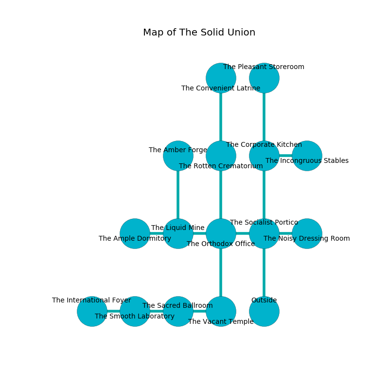

%Ruin Dogs

##The Solid Union
###Overview
The Solid Union is located on a flooded mountain. Parts of it are flooded. The ruin is collapsing slowly. It is occupied by Quaggoths. Sacha Hadden The Cruel, a Cloud Giant is here. The Quaggoths worship Sacha Hadden The Cruel. She  is trying to destroy [Boiaecaeem](#Boiaecaeem). 

###Artifact
####Boiaecaeem

Boiaecaeem has the form of a soft gem. Water flows towards it. When rubbed it changes probabilities. 

###Locations

####the socialist portico
Red lichens are growing in broken urns. The floor is bloodstained. 

There is an engraving on a monolith written in common. 

> [Boiaecaeem](#Boiaecaeem)
>
> angry and soft
>
> ethnic and thin
>
> artificial, colourful, hot
>
> [Boiaecaeem](#Boiaecaeem)
>

* To the west a long hall leads to [the orthodox office](#the-orthodox-office).
* To the east a dark walkway opens to [the noisy dressing room](#the-noisy-dressing-room).
* To the north a small cavern leads to [the corporate kitchen](#the-corporate-kitchen).
* To the south is the entrance.

####the orthodox office
The floor is smooth. The air tastes like chicken coup here. 

There is an engraving on a monolith written in Quaggoths Script. 

> A lip is a directory
>
> other and compatible
>

* To the west a flooded gap connects to [the liquid mine](#the-liquid-mine).
* To the east a long hall opens to [the socialist portico](#the-socialist-portico).
* To the north a twisted artery opens to [the rotten crematorium](#the-rotten-crematorium).
* To the south a flooded hallway opens to [the vacant temple](#the-vacant-temple).

####the corporate kitchen
The stone walls are ruined. 

* To the east a dripping corridor opens to [the incongruous stables](#the-incongruous-stables).
* To the north a dark hallway leads to [the pleasant storeroom](#the-pleasant-storeroom).
* To the south a small cavern opens to [the socialist portico](#the-socialist-portico).

####the rotten crematorium
The obsidion walls are pristine. 

* To the north a twisted hall connects to [the convenient latrine](#the-convenient-latrine).
* To the south a twisted artery connects to [the orthodox office](#the-orthodox-office).

####the pleasant storeroom
White razorgrass is decaying from the ceiling. 

* There is a basket here.
* [Sacha Hadden The Cruel](#Sacha-Hadden-The-Cruel) is here.
* To the south a dark hallway leads to [the corporate kitchen](#the-corporate-kitchen).

####the vacant temple
The concrete walls are covered in mold. Red moss is decaying in broken urns. 

* To the west a flooded opening connects to [the sacred ballroom](#the-sacred-ballroom).
* To the north a flooded hallway opens to [the orthodox office](#the-orthodox-office).

####the convenient latrine
Red mushrooms are growing from the ceiling. There are two Quaggoth Thonots and two Quaggoths here. The Quaggoths are sleeping. 

* To the south a twisted hall leads to [the rotten crematorium](#the-rotten-crematorium).

####the noisy dressing room
The crystal walls are pristine. There is a trap here. When activated, a pressure plate will blast flames. Gray ferns are growing in broken urns. 

* There is a spring here.
* There is a jewel here.
* To the west a dark walkway leads to [the socialist portico](#the-socialist-portico).

####the liquid mine
There are two Quaggoth Thonots and two Quaggoths here. The concrete walls are caving in. One of the Quaggoths is pointing a ballista at the entrance. 

There is an engraving on a stone written in Quaggoths Script. 

> Leave at once.
>

* To the west a windy hallway leads to [the ample dormitory](#the-ample-dormitory).
* To the east a flooded gap opens to [the orthodox office](#the-orthodox-office).
* To the north a long pathway leads to [the amber forge](#the-amber-forge).

####the incongruous stables
There is a Death Slaad here. The air tastes like soup here. Red lichens are decaying in cracks in the floor. 

* To the west a dripping corridor connects to [the corporate kitchen](#the-corporate-kitchen).

####the sacred ballroom
The glass walls are covered in mold. Green razorgrass is decaying in broken urns. 

* To the west a long passageway connects to [the smooth laboratory](#the-smooth-laboratory).
* To the east a flooded opening opens to [the vacant temple](#the-vacant-temple).

####the ample dormitory
There is a trap here. When activated, a magical sound detector will blast flames. The stone walls are bloodstained. There are a Red Slaad, a Barbed Devil, a Satyr, a Dire Wolf, a Tridrone, a Giant Badger, and a Flying Snake here. 

* To the east a windy hallway connects to [the liquid mine](#the-liquid-mine).

####the amber forge
There is a trap here. When activated, a magical sound detector will blast flames. The floor is cluttered with debris. Green lichens are growing in cracks in the floor. 

* To the south a long pathway opens to [the liquid mine](#the-liquid-mine).

####the smooth laboratory
The obsidion walls are scratched. There are a Sprite, a Deep Gnome, a Gargoyle, a Rust Monster, a Drow Elite Warrior, an Intellect Devourer, and a Lemure here. The air tastes like shrimp here. 

* [Boiaecaeem](#Boiaecaeem) is here.
* To the west a dripping cavern opens to [the international foyer](#the-international-foyer).
* To the east a long passageway leads to [the sacred ballroom](#the-sacred-ballroom).

####the international foyer
The stone walls are unsettled. The floor is smooth. Blue moss is decaying from the walls. 

There is an engraving on a monolith written in Quaggoths Script. 

> A tree is an user
>
> smart and international
>
> They are free
>
> outer and favorable
>
> [Boiaecaeem](#Boiaecaeem)
>
> always inappropriate
>
> A tree is an user
>

* To the east a dripping cavern opens to [the smooth laboratory](#the-smooth-laboratory).

