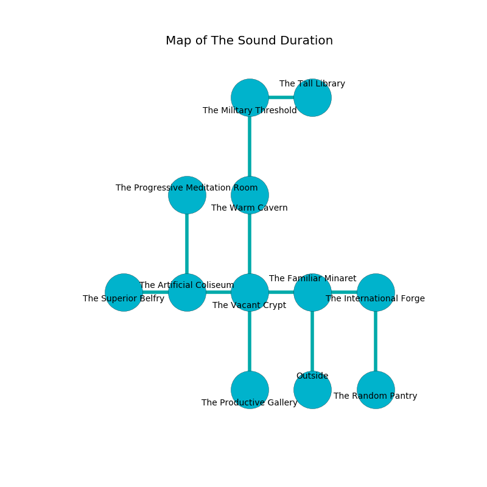

%Ruin Dogs

##The Sound Duration
###Overview
The Sound Duration is constructed on a haunted city. Some rooms of it are cursed. A battle between raiders is happening outside. It is occupied by Cyclopses. Lakisha Kimmel The Belligerent, a Hobgoblin Warlord is here. The Cyclopses have been charmed by Lakisha Kimmel The Belligerent. She  is founding a new religion. 

###Artifact
####The Beautiful Fibre

The Beautiful Fibre is a powerful artifact in the shape of a glassy blade. Water slides away from it. It smells like malt. When picked up it floats above the ground. 

###Locations

####the familiar minaret
The floor is bloodstained. There are two Cyclopses here. The Cyclopses are willing to negotiate. 

* To the west a twisted pathway connects to [the vacant crypt](#the-vacant-crypt).
* To the east a hazy threshold opens to [the international forge](#the-international-forge).
* To the south is the entrance.

####the international forge
The floor is sticky. The wooden walls are scratched. 

There is an engraving on a tablet written in common. 

> Go away.
>

* There is a fly here.
* To the west a hazy threshold connects to [the familiar minaret](#the-familiar-minaret).
* To the south a windy opening leads to [the random pantry](#the-random-pantry).

####the vacant crypt
The floor is sticky. 

* To the west a twisted artery leads to [the artificial coliseum](#the-artificial-coliseum).
* To the east a twisted pathway leads to [the familiar minaret](#the-familiar-minaret).
* To the north a dark corridor leads to [the warm cavern](#the-warm-cavern).
* To the south a small passageway connects to [the productive gallery](#the-productive-gallery).

####the productive gallery
The air smells like caramel here. There are an Ice Mephit, a Merrow, a Drow Mage, and a Giant Crab here. The floor is bloodstained. 

* There is a shield here.
* To the north a small passageway leads to [the vacant crypt](#the-vacant-crypt).

####the random pantry
The air tastes like starfruit here. Green razorgrass is decaying from the ceiling. There are a Frog, a Giant Scorpion, a Crocodile, and a Giant Shark here. 

* To the north a windy opening connects to [the international forge](#the-international-forge).

####the artificial coliseum
There are a Pentadrone, a Quaggoth, and a Druid here. Red lichens are growing from the ceiling. The air tastes like caramel here. 

There is an engraving on the ceiling written in common. 

> O! sad god
>
> yet never secular
>
> angry, balanced, odd
>
> nothing is molecular
>

* There is a bag here.
* [The Beautiful Fibre](#The-Beautiful-Fibre) is here.
* To the west a dripping corridor opens to [the superior belfry](#the-superior-belfry).
* To the east a twisted artery connects to [the vacant crypt](#the-vacant-crypt).
* To the north a dripping hallway opens to [the progressive meditation room](#the-progressive-meditation-room).

####the warm cavern
The crystal walls are unsettled. Gray razorgrass is decaying from the walls. The air smells like phenolic here. 

There is an engraving on the wall written in common. 

> Try hiding.
>

* To the north a dark corridor connects to [the military threshold](#the-military-threshold).
* To the south a dark corridor opens to [the vacant crypt](#the-vacant-crypt).

####the military threshold
The air tastes like wormwood here. There are two Cyclopses here. The floor is flooded with one inch deep scalding water. One of the Cyclopses is on watch, the rest are caring for babies. 

* [Lakisha Kimmel The Belligerent](#Lakisha-Kimmel-The-Belligerent) is here.
* To the east a flooded path opens to [the tall library](#the-tall-library).
* To the south a dark corridor leads to [the warm cavern](#the-warm-cavern).

####the tall library
The mirrored walls are bloodstained. There are a Chuul, an Ankheg, a Grick, and an Axe Beak here. 

* To the west a flooded path connects to [the military threshold](#the-military-threshold).

####the progressive meditation room
There is a trap here. When activated, a magical sound detector will flood the room with water. There are a Centaur, a Giant Rat, a Winter Wolf, and a Gnoll Pack Lord here. The floor is cluttered with broken glass. Red razorgrass is decaying from the walls. The air smells like corn here. 

* To the south a dripping hallway opens to [the artificial coliseum](#the-artificial-coliseum).

####the superior belfry
There are an Incubus, a Ghoul, and a Sahuagin Priestess here. The obsidion walls are covered in mold. There is a trap here. When activated, a tripwire will cast a curse. 

* To the east a dripping corridor leads to [the artificial coliseum](#the-artificial-coliseum).

