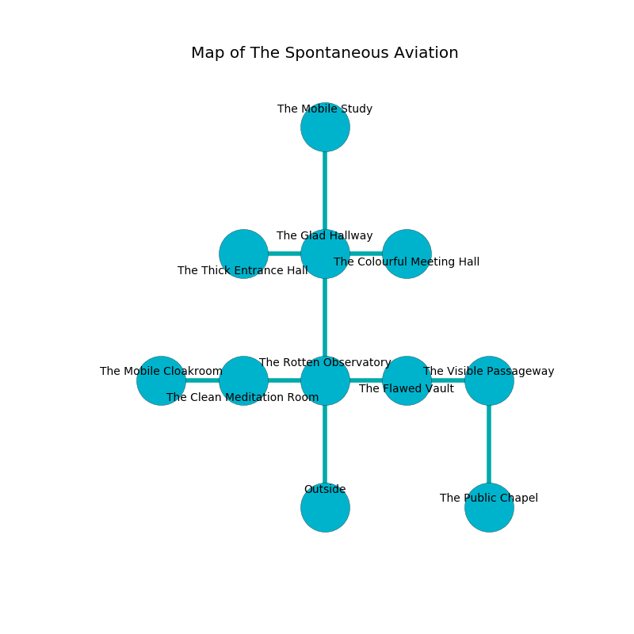

%Ruin Dogs

##The Spontaneous Aviation
###Overview
The Spontaneous Aviation is located in a flooded plain. Some rooms of it are flooded. A massive flood is happening outside. It is occupied by Gnolls. Emanuel Dowling The Lazy, a Mind Flayer is here. The Gnolls are the soldiers of Emanuel Dowling The Lazy. He  is founding a new religion. 

###Artifact
####Uahuad

Uahuad is a powerful artifact in the shape of a wet cube. It is a bright red color. Light glows towards it. When held it floats above the ground. 

###Locations

####the rotten observatory
The wooden walls are scratched. White mushrooms are sprouting in a patch on the floor. There are two Gnolls and four Gnoll Pack Lords here. The floor is smooth. The Gnolls are willing to fight to the death. 

* To the west a small cave connects to [the clean meditation room](#the-clean-meditation-room).
* To the east a dripping opening leads to [the flawed vault](#the-flawed-vault).
* To the north a narrow threshold connects to [the glad hallway](#the-glad-hallway).
* To the south is the entrance.

####the flawed vault
The air tastes like capers here. There is a trap here. When activated, a magical rune will launch a rolling boulder. 

* To the west a dripping opening connects to [the rotten observatory](#the-rotten-observatory).
* To the east a flooded opening leads to [the visible passageway](#the-visible-passageway).

####the glad hallway
There are two Gnoll Fangs of Yeenoghu here. Yellow moss is decaying in a patch on the floor. One of the Gnolls is on watch, the rest are feasting. 

* There is a key here.
* There is a pig here.
* To the west a twisted corridor leads to [the thick entrance hall](#the-thick-entrance-hall).
* To the east a narrow cavern opens to [the colourful meeting hall](#the-colourful-meeting-hall).
* To the north a dark corridor connects to [the mobile study](#the-mobile-study).
* To the south a narrow threshold opens to [the rotten observatory](#the-rotten-observatory).

####the thick entrance hall
The wooden walls are ruined. The floor is flooded with nine inch deep lukewarm water. The air smells like buttermilk here. 

* To the east a twisted corridor connects to [the glad hallway](#the-glad-hallway).

####the clean meditation room
The floor is glossy. Blue lichens are swaying in broken urns. 

* There is a knife here.
* [Emanuel Dowling The Lazy](#Emanuel-Dowling-The-Lazy) is here.
* To the west a narrow corridor opens to [the mobile cloakroom](#the-mobile-cloakroom).
* To the east a small cave connects to [the rotten observatory](#the-rotten-observatory).

####the colourful meeting hall
There are a Half-Red Dragon Veteran and a Fire Elemental here. The floor is flooded with five inch deep cold water. The brick walls are ruined. 

* There is a goblin here.
* To the west a narrow cavern leads to [the glad hallway](#the-glad-hallway).

####the visible passageway
The air tastes like autumn here. White razorgrass is growing from the walls. There are two Gnoll Fangs of Yeenoghu, a Gnoll, a Gnoll Pack Lord, and  here. The obsidion walls are covered in mold. The Gnolls are willing to negotiate. 

* [Uahuad](#Uahuad) is here.
* To the west a flooded opening opens to [the flawed vault](#the-flawed-vault).
* To the south a windy pathway opens to [the public chapel](#the-public-chapel).

####the mobile cloakroom
Gray mushrooms are swaying from the walls. There are a Gnoll Fang of Yeenoghu and two Gnoll Pack Lords here. If the Gnolls notice the Ruin Dogs, one of them will retreat and alert the others. 

* To the east a narrow corridor opens to [the clean meditation room](#the-clean-meditation-room).

####the mobile study
There are a Gnoll Fang of Yeenoghu and two Gnoll Pack Lords here. The air smells like bacon here. Green mushrooms are sprouting from the walls. There is a trap here. When activated, a tripwire will open a large pit in the floor. If the Gnolls notice the Ruin Dogs, one of them will retreat and alert [Emanuel Dowling](#Emanuel-Dowling). 

* There is a salamander here.
* To the south a dark corridor connects to [the glad hallway](#the-glad-hallway).

####the public chapel
There are two Gnoll Fangs of Yeenoghu and a Gnoll here. The floor is cluttered with rocks. Yellow moss is swaying in a patch on the floor. The Gnolls are caring for babies. 

* To the north a windy pathway opens to [the visible passageway](#the-visible-passageway).

