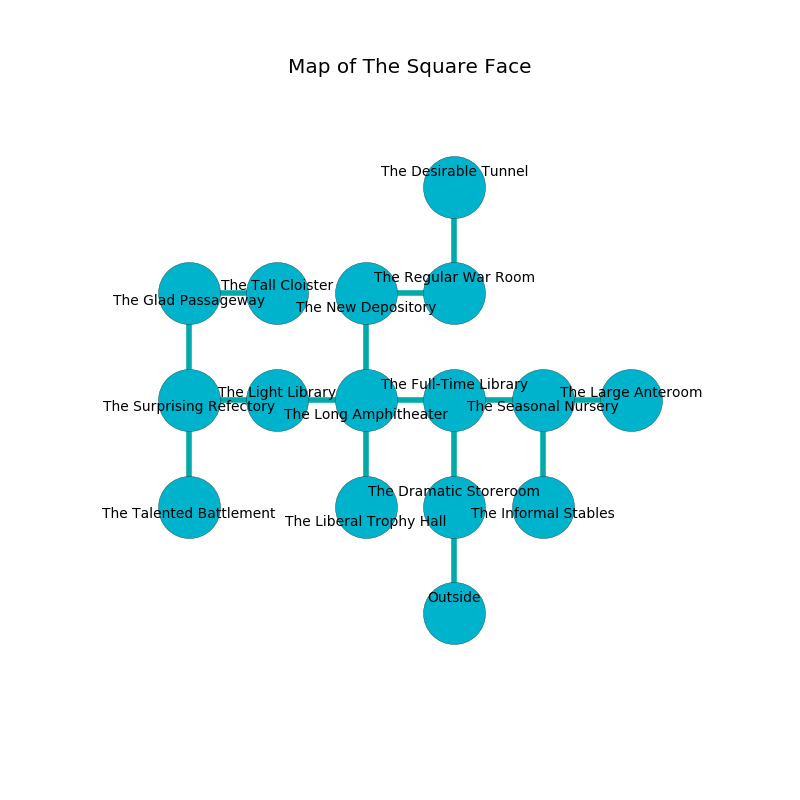

%Ruin Dogs

##The Square Face
###Overview
The Square Face is located in a giant mountain. Parts of it are foggy. A blizzard is happening outside. It is occupied by Duergars. Tennie Leeper The Pompous, a Quaggoth is here. The Duergars are battling Tennie Leeper The Pompous. She  is founding a new religion. 

###Artifact
####Babdafimaed

Babdafimaed has the form of a smooth gem. Light shifts towards it. It smells like brandy. When smelled it becomes a force of destiny. 

###Locations

####the dramatic storeroom
There are three Duergars here. The floor is sticky. The Duergars are sleeping. 

There is an engraving on a tablet written in Duergars Script. 

> [Babdafimaed](#Babdafimaed)
>
> yet helpful
>
> They are dying
>
> distant, commercial, original
>
> rational and alert
>
> influential, unexpected, constitutional
>
> [Babdafimaed](#Babdafimaed)
>

* To the north a flooded path leads to [the full-time library](#the-full-time-library).
* To the south is the entrance.

####the full-time library
Gray moss is decaying from the ceiling. There are a Quaggoth Spore Servant, a Goblin, a Swarm of Bats, a Swarm of Quippers, and a Giant Sea Horse here. The air tastes like chive here. The floor is flooded with six inch deep scalding water. 

* To the west a hazy gap opens to [the long amphitheater](#the-long-amphitheater).
* To the east a torchlit artery opens to [the seasonal nursery](#the-seasonal-nursery).
* To the south a flooded path opens to [the dramatic storeroom](#the-dramatic-storeroom).

####the long amphitheater
The stone walls are pristine. The floor is bloodstained. There are a Hunter Shark, a Gray Ooze, and a Swarm of Insects here. 

* To the west a flooded gap opens to [the light library](#the-light-library).
* To the east a hazy gap opens to [the full-time library](#the-full-time-library).
* To the north a dripping hall connects to [the new depository](#the-new-depository).
* To the south a hazy walkway opens to [the liberal trophy hall](#the-liberal-trophy-hall).

####the liberal trophy hall
There is a trap here. When activated, a magical sound detector will collapse a wall. The crystal walls are pristine. Yellow razorgrass is swaying in a patch on the floor. 

There is an engraving on the ceiling written in common. 

> I am powerful.
>
> Dig here.
>

* To the north a hazy walkway leads to [the long amphitheater](#the-long-amphitheater).

####the light library
There are a Giant Toad and an Allosaurus here. White ferns are swaying from the ceiling. The air tastes like cilantro here. The floor is bloodstained. 

There is an engraving on the floor written in Duergars Script. 

> I discovered [Babdafimaed](#Babdafimaed).
>

* There is a head here.
* To the west a dripping gap opens to [the surprising refectory](#the-surprising-refectory).
* To the east a flooded gap leads to [the long amphitheater](#the-long-amphitheater).

####the new depository
There are three Duergars here. Gray razorgrass is growing in broken urns. One of the Duergars is pointing a ballista at the entrance. 

* To the east a twisted gap connects to [the regular war Room](#the-regular-war-Room).
* To the south a dripping hall connects to [the long amphitheater](#the-long-amphitheater).

####the surprising refectory
The air smells like strawberry here. The stone walls are ruined. 

There is an engraving on the floor written in common. 

> Do not try swimming.
>

* To the east a dripping gap leads to [the light library](#the-light-library).
* To the north a hazy cavern leads to [the glad passageway](#the-glad-passageway).
* To the south a long hallway connects to [the talented battlement](#the-talented-battlement).

####the glad passageway
The floor is cluttered with bones. The concrete walls are unsettled. The air smells like bouillon here. There are three Duergars here. Yellow lichens are growing in broken urns. The Duergars are willing to fight to the death. 

* To the east a narrow corridor opens to [the tall cloister](#the-tall-cloister).
* To the south a hazy cavern opens to [the surprising refectory](#the-surprising-refectory).

####the seasonal nursery
The floor is cluttered with debris. The metallic walls are caving in. The air smells like cooked apple here. 

There is an engraving on a stone written in Duergars Script. 

> O my fate is poor
>
> yet never premature
>
> it is never blind
>
> fate is pure
>

* There is a shoe here.
* There is a brick here.
* There is a button here.
* To the west a torchlit artery leads to [the full-time library](#the-full-time-library).
* To the east a hazy hall opens to [the large anteroom](#the-large-anteroom).
* To the south a windy artery leads to [the informal stables](#the-informal-stables).

####the regular war Room
The floor is glossy. The air smells like mushroom here. There are a Quipper, a Winter Wolf, and a Camel here. 

There is an engraving on the ceiling written in Duergars Script. 

> Oh our fate is sadistic
>
> it is always artistic
>
> but normal
>
> nothing is realistic
>

* [Babdafimaed](#Babdafimaed) is here.
* [Tennie Leeper The Pompous](#Tennie-Leeper-The-Pompous) is here.
* To the west a twisted gap leads to [the new depository](#the-new-depository).
* To the north a hazy cave connects to [the desirable tunnel](#the-desirable-tunnel).

####the tall cloister
The brick walls are ruined. Green razorgrass is growing from the walls. 

* To the west a narrow corridor opens to [the glad passageway](#the-glad-passageway).

####the talented battlement
The metallic walls are caving in. The air tastes like truffle here. 

* To the north a long hallway leads to [the surprising refectory](#the-surprising-refectory).

####the informal stables
The air tastes like lovage here. The floor is sticky. There are three Duergars here. The concrete walls are unsettled. Blue moss is growing from the walls. The Duergars are fighting amongst themselves. 

There is an engraving on a monolith written in common. 

> A tooth is a fun
>
> literary and annual
>
> always compatible
>
> You are maddened
>
> secondary and optional
>
> always foolish
>
> [Babdafimaed](#Babdafimaed)
>
> honest, wrong, electronic
>
> past, just, rural
>
> unlikely, restricted, unlawful
>

* To the north a windy artery opens to [the seasonal nursery](#the-seasonal-nursery).

####the large anteroom
There are a Warhorse, a Crab, a Green Hag, and a Gibbering Mouther here. The stone walls are pristine. The floor is cluttered with broken glass. Yellow ferns are growing from the ceiling. 

There is an engraving on the wall written in common. 

> Run away.
>

* To the west a hazy hall connects to [the seasonal nursery](#the-seasonal-nursery).

####the desirable tunnel
There are a Hippogriff and a Killer Whale here. The obsidion walls are pristine. 

There is an engraving on a monolith written in Duergars Script. 

> A drain is a grass
>
> agricultural, current, frequent
>
> A drain is a grass
>

* To the south a hazy cave connects to [the regular war Room](#the-regular-war-Room).

