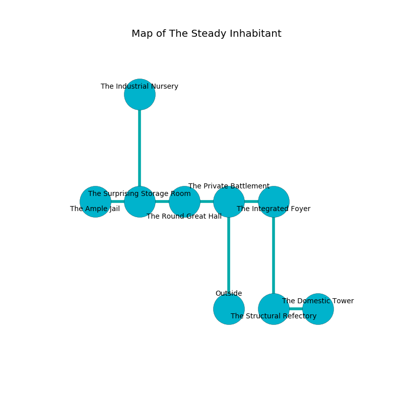

%Ruin Dogs

##The Steady Inhabitant
###Overview
The Steady Inhabitant is constructed on a cursed city. Parts of The Steady Inhabitant are somewhat hot. A solar eclipse is happening outside. It is occupied by Satyrs. Kia Marlow The Foolish, a Frost Giant is here. The Satyrs are the slaves of Kia Marlow The Foolish. She  is founding a new religion. 

###Artifact
####Cuomcaeh

Cuomcaeh is a powerful artifact in the shape of a hard crystal. It smells like lily of the valley. When cradled it flies into the air. 

###Locations

####the private battlement
The crystal walls are caving in. 

* To the west a twisted gap leads to [the round great hall](#the-round-great-hall).
* To the east a long opening connects to [the integrated foyer](#the-integrated-foyer).
* To the south is the entrance.

####the round great hall
Gray lichens are growing from the ceiling. The brick walls are caving in. The air smells like shrimp here. 

* There is a trousers here.
* To the west a dripping passageway opens to [the surprising storage room](#the-surprising-storage-room).
* To the east a twisted gap connects to [the private battlement](#the-private-battlement).

####the surprising storage room
White razorgrass is decaying in broken urns. The air smells like menthol here. The metallic walls are bloodstained. 

* [Kia Marlow The Foolish](#Kia-Marlow-The-Foolish) is here.
* To the west a windy cave leads to [the ample jail](#the-ample-jail).
* To the east a dripping passageway opens to [the round great hall](#the-round-great-hall).
* To the north a dark threshold leads to [the industrial nursery](#the-industrial-nursery).

####the integrated foyer

* There is a spade here.
* To the west a long opening leads to [the private battlement](#the-private-battlement).
* To the south a dripping path leads to [the structural refectory](#the-structural-refectory).

####the structural refectory
The obsidion walls are caving in. The air smells like phenolic here. 

* [Cuomcaeh](#Cuomcaeh) is here.
* To the east a narrow corridor opens to [the domestic tower](#the-domestic-tower).
* To the north a dripping path leads to [the integrated foyer](#the-integrated-foyer).

####the ample jail
White lichens are sprouting from the walls. The air tastes like orchid here. The wooden walls are covered in mold. 

* There is a bag here.
* To the east a windy cave opens to [the surprising storage room](#the-surprising-storage-room).

####the industrial nursery
The stone walls are ruined. The air tastes like resin here. There are fourteen Satyrs here. One of the Satyrs is working a mechanism that can lock the exits. 

* There is a crystal here.
* There is a feather here.
* To the south a dark threshold leads to [the surprising storage room](#the-surprising-storage-room).

####the domestic tower
There is a trap here. When activated, a magical rune will launch a ceiling pendulum. The air smells like orangeflower here. The floor is smooth. There are a Gelatinous Cube and a Young White Dragon here. The metallic walls are pristine. Gray mushrooms are decaying in cracks in the floor. 

* To the west a narrow corridor opens to [the structural refectory](#the-structural-refectory).

