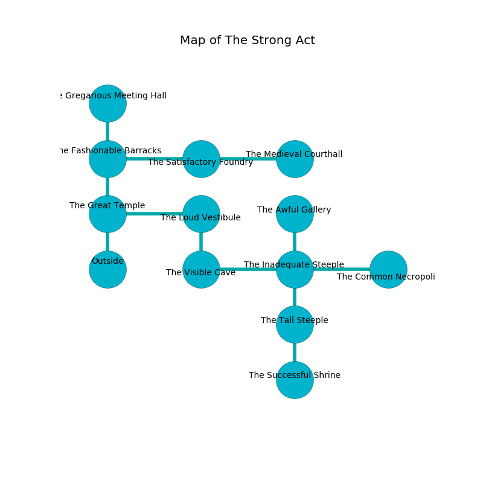

%Ruin Dogs

##The Strong Act
###Overview
The Strong Act is constructed on a broken city. Regions of it are flooded. The ruin is collapsing slowly. It is occupied by Deep Gnomes. Paola Baskin The Truculent, a Frost Giant is here. The Deep Gnomes have been charmed by Paola Baskin The Truculent. She  is founding a new religion. 

###Artifact
####The Cool Pass

The Cool Pass looks like a cold cube. It is a bright gray color. It smells like grease. Light shifts away from it. When picked up it sings the hymn of the damned. 

###Locations

####the great temple
Green mushrooms are sprouting in cracks in the floor. There are fourteen Deep Gnomes here. The air tastes like cream here. The glass walls are scratched. The Deep Gnomes are berserk with rage. 

* To the east a torchlit pathway opens to [the loud vestibule](#the-loud-vestibule).
* To the north a narrow cave connects to [the fashionable barracks](#the-fashionable-barracks).
* To the south is the entrance.

####the fashionable barracks
There are a Cultist, a Poltergeist, a Giant Hyena, a Giant Weasel, and an Incubus here. The floor is cluttered with broken glass. Gray moss is sprouting in a patch on the floor. 

* To the east a windy threshold connects to [the satisfactory foundry](#the-satisfactory-foundry).
* To the north a windy path leads to [the gregarious meeting hall](#the-gregarious-meeting-hall).
* To the south a narrow cave leads to [the great temple](#the-great-temple).

####the loud vestibule
There are fourteen Deep Gnomes here. One of the Deep Gnomes is pointing a ballista at the entrance. 

* To the west a torchlit pathway leads to [the great temple](#the-great-temple).
* To the south a torchlit corridor leads to [the visible cave](#the-visible-cave).

####the visible cave
The air tastes like caraway here. The crystal walls are ruined. 

* To the east a narrow path connects to [the inadequate steeple](#the-inadequate-steeple).
* To the north a torchlit corridor connects to [the loud vestibule](#the-loud-vestibule).

####the satisfactory foundry
There are fourteen Deep Gnomes here. The wooden walls are pristine. Red lichens are swaying in broken urns. One of the Deep Gnomes is pointing a ballista at the entrance. 

* To the west a windy threshold opens to [the fashionable barracks](#the-fashionable-barracks).
* To the east a twisted cavern connects to [the medieval courthall](#the-medieval-courthall).

####the gregarious meeting hall
Yellow ferns are growing in cracks in the floor. The floor is sticky. 

* There is a wight here.
* There is a sponge here.
* To the south a windy path leads to [the fashionable barracks](#the-fashionable-barracks).

####the inadequate steeple
Red razorgrass is growing in broken urns. There are fourteen Deep Gnomes here. One of the Deep Gnomes is on watch, the rest are meditating. 

* To the west a narrow path leads to [the visible cave](#the-visible-cave).
* To the east a torchlit gap leads to [the common necropolis](#the-common-necropolis).
* To the north a twisted cavern connects to [the awful gallery](#the-awful-gallery).
* To the south a flooded passageway connects to [the tall steeple](#the-tall-steeple).

####the tall steeple
The floor is glossy. Green mushrooms are decaying in a patch on the floor. 

There is an engraving on the floor written in common. 

> Maybe try leaving.
>

* [The Cool Pass](#The-Cool-Pass) is here.
* To the north a flooded passageway opens to [the inadequate steeple](#the-inadequate-steeple).
* To the south a torchlit walkway connects to [the successful shrine](#the-successful-shrine).

####the awful gallery
The floor is sticky. Green lichens are sprouting from the walls. There are a Blink Dog, a Zombie, a Peryton, a Giant Goat, a Red Slaad, and a Flying Snake here. The air smells like pineapple here. The wooden walls are unsettled. 

* To the south a twisted cavern opens to [the inadequate steeple](#the-inadequate-steeple).

####the common necropolis
The floor is flooded with three inch deep lukewarm water. The air tastes like privet here. The metallic walls are pristine. Red ferns are decaying from the walls. 

There is an engraving on the floor written in Deep Gnomes Script. 

> Run away.
>

* There is a pendant here.
* To the west a torchlit gap leads to [the inadequate steeple](#the-inadequate-steeple).

####the medieval courthall
The floor is sticky. Gray ferns are swaying from the ceiling. The mirrored walls are unsettled. 

There is an engraving on a monolith written in Deep Gnomes Script. 

> Dear me! terrible soul
>
> yet never whole
>
> it is never automatic
>
> life is whole
>

* [Paola Baskin The Truculent](#Paola-Baskin-The-Truculent) is here.
* To the west a twisted cavern opens to [the satisfactory foundry](#the-satisfactory-foundry).

####the successful shrine
The floor is glossy. The wooden walls are covered in mold. The air smells like clary sage here. 

There is an engraving on the floor written in Deep Gnomes Script. 

> A trap ahead.
>

* To the north a torchlit walkway opens to [the tall steeple](#the-tall-steeple).

