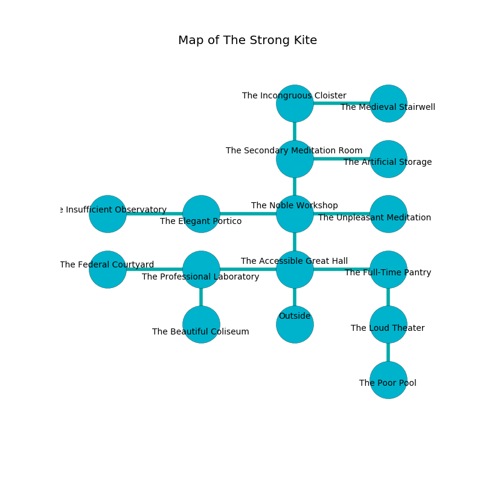

%Ruin Dogs

##The Strong Kite
###Overview
The Strong Kite is located in a flooded plain. Parts of The Strong Kite are inaccessible. A massive flood is happening outside. It is occupied by Satyrs. Renea Garza The Foolhardy, a Cult Fanatic is here. The Satyrs are the slaves of Renea Garza The Foolhardy. She  is founding a new religion. 

###Artifact
####Aebehaemedaeum Idhaed

Aebehaemedaeum Idhaed has the form of a broken doll. Light shifts from it. It is a shifting blue color. It smells like jasmin. When touched it changes the past. 

###Locations

####the accessible great hall
The floor is glossy. White razorgrass is growing from the ceiling. 

* There is a brush here.
* To the west a dark cavern opens to [the professional laboratory](#the-professional-laboratory).
* To the east a small threshold leads to [the full-time pantry](#the-full-time-pantry).
* To the north a small hallway connects to [the noble workshop](#the-noble-workshop).
* To the south is the entrance.

####the noble workshop
There are four Satyrs here. The floor is cluttered with ashes. The concrete walls are caving in. The air tastes like tamarind here. The Satyrs are performing a ritual. If not interrupted, a powerful monster will be summoned. 

* To the west a long artery opens to [the elegant portico](#the-elegant-portico).
* To the east a hazy opening opens to [the unpleasant meditation room](#the-unpleasant-meditation-room).
* To the north a windy cave connects to [the secondary meditation room](#the-secondary-meditation-room).
* To the south a small hallway connects to [the accessible great hall](#the-accessible-great-hall).

####the elegant portico
The floor is bloodstained. There are a Hawk, a Giant Poisonous Snake, and a Druid here. Gray lichens are growing in broken urns. 

* There is a button here.
* To the west a windy gap opens to [the insufficient observatory](#the-insufficient-observatory).
* To the east a long artery leads to [the noble workshop](#the-noble-workshop).

####the professional laboratory
The floor is sticky. 

* There is a blade here.
* To the west a windy pathway leads to [the federal courtyard](#the-federal-courtyard).
* To the east a dark cavern opens to [the accessible great hall](#the-accessible-great-hall).
* To the south a small threshold connects to [the beautiful coliseum](#the-beautiful-coliseum).

####the full-time pantry
There are four Satyrs here. The metallic walls are pristine. Red ferns are sprouting in cracks in the floor. The floor is flooded with four inch deep cold water. The Satyrs are feasting. 

There is an engraving on a monolith written in Satyrs Script. 

> Poor me! the memory of you is inhumane
>
> it is never main
>
> accurate, tasty, realistic
>
> death is artistic
>

* To the west a small threshold connects to [the accessible great hall](#the-accessible-great-hall).
* To the south a twisted threshold leads to [the loud theater](#the-loud-theater).

####the secondary meditation room
Green moss is sprouting in cracks in the floor. The floor is cluttered with shells. 

* To the east a dripping artery connects to [the artificial storage](#the-artificial-storage).
* To the north a hazy walkway leads to [the incongruous cloister](#the-incongruous-cloister).
* To the south a windy cave leads to [the noble workshop](#the-noble-workshop).

####the beautiful coliseum
The obsidion walls are caving in. Green lichens are sprouting in broken urns. 

There is an engraving on the floor written in Satyrs Script. 

> [Aebehaemedaeum Idhaed](#Aebehaemedaeum-Idhaed)
>
> amber and military
>
> hot, welcome, uncomfortable
>
> [Aebehaemedaeum Idhaed](#Aebehaemedaeum-Idhaed)
>
> dynamic, similar, unaware
>
> constitutional, junior, literary
>
> you are not hidden
>

* To the north a small threshold connects to [the professional laboratory](#the-professional-laboratory).

####the unpleasant meditation room
The floor is smooth. The air smells like eggs here. 

* To the west a hazy opening opens to [the noble workshop](#the-noble-workshop).

####the loud theater
There are four Satyrs here. Red moss is sprouting from the walls. The floor is sticky. One of the Satyrs is on watch, the rest are drunk. 

* [Renea Garza The Foolhardy](#Renea-Garza-The-Foolhardy) is here.
* To the north a twisted threshold opens to [the full-time pantry](#the-full-time-pantry).
* To the south a windy cavern opens to [the poor pool](#the-poor-pool).

####the poor pool
The air tastes like sarsaparilla here. There is a trap here. When activated, a pressure plate will launch a hail of needles. Red ferns are swaying in cracks in the floor. There are four Satyrs here. One of the Satyrs is on watch, the rest are celebrating. 

* To the north a windy cavern opens to [the loud theater](#the-loud-theater).

####the federal courtyard
There is a Berserker here. The crystal walls are bloodstained. Red moss is sprouting from the walls. 

* There is a hat here.
* To the east a windy pathway opens to [the professional laboratory](#the-professional-laboratory).

####the incongruous cloister
Gray lichens are growing in cracks in the floor. The air tastes like tomato here. The obsidion walls are caving in. 

There is an engraving on the floor written in Satyrs Script. 

> I am fleeing this place.
>

* There is a leprechaun here.
* There is a dress here.
* [Aebehaemedaeum Idhaed](#Aebehaemedaeum-Idhaed) is here.
* To the east a small corridor opens to [the medieval stairwell](#the-medieval-stairwell).
* To the south a hazy walkway leads to [the secondary meditation room](#the-secondary-meditation-room).

####the insufficient observatory
There are four Satyrs here. One of the Satyrs is on watch, the rest are celebrating. 

* To the east a windy gap opens to [the elegant portico](#the-elegant-portico).

####the artificial storage
The floor is smooth. The crystal walls are unsettled. There are four Satyrs here. The Satyrs are performing a ritual. If not interrupted, a powerful monster will be summoned. 

There is an engraving on the floor written in common. 

> [Aebehaemedaeum Idhaed](#Aebehaemedaeum-Idhaed)
>
> gregarious, senior, molecular
>
> A gun is a post
>
> but never abstract
>
> You are maddened
>
> yet modern
>
> but hot
>
> valid and sick
>
> available and distant
>

* To the west a dripping artery leads to [the secondary meditation room](#the-secondary-meditation-room).

####the medieval stairwell
The mirrored walls are covered in mold. The floor is smooth. There are four Satyrs here. The Satyrs are performing a ritual. If not interrupted, [Renea Garza](#Renea-Garza) will be magically alarmed. 

There is an engraving on a stone written in Satyrs Script. 

> Maybe try running.
>

* There is a tree here.
* To the west a small corridor leads to [the incongruous cloister](#the-incongruous-cloister).

