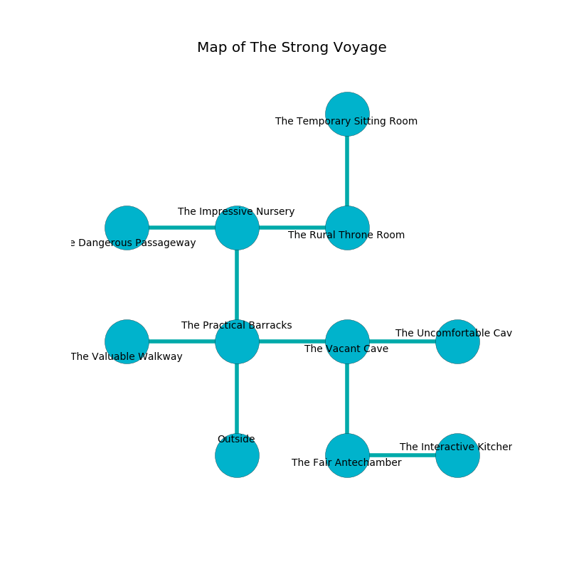

%Ruin Dogs

##The Strong Voyage
###Overview
The Strong Voyage is located on a flooded plain. Some rooms of it are cursed. The ruin is larger on the inside than the outside. It is occupied by Sahuagin. Scottie Salisbury The Pusillanimous, a Knight is here. The Sahuagin are the minions of Scottie Salisbury The Pusillanimous. She  is founding a new religion. 

###Artifact
####Cubgufd Baed

Cubgufd Baed has the form of a hard crystal. When worshipped it grants a wish. 

###Locations

####the practical barracks
There are four Sahuagin here. The floor is smooth. If the Sahuagin notice the Ruin Dogs, one of them will retreat and alert the others. 

There is an engraving on the wall written in common. 

> Do not try jumping.
>

* To the west a hazy path leads to [the valuable walkway](#the-valuable-walkway).
* To the east a windy corridor connects to [the vacant cave](#the-vacant-cave).
* To the north a twisted opening leads to [the impressive nursery](#the-impressive-nursery).
* To the south is the entrance.

####the impressive nursery
There are four Sahuagin here. The floor is bloodstained. The stone walls are caving in. There is a trap here. When activated, a magical rune will collapse a wall. Red ferns are swaying in broken urns. If the Sahuagin notice the Ruin Dogs, one of them will retreat and alert the others. 

There is an engraving on a stone written in common. 

> Dear me! terrible we
>
> it is never main
>
> yet free
>
> hope is vain
>

* To the west a windy gap leads to [the dangerous passageway](#the-dangerous-passageway).
* To the east a small gap connects to [the rural throne room](#the-rural-throne-room).
* To the south a twisted opening opens to [the practical barracks](#the-practical-barracks).

####the valuable walkway
Gray lichens are decaying in cracks in the floor. There is a Cult Fanatic here. The air smells like roasted coffee here. 

* To the east a hazy path connects to [the practical barracks](#the-practical-barracks).

####the rural throne room
The air smells like guava here. There are a Black Bear, a Shadow, a Scorpion, and an Animated Armor here. 

* To the west a small gap leads to [the impressive nursery](#the-impressive-nursery).
* To the north a long hallway connects to [the temporary sitting Room](#the-temporary-sitting-Room).

####the vacant cave
The wooden walls are covered in mold. 

There is an engraving on the ceiling written in common. 

> [Cubgufd Baed](#Cubgufd-Baed)
>
> sympathetic, explicit, accessible
>
> [Cubgufd Baed](#Cubgufd-Baed)
>
> whole, controversial, proper
>
> you must be returned
>

* To the west a windy corridor opens to [the practical barracks](#the-practical-barracks).
* To the east a long hall opens to [the uncomfortable cave](#the-uncomfortable-cave).
* To the south a twisted corridor leads to [the fair antechamber](#the-fair-antechamber).

####the dangerous passageway
The air tastes like cornmeal here. The floor is bloodstained. 

* [Scottie Salisbury The Pusillanimous](#Scottie-Salisbury-The-Pusillanimous) is here.
* To the east a windy gap connects to [the impressive nursery](#the-impressive-nursery).

####the temporary sitting Room
Green razorgrass is sprouting in a patch on the floor. The air tastes like phenolic here. The glass walls are ruined. 

* To the south a long hallway leads to [the rural throne room](#the-rural-throne-room).

####the uncomfortable cave
There is a Carrion Crawler here. 

* To the west a long hall connects to [the vacant cave](#the-vacant-cave).

####the fair antechamber
The air tastes like coconut here. 

* [Cubgufd Baed](#Cubgufd-Baed) is here.
* To the east a long passageway connects to [the interactive kitchen](#the-interactive-kitchen).
* To the north a twisted corridor leads to [the vacant cave](#the-vacant-cave).

####the interactive kitchen
Gray moss is growing in cracks in the floor. The air smells like opoponax here. The floor is flooded with nine inch deep cool water. There are four Sahuagin here. The Sahuagin are drunk. 

* To the west a long passageway connects to [the fair antechamber](#the-fair-antechamber).

