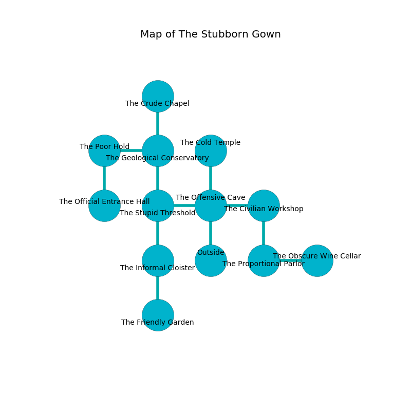

%Ruin Dogs

##The Stubborn Gown
###Overview
The Stubborn Gown is located in a cursed rift. Regions of The Stubborn Gown are frozen. A battle between raiders is happening outside. It is occupied by Duergars. Abraham Clarkson The Ruthless, a Cloud Giant is here. The Duergars are the slaves of Abraham Clarkson The Ruthless. He  is trying to exploit [Imahdaf Cehamlef](#Imahdaf-Cehamlef). 

###Artifact
####Imahdaf Cehamlef

Imahdaf Cehamlef looks like a transparent monument. It smells like kumquat. When thrown it projects energy. 

###Locations

####the offensive cave
The floor is glossy. The air tastes like narcissus here. The metallic walls are scratched. There are ten Duergars here. The Duergars are willing to negotiate. 

* There is a brain here.
* To the west a hazy corridor connects to [the stupid threshold](#the-stupid-threshold).
* To the east a long threshold opens to [the civilian workshop](#the-civilian-workshop).
* To the north a long cave leads to [the cold temple](#the-cold-temple).
* To the south is the entrance.

####the civilian workshop
Blue moss is growing from the walls. The metallic walls are caving in. The air smells like lemongrass here. There are ten Duergars here. The floor is flooded with nine inch deep lukewarm water. The Duergars are performing a ritual. If not interrupted, the Duergars will become more powerful. 

* There is a crystal here.
* To the west a long threshold connects to [the offensive cave](#the-offensive-cave).
* To the south a small corridor leads to [the proportional parlor](#the-proportional-parlor).

####the stupid threshold
There are ten Duergars here. Blue ferns are sprouting in a patch on the floor. The floor is smooth. The wooden walls are caving in. The Duergars are willing to negotiate. 

* To the east a hazy corridor opens to [the offensive cave](#the-offensive-cave).
* To the north a small cave connects to [the geological conservatory](#the-geological-conservatory).
* To the south a dripping artery connects to [the informal cloister](#the-informal-cloister).

####the geological conservatory
The air tastes like lily of the valley here. Yellow ferns are decaying from the ceiling. 

* There is an arch here.
* To the west a dark walkway leads to [the poor hold](#the-poor-hold).
* To the north a windy pathway leads to [the crude chapel](#the-crude-chapel).
* To the south a small cave connects to [the stupid threshold](#the-stupid-threshold).

####the crude chapel
Green ferns are decaying in broken urns. 

* There is a breastplate here.
* To the south a windy pathway leads to [the geological conservatory](#the-geological-conservatory).

####the cold temple
The glass walls are scratched. There are ten Duergars here. The floor is bloodstained. The Duergars are defending this room from intruders. 

* There is a whip here.
* [Abraham Clarkson The Ruthless](#Abraham-Clarkson-The-Ruthless) is here.
* To the south a long cave connects to [the offensive cave](#the-offensive-cave).

####the proportional parlor
The floor is cluttered with ashes. 

* There is a cart here.
* There is a comb here.
* To the east a narrow hallway connects to [the obscure wine cellar](#the-obscure-wine-cellar).
* To the north a small corridor leads to [the civilian workshop](#the-civilian-workshop).

####the obscure wine cellar
There are ten Duergars here. The floor is flooded with eight inch deep lukewarm water. The Duergars are fighting amongst themselves. 

There is an engraving on a stone written in common. 

> Dig here.
>

* There is a basket here.
* To the west a narrow hallway leads to [the proportional parlor](#the-proportional-parlor).

####the informal cloister
The stone walls are unsettled. 

* To the north a dripping artery opens to [the stupid threshold](#the-stupid-threshold).
* To the south a hazy walkway connects to [the friendly garden](#the-friendly-garden).

####the friendly garden
Blue mushrooms are swaying in a patch on the floor. The glass walls are ruined. The floor is flooded with four inch deep lukewarm water. 

There is an engraving on a stone written in common. 

> I am worshipping this place.
>
> Go away.
>

* There is a hoard here.
* There is a stamp here.
* To the north a hazy walkway connects to [the informal cloister](#the-informal-cloister).

####the poor hold
Yellow moss is decaying from the walls. The wooden walls are caving in. 

* [Imahdaf Cehamlef](#Imahdaf-Cehamlef) is here.
* To the east a dark walkway leads to [the geological conservatory](#the-geological-conservatory).
* To the south a long threshold leads to [the official entrance hall](#the-official-entrance-hall).

####the official entrance hall

There is an engraving on a monolith written in common. 

> We are sorrowful
>
> yet archaeological
>
> always native
>

* To the north a long threshold connects to [the poor hold](#the-poor-hold).

