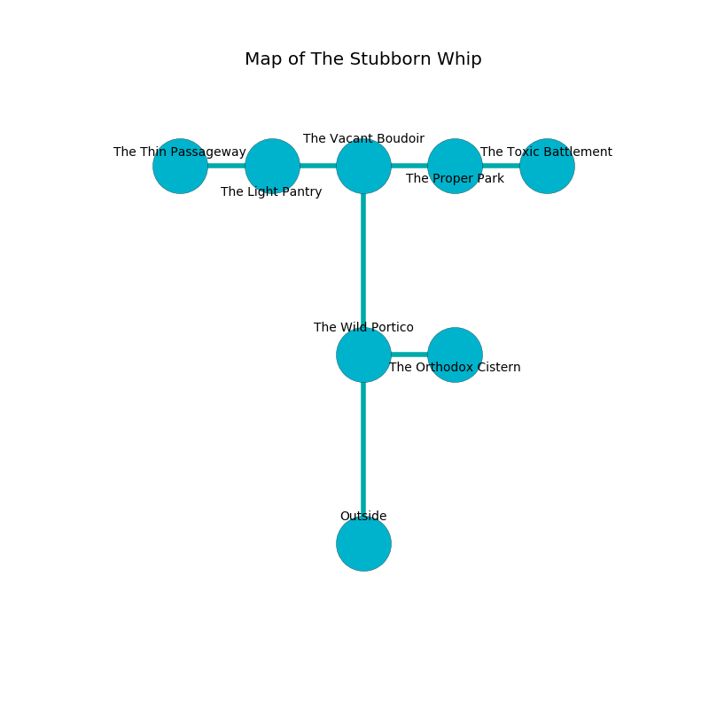

%Ruin Dogs

##The Stubborn Whip
###Overview
The Stubborn Whip is constructed on a volcanic rift. Some areas of it are cursed. The ruin is coming to life. It is occupied by Orc. Davina Meyers The Machiavellian, a Yuan-Ti Abomination is here. The Orc are the soldiers of Davina Meyers The Machiavellian. She  is trying to discover [The Municipal Assumption](#The-Municipal-Assumption). 

###Artifact
####The Municipal Assumption

The Municipal Assumption has the form of a warm figurine. Cacophony slides towards it. It smells like seed. It is a sickly yellow color. When thrown it changes probabilities. 

###Locations

####the wild portico
Red moss is swaying in a patch on the floor. The floor is bloodstained. 

* To the east a long hallway leads to [the orthodox cistern](#the-orthodox-cistern).
* To the north a flooded gap connects to [the vacant boudoir](#the-vacant-boudoir).
* To the south is the entrance.

####the vacant boudoir
The stone walls are caving in. The air tastes like labdanum here. 

* To the west a hazy cave opens to [the light pantry](#the-light-pantry).
* To the east a windy path leads to [the proper park](#the-proper-park).
* To the south a flooded gap connects to [the wild portico](#the-wild-portico).

####the orthodox cistern
There is a trap here. When activated, a magical proximity detector will launch a rolling boulder. There are a Giant Wolf Spider, a Jackal, an Unicorn, and a Fire Snake here. Red ferns are sprouting in a patch on the floor. The brick walls are covered in mold. 

* [Davina Meyers The Machiavellian](#Davina-Meyers-The-Machiavellian) is here.
* To the west a long hallway opens to [the wild portico](#the-wild-portico).

####the light pantry
The wooden walls are bloodstained. There are twelve Orcs here. The Orc are fighting amongst themselves. 

* To the west a flooded cave opens to [the thin passageway](#the-thin-passageway).
* To the east a hazy cave opens to [the vacant boudoir](#the-vacant-boudoir).

####the thin passageway
There are twelve Orcs here. The crystal walls are bloodstained. White mushrooms are growing in cracks in the floor. One of the Orc is working a mechanism that can engulf the room in a fiery blaze. 

* To the east a flooded cave connects to [the light pantry](#the-light-pantry).

####the proper park
The air smells like basil here. There are twelve Orcs here. The brick walls are ruined. One of the Orc is on watch, the rest are celebrating. 

* There is a pig here.
* [The Municipal Assumption](#The-Municipal-Assumption) is here.
* To the west a windy path opens to [the vacant boudoir](#the-vacant-boudoir).
* To the east a small gap opens to [the toxic battlement](#the-toxic-battlement).

####the toxic battlement
The metallic walls are unsettled. The air smells like pimenta here. Blue mushrooms are swaying from the ceiling. 

* To the west a small gap connects to [the proper park](#the-proper-park).

