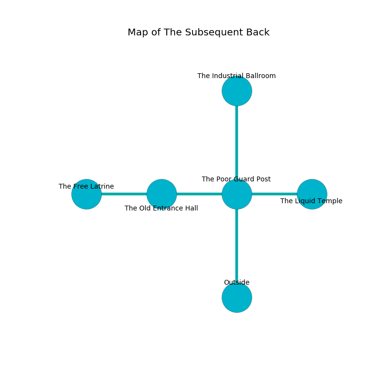

%Ruin Dogs

##The Subsequent Back
###Overview
The Subsequent Back is located under a broken city. Some rooms of The Subsequent Back are flooded. The ruin is collapsing slowly. It is occupied by Drows. Rob Billingsley The Lazy, a Cloud Giant is here. The Drows are ruled by Rob Billingsley The Lazy. He  is trying to exploit [Faeia Ehamle](#Faeia-Ehamle). 

###Artifact
####Faeia Ehamle

Faeia Ehamle has the form of a cold monument. Fire bends near it. It is a shifting red color. It smells like verbena. When worn it destroys itself. 

###Locations

####the poor guard post

* [Faeia Ehamle](#Faeia-Ehamle) is here.
* To the west a hazy cave opens to [the old entrance hall](#the-old-entrance-hall).
* To the east a hazy cave opens to [the liquid temple](#the-liquid-temple).
* To the north a small gap opens to [the industrial ballroom](#the-industrial-ballroom).
* To the south is the entrance.

####the old entrance hall
The air smells like cilantro here. There are a Glabrezu and a Brown Bear here. 

* There is a hat here.
* There is a femur here.
* To the west a hazy threshold opens to [the free latrine](#the-free-latrine).
* To the east a hazy cave leads to [the poor guard post](#the-poor-guard-post).

####the free latrine
There are a Mud Mephit, a Lizard King, a Giant Crocodile, and a Mummy here. The floor is glossy. The stone walls are caving in. Green moss is sprouting in a patch on the floor. 

There is an engraving on a tablet written in Drows Script. 

> A garden is a flock
>
> yet mechanical
>
> last and offensive
>

* To the east a hazy threshold leads to [the old entrance hall](#the-old-entrance-hall).

####the industrial ballroom
Blue moss is growing in a patch on the floor. The floor is glossy. The concrete walls are scratched. The air smells like fig here. 

* [Rob Billingsley The Lazy](#Rob-Billingsley-The-Lazy) is here.
* To the south a small gap opens to [the poor guard post](#the-poor-guard-post).

####the liquid temple
The floor is flooded with five inch deep cold water. There are a Chasme, a Winged Kobold, and a Young Green Dragon here. The air smells like must here. The glass walls are bloodstained. 

There is an engraving on a monolith written in common. 

> I can not find [Faeia Ehamle](#Faeia-Ehamle).
>

* To the west a hazy cave connects to [the poor guard post](#the-poor-guard-post).

