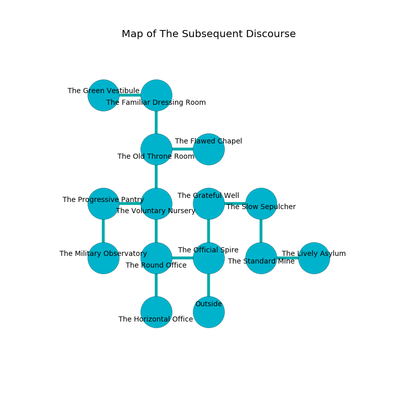

%Ruin Dogs

##The Subsequent Discourse
###Overview
The Subsequent Discourse is located under a haunted plain. Some rooms of The Subsequent Discourse are foggy. A blizzard is happening outside. It is occupied by Duergars. Ilana Richards The Superficial, a Cloud Giant is here. The Duergars have been charmed by Ilana Richards The Superficial. She  is founding a new religion. 

###Artifact
####Imefc

Imefc has the form of a cold meteorite. Cacophony flows away from it. It is a pale purple color. When smelled it makes its owner invisible. 

###Locations

####the official spire
The air smells like apple skin here. There are eight Duergars here. The mirrored walls are pristine. The Duergars are performing a ritual. If not interrupted, a powerful monster will be summoned. 

* To the west a narrow hallway leads to [the round office](#the-round-office).
* To the north a flooded pathway opens to [the grateful well](#the-grateful-well).
* To the south is the entrance.

####the grateful well
The floor is sticky. The glass walls are unsettled. Yellow moss is growing in a patch on the floor. The air smells like watercress here. 

* There is a dragon here.
* To the east a windy path connects to [the slow sepulcher](#the-slow-sepulcher).
* To the south a flooded pathway leads to [the official spire](#the-official-spire).

####the round office
The stone walls are pristine. There are eight Duergars here. The floor is glossy. The air smells like ammonia here. White razorgrass is sprouting in a patch on the floor. The Duergars are performing a ritual. If not interrupted, [Ilana Richards](#Ilana-Richards) will be magically alarmed. 

* To the east a narrow hallway leads to [the official spire](#the-official-spire).
* To the north a hazy cavern connects to [the voluntary nursery](#the-voluntary-nursery).
* To the south a hazy walkway connects to [the horizontal office](#the-horizontal-office).

####the horizontal office
The air tastes like cognac here. Green razorgrass is swaying from the ceiling. The floor is smooth. 

There is an engraving on the wall written in Duergars Script. 

> Dear me! pitiful fate
>
> offensive and impossible
>
> it is always straight
>
> fate is possible
>

* To the north a hazy walkway leads to [the round office](#the-round-office).

####the voluntary nursery
The metallic walls are ruined. There are eight Duergars here. The floor is cluttered with debris. If the Duergars notice the Ruin Dogs, one of them will retreat and alert the others. 

There is an engraving on the wall written in Duergars Script. 

> Maybe try cowering.
>

* There is a cart here.
* To the west a dark passageway leads to [the progressive pantry](#the-progressive-pantry).
* To the north a hazy path connects to [the old throne room](#the-old-throne-room).
* To the south a hazy cavern leads to [the round office](#the-round-office).

####the progressive pantry
There are a Barbed Devil, a Chimera, and a Giant Poisonous Snake here. The air tastes like narcissus here. Red ferns are decaying from the ceiling. 

There is an engraving on a stone written in common. 

> Oh my! dire we
>
> offensive and free
>
> ever present
>
> cruelty is unpleasant
>

* To the east a dark passageway connects to [the voluntary nursery](#the-voluntary-nursery).
* To the south a dark walkway leads to [the military observatory](#the-military-observatory).

####the slow sepulcher
Gray mushrooms are growing in broken urns. The air smells like fish here. 

* To the west a windy path opens to [the grateful well](#the-grateful-well).
* To the south a dripping artery opens to [the standard mine](#the-standard-mine).

####the military observatory
There are a Mud Mephit, a Raven, a Silver Dragon Wyrmling, a Couatl, a Hobgoblin, a Winged Kobold, and a Gladiator here. The air smells like acai here. 

There is an engraving on the floor written in common. 

> I want to find [Imefc](#Imefc).
>

* To the north a dark walkway connects to [the progressive pantry](#the-progressive-pantry).

####the old throne room
The concrete walls are ruined. 

* There is a seed here.
* To the east a narrow corridor opens to [the flawed chapel](#the-flawed-chapel).
* To the north a hazy artery connects to [the familiar dressing room](#the-familiar-dressing-room).
* To the south a hazy path opens to [the voluntary nursery](#the-voluntary-nursery).

####the standard mine
There are eight Duergars here. The brick walls are ruined. Gray ferns are decaying in broken urns. If the Duergars notice the Ruin Dogs, one of them will retreat and alert [Ilana Richards](#Ilana-Richards). 

* There is a whistle here.
* There is a key here.
* There is a hook here.
* [Ilana Richards The Superficial](#Ilana-Richards-The-Superficial) is here.
* To the east a long threshold connects to [the lively asylum](#the-lively-asylum).
* To the north a dripping artery opens to [the slow sepulcher](#the-slow-sepulcher).

####the flawed chapel
The concrete walls are covered in mold. 

* To the west a narrow corridor leads to [the old throne room](#the-old-throne-room).

####the lively asylum
The floor is sticky. 

* There is a net here.
* There is a board here.
* There is a sword here.
* There is a goblin here.
* To the west a long threshold opens to [the standard mine](#the-standard-mine).

####the familiar dressing room
The air tastes like white rose here. The floor is cluttered with broken glass. 

* There is a stick here.
* There is a diamond here.
* [Imefc](#Imefc) is here.
* To the west a small gap leads to [the green vestibule](#the-green-vestibule).
* To the south a hazy artery leads to [the old throne room](#the-old-throne-room).

####the green vestibule
The air tastes like fig here. White ferns are growing in broken urns. The concrete walls are caving in. 

* There is a basket here.
* To the east a small gap opens to [the familiar dressing room](#the-familiar-dressing-room).

