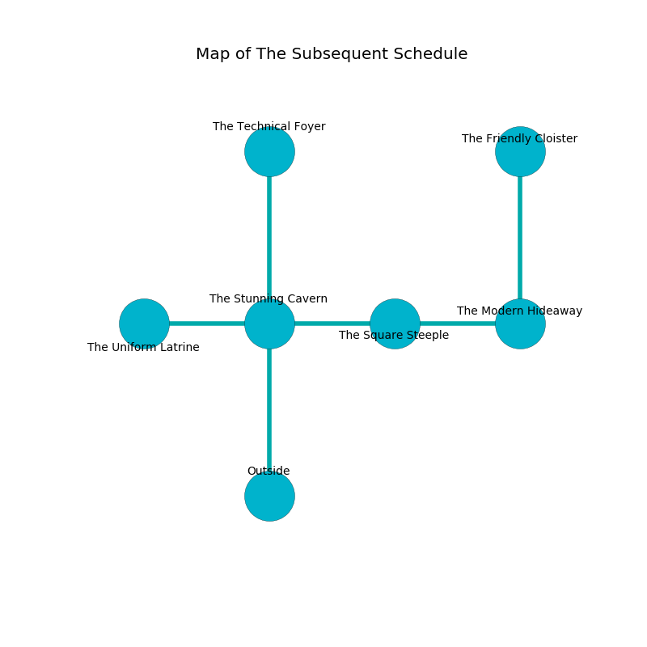

%Ruin Dogs

##The Subsequent Schedule
###Overview
The Subsequent Schedule is located under an obsidion city. Parts of it are inaccessible. A lunar eclipse is happening outside. It is occupied by Gnolls. Myesha Bryan The Pessimistic, a Cloud Giant is here. The Gnolls have been charmed by Myesha Bryan The Pessimistic. She  is founding a new religion. 

###Artifact
####Femha Bemogecdofaf

Femha Bemogecdofaf has the form of a sharp meteorite. It smells like oily. Psychic energy glows away from it. When worshipped it dissappears. 

###Locations

####the stunning cavern
The floor is cluttered with shells. There are a Winter Wolf, a Giant Crab, a Bugbear, an Earth Elemental, a Knight, and a Camel here. The air smells like neroli here. Yellow ferns are growing from the walls. 

There is an engraving on the ceiling written in Gnolls Script. 

> Oh meak god
>
> absolute, junior, odd
>
> yet never influential
>
> the world is residential
>

* To the west a twisted gap connects to [the uniform latrine](#the-uniform-latrine).
* To the east a torchlit opening opens to [the square steeple](#the-square-steeple).
* To the north a twisted path leads to [the technical foyer](#the-technical-foyer).
* To the south is the entrance.

####the technical foyer
The floor is cluttered with shells. Green mushrooms are sprouting in a patch on the floor. The air smells like acid here. 

There is an engraving on a monolith written in Gnolls Script. 

> I am seeking [Femha Bemogecdofaf](#Femha-Bemogecdofaf).
>
> Try giving up.
>

* There is a rowboat here.
* To the south a twisted path connects to [the stunning cavern](#the-stunning-cavern).

####the uniform latrine
The metallic walls are scratched. There are a Vampire Spawn, a Kuo-Toa, and a Mind Flayer here. There is a trap here. When activated, a magical rune will launch a hail of needles. The air smells like tequila here. 

* There is a trophy here.
* [Myesha Bryan The Pessimistic](#Myesha-Bryan-The-Pessimistic) is here.
* To the east a twisted gap connects to [the stunning cavern](#the-stunning-cavern).

####the square steeple
The floor is glossy. The air tastes like lemon here. There are a Riding Horse, a Ghoul, a Kenku, a Dire Wolf, a Scout, a Gnoll Pack Lord, a Bugbear Chief, a Kobold, and a Swarm of Poisonous Snakes here. 

* To the west a torchlit opening connects to [the stunning cavern](#the-stunning-cavern).
* To the east a flooded opening opens to [the modern hideaway](#the-modern-hideaway).

####the modern hideaway
The floor is cluttered with ashes. White moss is decaying in broken urns. The air smells like forest here. 

* [Femha Bemogecdofaf](#Femha-Bemogecdofaf) is here.
* To the west a flooded opening connects to [the square steeple](#the-square-steeple).
* To the north a dripping hallway opens to [the friendly cloister](#the-friendly-cloister).

####the friendly cloister
The air tastes like beeswax here. Blue razorgrass is decaying from the walls. 

There is an engraving on a monolith written in Gnolls Script. 

> O terrible soul
>
> always dramatic
>
> obscure, able, whole
>
> nothing is diplomatic
>

* To the south a dripping hallway connects to [the modern hideaway](#the-modern-hideaway).

