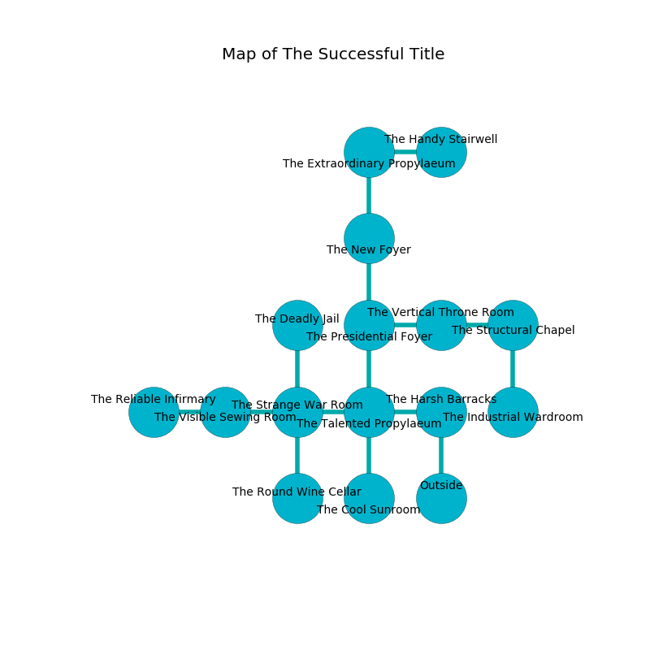

%Ruin Dogs

##The Successful Title
###Overview
The Successful Title is constructed on a volcanic rift. Regions of it are corrupted. The ruin is larger on the inside than the outside. It is occupied by Giants. Hortencia Eng The Possessive, a Cloud Giant is here. The Giants are the minions of Hortencia Eng The Possessive. She  is trying to hide [The Multiple Affair](#The-Multiple-Affair). 

###Artifact
####The Multiple Affair

The Multiple Affair has the form of a glassy doll. It smells like bay. When eaten it repels insects. 

###Locations

####the harsh barracks
The air smells like red rose here. The floor is smooth. The glass walls are unsettled. There is a Bone Devil here. 

* To the west a narrow gap opens to [the talented propylaeum](#the-talented-propylaeum).
* To the south is the entrance.

####the talented propylaeum
The crystal walls are ruined. The floor is cluttered with rocks. 

* To the west a long path opens to [the strange war Room](#the-strange-war-Room).
* To the east a narrow gap opens to [the harsh barracks](#the-harsh-barracks).
* To the north a flooded hallway leads to [the presidential foyer](#the-presidential-foyer).
* To the south a torchlit cave leads to [the cool sunroom](#the-cool-sunroom).

####the presidential foyer
There is a Cloud Giant here. The mirrored walls are bloodstained. The air tastes like orchid here. The floor is glossy. The Cloud Giant is performing a ritual. If not interrupted, a powerful monster will be summoned. 

There is an engraving on the wall written in common. 

> Oh my! the world is poor
>
> heavy, regular, secure
>
> intellectual, odd, ordinary
>
> the world is premature
>

* [Hortencia Eng The Possessive](#Hortencia-Eng-The-Possessive) is here.
* To the east a hazy hall leads to [the vertical throne room](#the-vertical-throne-room).
* To the north a flooded walkway leads to [the new foyer](#the-new-foyer).
* To the south a flooded hallway leads to [the talented propylaeum](#the-talented-propylaeum).

####the vertical throne room
The floor is glossy. White lichens are sprouting in a patch on the floor. There are a Hill Giant and a Cloud Giant here. The obsidion walls are caving in. The Giants are willing to fight to the death. 

* To the west a hazy hall leads to [the presidential foyer](#the-presidential-foyer).
* To the east a long threshold leads to [the structural chapel](#the-structural-chapel).

####the new foyer
The glass walls are scratched. The air tastes like nut flesh here. White ferns are decaying from the walls. 

* There is a rowboat here.
* To the north a windy artery opens to [the extraordinary propylaeum](#the-extraordinary-propylaeum).
* To the south a flooded walkway leads to [the presidential foyer](#the-presidential-foyer).

####the structural chapel
The air tastes like mold here. The crystal walls are bloodstained. 

* To the west a long threshold opens to [the vertical throne room](#the-vertical-throne-room).
* To the south a dark walkway leads to [the industrial wardroom](#the-industrial-wardroom).

####the strange war Room
Red ferns are decaying from the ceiling. The air smells like vetiver here. The floor is sticky. There are a Gnoll Fang of Yeenoghu, a Lamia, and a Tyrannosaurus Rex here. 

* To the west a torchlit walkway connects to [the visible sewing room](#the-visible-sewing-room).
* To the east a long path opens to [the talented propylaeum](#the-talented-propylaeum).
* To the north a narrow passageway opens to [the deadly jail](#the-deadly-jail).
* To the south a windy opening connects to [the round wine cellar](#the-round-wine-cellar).

####the cool sunroom
There are a Hill Giant and a Frost Giant here. The stone walls are caving in. The floor is glossy. The Giants are willing to fight to the death. 

There is an engraving on the floor written in Giants Script. 

> O the world is poor
>
> but secure
>
> aggressive, typical, resident
>
> everything is mature
>

* There is a wall here.
* To the north a torchlit cave leads to [the talented propylaeum](#the-talented-propylaeum).

####the deadly jail
There is a trap here. When activated, a tripwire will launch a fusillade of darts. The floor is smooth. 

There is an engraving on the wall written in Giants Script. 

> I could not try cowering.
>

* To the south a narrow passageway leads to [the strange war Room](#the-strange-war-Room).

####the industrial wardroom
Yellow razorgrass is sprouting from the walls. The stone walls are unsettled. 

There is an engraving on the wall written in Giants Script. 

> Try digging.
>

* To the north a dark walkway leads to [the structural chapel](#the-structural-chapel).

####the visible sewing room
Gray mushrooms are swaying in cracks in the floor. The glass walls are pristine. There are a Stone Giant and a Cloud Giant here. The Giants are willing to fight to the death. 

There is an engraving on a stone written in common. 

> I could not try jumping.
>

* To the west a flooded gap opens to [the reliable infirmary](#the-reliable-infirmary).
* To the east a torchlit walkway leads to [the strange war Room](#the-strange-war-Room).

####the round wine cellar
Yellow ferns are growing from the ceiling. There is a Fire Giant here. The Fire Giant is feasting. 

* To the north a windy opening connects to [the strange war Room](#the-strange-war-Room).

####the extraordinary propylaeum
The metallic walls are pristine. The air tastes like banana here. Gray ferns are sprouting from the ceiling. 

* [The Multiple Affair](#The-Multiple-Affair) is here.
* To the east a small hall leads to [the handy stairwell](#the-handy-stairwell).
* To the south a windy artery leads to [the new foyer](#the-new-foyer).

####the reliable infirmary
The air smells like deertongue here. The floor is cluttered with shells. The crystal walls are unsettled. Gray mushrooms are swaying from the ceiling. 

There is an engraving on a monolith written in Giants Script. 

> I thought about swimming.
>

* To the east a flooded gap opens to [the visible sewing room](#the-visible-sewing-room).

####the handy stairwell
The air tastes like chamomile here. The wooden walls are pristine. 

* To the west a small hall opens to [the extraordinary propylaeum](#the-extraordinary-propylaeum).

