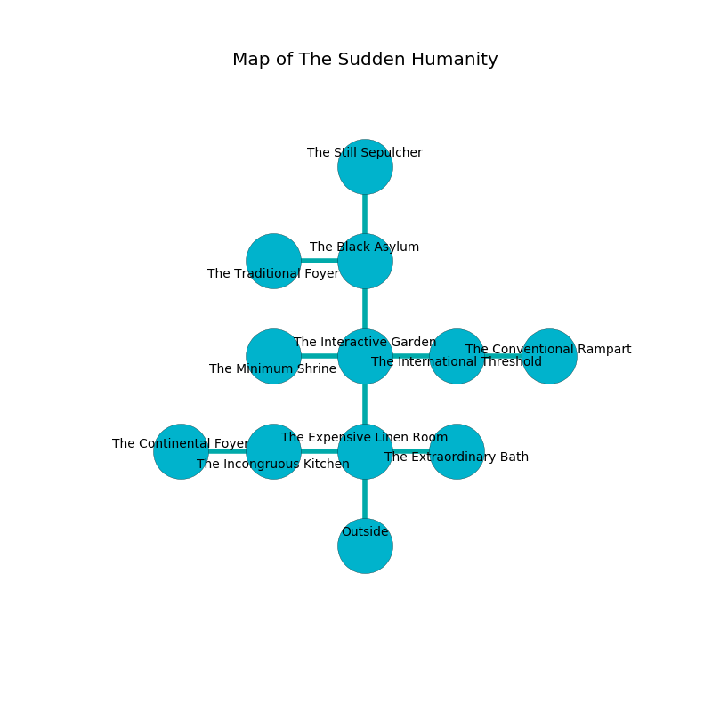

%Ruin Dogs

##The Sudden Humanity
###Overview
The Sudden Humanity is located under an alien mountain. Regions of The Sudden Humanity are cursed. A solar eclipse is happening outside. It is occupied by Ogres. Fernando Callaghan The Truculent, a Yuan-Ti Malison is here. The Ogres are ruled by Fernando Callaghan The Truculent. He  is trying to research [The Awkward Link](#The-Awkward-Link). 

###Artifact
####The Awkward Link

The Awkward Link looks like a transparent orb. It smells like radish. When worshipped it destroys others. 

###Locations

####the expensive linen room
White razorgrass is decaying in cracks in the floor. The floor is smooth. The air smells like coriander here. 

* To the west a long cavern opens to [the incongruous kitchen](#the-incongruous-kitchen).
* To the east a flooded passageway leads to [the extraordinary bath](#the-extraordinary-bath).
* To the north a torchlit hall opens to [the interactive garden](#the-interactive-garden).
* To the south is the entrance.

####the incongruous kitchen
There are a Yuan-Ti Malison and a Giant Centipede here. The air smells like cocoa here. The floor is sticky. 

* To the west a windy threshold opens to [the continental foyer](#the-continental-foyer).
* To the east a long cavern connects to [the expensive linen room](#the-expensive-linen-room).

####the interactive garden
There are two Half-Ogres and an Ogre here. Gray lichens are decaying from the ceiling. The Ogres are performing a ritual. If not interrupted, the Ogres will become more powerful. 

* To the west a small threshold leads to [the minimum shrine](#the-minimum-shrine).
* To the east a flooded path opens to [the international threshold](#the-international-threshold).
* To the north a torchlit cavern opens to [the black asylum](#the-black-asylum).
* To the south a torchlit hall connects to [the expensive linen room](#the-expensive-linen-room).

####the international threshold
The floor is bloodstained. The air smells like salt here. 

* [Fernando Callaghan The Truculent](#Fernando-Callaghan-The-Truculent) is here.
* To the west a flooded path opens to [the interactive garden](#the-interactive-garden).
* To the east a long opening connects to [the conventional rampart](#the-conventional-rampart).

####the extraordinary bath
The crystal walls are covered in mold. Green mushrooms are growing in broken urns. The air tastes like ginseng here. 

* To the west a flooded passageway connects to [the expensive linen room](#the-expensive-linen-room).

####the minimum shrine
The floor is bloodstained. There are a Quaggoth Spore Servant, a Quipper, a Displacer Beast, and a Panther here. The air tastes like castoreum here. 

There is an engraving on a tablet written in Ogres Script. 

> An eye is a colleague
>
> black and passive
>
> persistent and glad
>

* To the east a small threshold leads to [the interactive garden](#the-interactive-garden).

####the black asylum
There are a Half-Ogre and an Ogre here. White razorgrass is swaying in cracks in the floor. The floor is smooth. The Ogres are performing a ritual. If not interrupted, the Ogres will become more powerful. 

* There is a pot here.
* [The Awkward Link](#The-Awkward-Link) is here.
* To the west a dripping passageway leads to [the traditional foyer](#the-traditional-foyer).
* To the north a narrow hallway connects to [the still sepulcher](#the-still-sepulcher).
* To the south a torchlit cavern opens to [the interactive garden](#the-interactive-garden).

####the conventional rampart
There are a Half-Ogre and an Ogre here. The Ogres are willing to negotiate. 

There is an engraving on the floor written in Ogres Script. 

> A cow is an exhibition
>
> consistent, miserable, first
>

* To the west a long opening opens to [the international threshold](#the-international-threshold).

####the continental foyer
There are an Owlbear and a Rat here. The glass walls are bloodstained. Red lichens are swaying from the ceiling. 

* To the east a windy threshold connects to [the incongruous kitchen](#the-incongruous-kitchen).

####the still sepulcher
The floor is sticky. Yellow razorgrass is swaying from the ceiling. 

* To the south a narrow hallway opens to [the black asylum](#the-black-asylum).

####the traditional foyer
The metallic walls are scratched. The air smells like smoke here. The floor is smooth. Blue mushrooms are swaying in a patch on the floor. 

* To the east a dripping passageway connects to [the black asylum](#the-black-asylum).

