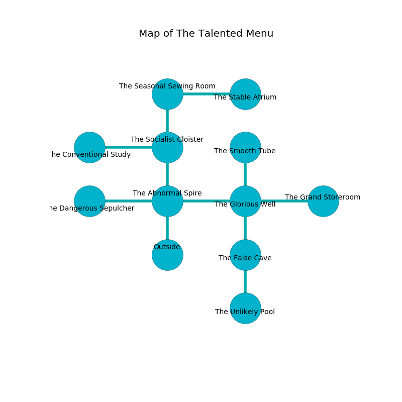

%Ruin Dogs

##The Talented Menu
###Overview
The Talented Menu is constructed on a cursed plain. Parts of The Talented Menu are somewhat hot. A massive storm is happening outside. It is occupied by Drows. Shera Coughlin The Weak-Willed, a Hobgoblin Warlord is here. The Drows worship Shera Coughlin The Weak-Willed. She  is founding a new religion. 

###Artifact
####The Parental Exercise

The Parental Exercise is a powerful artifact in the shape of a wet prism. Psychic energy pours from it. It smells like black tea. When worshipped it becomes lost. 

###Locations

####the abnormal spire
Yellow razorgrass is growing from the walls. The obsidion walls are ruined. 

* There is a ring here.
* To the west a twisted gap connects to [the dangerous sepulcher](#the-dangerous-sepulcher).
* To the east a narrow walkway leads to [the glorious well](#the-glorious-well).
* To the north a flooded hall opens to [the socialist cloister](#the-socialist-cloister).
* To the south is the entrance.

####the dangerous sepulcher
The floor is cluttered with rocks. 

* To the east a twisted gap connects to [the abnormal spire](#the-abnormal-spire).

####the glorious well
There are a Ghoul and a Werebear here. 

There is an engraving on a stone written in Drows Script. 

> I am worshipping The Talented Menu.
>

* There is a fork here.
* To the west a narrow walkway connects to [the abnormal spire](#the-abnormal-spire).
* To the east a windy artery connects to [the grand storeroom](#the-grand-storeroom).
* To the north a flooded gap leads to [the smooth tube](#the-smooth-tube).
* To the south a hazy path leads to [the false cave](#the-false-cave).

####the socialist cloister

* There is a horn here.
* There is a hat here.
* To the west a long hall connects to [the conventional study](#the-conventional-study).
* To the north a small hallway opens to [the seasonal sewing room](#the-seasonal-sewing-room).
* To the south a flooded hall opens to [the abnormal spire](#the-abnormal-spire).

####the conventional study
The glass walls are caving in. Red mushrooms are sprouting from the walls. 

* To the east a long hall connects to [the socialist cloister](#the-socialist-cloister).

####the seasonal sewing room
White lichens are swaying in broken urns. 

* [The Parental Exercise](#The-Parental-Exercise) is here.
* To the east a torchlit hallway connects to [the stable atrium](#the-stable-atrium).
* To the south a small hallway leads to [the socialist cloister](#the-socialist-cloister).

####the smooth tube
Blue moss is sprouting from the ceiling. 

* There is a head here.
* There is a basket here.
* There is a parcel here.
* To the south a flooded gap opens to [the glorious well](#the-glorious-well).

####the grand storeroom
The metallic walls are covered in mold. Gray ferns are decaying from the walls. The air smells like orangeflower here. There are a Mud Mephit, a Death Dog, a Blue Dragon Wyrmling, a Ghoul, an Awakened Shrub, and a Shambling Mound here. The floor is cluttered with ashes. 

There is an engraving on a monolith written in Drows Script. 

> I found this place.
>

* [Shera Coughlin The Weak-Willed](#Shera-Coughlin-The-Weak-Willed) is here.
* To the west a windy artery leads to [the glorious well](#the-glorious-well).

####the false cave
The floor is sticky. There are a Riding Horse, a Wolf, a Warhorse Skeleton, a Revenant, a Bearded Devil, a Giant Lizard, a Winged Kobold, and a Goblin Boss here. The metallic walls are ruined. 

There is an engraving on the wall written in Drows Script. 

> [The Parental Exercise](#The-Parental-Exercise)
>
> yet never cute
>

* To the north a hazy path opens to [the glorious well](#the-glorious-well).
* To the south a dark cave connects to [the unlikely pool](#the-unlikely-pool).

####the unlikely pool
White lichens are sprouting in a patch on the floor. The mirrored walls are ruined. 

There is an engraving on a monolith written in common. 

> [The Parental Exercise](#The-Parental-Exercise)
>
> always huge
>
> influential and fragrant
>
> [The Parental Exercise](#The-Parental-Exercise)
>
> outside, appropriate, ugly
>
> trivial, enthusiastic, junior
>
> [The Parental Exercise](#The-Parental-Exercise)
>

* To the north a dark cave opens to [the false cave](#the-false-cave).

####the stable atrium
There are two Stirges, a Giant Lizard, an Earth Elemental, a Druid, and  here. 

* To the west a torchlit hallway connects to [the seasonal sewing room](#the-seasonal-sewing-room).

