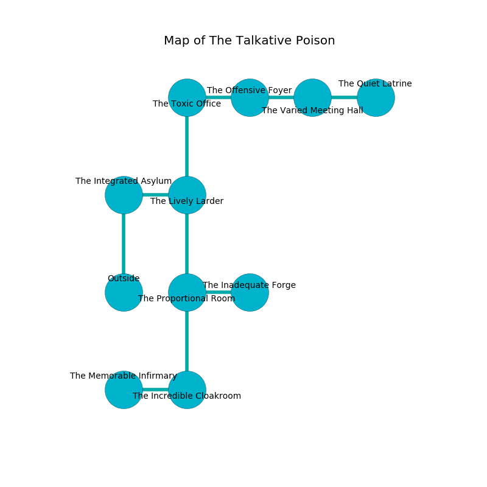

%Ruin Dogs

##The Talkative Poison
###Overview
The Talkative Poison is located in a flooded plain. Parts of it are inaccessible. The ruin is larger on the inside than the outside. It is occupied by Ogres. Brock Nicholas The Callous, a Hobgoblin Captain is here. The Ogres worship Brock Nicholas The Callous. He  is trying to use [Dfaiaelamd Cefaaf](#Dfaiaelamd-Cefaaf). 

###Artifact
####Dfaiaelamd Cefaaf

Dfaiaelamd Cefaaf looks like a sharp prism. Fire shifts from it. When gazed upon it curses all nearby. 

###Locations

####the integrated asylum
There are a Quasit and a Red Dragon Wyrmling here. The concrete walls are covered in mold. Gray razorgrass is decaying in broken urns. The floor is bloodstained. 

* [Brock Nicholas The Callous](#Brock-Nicholas-The-Callous) is here.
* To the east a narrow corridor leads to [the lively larder](#the-lively-larder).
* To the south is the entrance.

####the lively larder
The floor is glossy. The mirrored walls are pristine. The air smells like spearmint here. There are a Reef Shark, a Swarm of Quippers, and a Nightmare here. 

* To the west a narrow corridor leads to [the integrated asylum](#the-integrated-asylum).
* To the north a narrow cavern connects to [the toxic office](#the-toxic-office).
* To the south a dark cavern leads to [the proportional room](#the-proportional-room).

####the toxic office
The floor is cluttered with bones. 

* To the east a narrow threshold leads to [the offensive foyer](#the-offensive-foyer).
* To the south a narrow cavern opens to [the lively larder](#the-lively-larder).

####the proportional room
Gray lichens are swaying from the ceiling. There is a trap here. When activated, a magical rune will flood the room with water. There are an Orc War Chief and a Kobold here. 

* To the east a hazy artery connects to [the inadequate forge](#the-inadequate-forge).
* To the north a dark cavern leads to [the lively larder](#the-lively-larder).
* To the south a flooded walkway opens to [the incredible cloakroom](#the-incredible-cloakroom).

####the incredible cloakroom
The wooden walls are pristine. The floor is glossy. 

* To the west a dripping walkway leads to [the memorable infirmary](#the-memorable-infirmary).
* To the north a flooded walkway leads to [the proportional room](#the-proportional-room).

####the offensive foyer
There is a trap here. When activated, a pressure plate will launch a blade. Blue mushrooms are sprouting from the ceiling. 

There is an engraving on a monolith written in common. 

> I am starving.
>
> I thought about hiding.
>

* To the west a narrow threshold opens to [the toxic office](#the-toxic-office).
* To the east a small threshold leads to [the varied meeting hall](#the-varied-meeting-hall).

####the memorable infirmary
The air smells like elderberry here. The glass walls are pristine. 

* To the east a dripping walkway opens to [the incredible cloakroom](#the-incredible-cloakroom).

####the inadequate forge
The floor is smooth. The crystal walls are covered in mold. 

There is an engraving on a monolith written in Ogres Script. 

> I could not try fighting.
>

* To the west a hazy artery connects to [the proportional room](#the-proportional-room).

####the varied meeting hall
The air tastes like cumin here. 

* There is a bucket here.
* There is a pendant here.
* There is a head here.
* [Dfaiaelamd Cefaaf](#Dfaiaelamd-Cefaaf) is here.
* To the west a small threshold leads to [the offensive foyer](#the-offensive-foyer).
* To the east a twisted gap leads to [the quiet latrine](#the-quiet-latrine).

####the quiet latrine
The metallic walls are pristine. The air smells like toffee here. The floor is flooded with eight inch deep cold water. There are two Ogres here. Yellow mushrooms are decaying from the ceiling. The Ogres are willing to negotiate. 

* To the west a twisted gap opens to [the varied meeting hall](#the-varied-meeting-hall).

