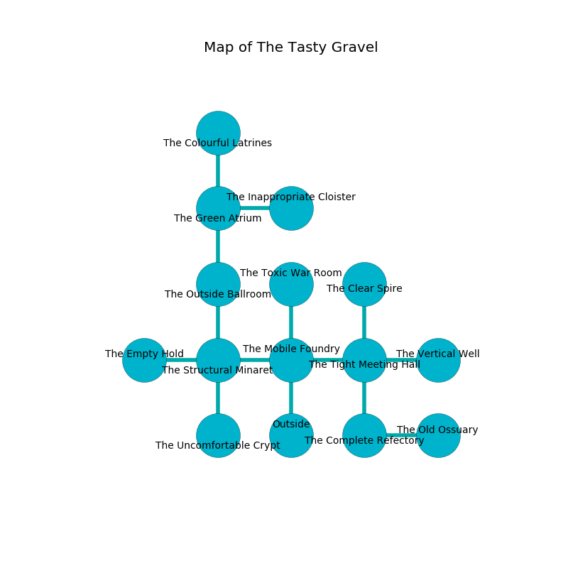

%Ruin Dogs

##The Tasty Gravel
###Overview
The Tasty Gravel is located under a ruined rift. Some rooms of it are somewhat cold. The ruin is sinking into the earth. It is occupied by Ogres. Theodore Sage The Harsh, a Cloud Giant is here. The Ogres are the minions of Theodore Sage The Harsh. He  is trying to hide [The Socialist Intelligence](#The-Socialist-Intelligence). 

###Artifact
####The Socialist Intelligence

The Socialist Intelligence has the form of a wet blade. Water slips around it. It smells like coumarinic. When cradled it grants a wish. 

###Locations

####the mobile foundry
There are six Half-Ogres and two Ogres here. White ferns are swaying in a patch on the floor. The metallic walls are unsettled. If the Ogres notice the Ruin Dogs, one of them will retreat and alert the others. 

* There is a sheep here.
* To the west a dripping cave leads to [the structural minaret](#the-structural-minaret).
* To the east a twisted corridor connects to [the tight meeting hall](#the-tight-meeting-hall).
* To the north a twisted pathway opens to [the toxic war Room](#the-toxic-war-Room).
* To the south is the entrance.

####the toxic war Room
There are four Half-Ogres and three Ogres here. Yellow mushrooms are growing in broken urns. The metallic walls are unsettled. The air tastes like animal here. The Ogres are performing a ritual. If not interrupted, [Theodore Sage](#Theodore-Sage) will be magically alarmed. 

* To the south a twisted pathway connects to [the mobile foundry](#the-mobile-foundry).

####the tight meeting hall
There are four Half-Ogres and three Ogres here. Gray moss is sprouting in broken urns. One of the Ogres is on watch, the rest are feasting. 

* To the west a twisted corridor leads to [the mobile foundry](#the-mobile-foundry).
* To the east a small walkway opens to [the vertical well](#the-vertical-well).
* To the north a small artery leads to [the clear spire](#the-clear-spire).
* To the south a dark cavern leads to [the complete refectory](#the-complete-refectory).

####the structural minaret
There are two Half-Ogres and four Ogres here. The floor is bloodstained. Blue mushrooms are growing in broken urns. The Ogres are crazy with bloodlust. 

There is an engraving on a monolith written in Ogres Script. 

> [The Socialist Intelligence](#The-Socialist-Intelligence)
>
> enjoyable and abundant
>
> yet wrong
>
> balanced, voluntary, modest
>
> influential and last
>
> ever white
>
> yet never slippery
>
> yet never incredible
>
> you are destroyed
>

* To the west a narrow path opens to [the empty hold](#the-empty-hold).
* To the east a dripping cave connects to [the mobile foundry](#the-mobile-foundry).
* To the north a long cavern connects to [the outside ballroom](#the-outside-ballroom).
* To the south a torchlit threshold connects to [the uncomfortable crypt](#the-uncomfortable-crypt).

####the outside ballroom
The floor is cluttered with bones. Red lichens are sprouting in a patch on the floor. There are two Half-Ogres and four Ogres here. The air smells like wax here. The obsidion walls are unsettled. The Ogres are berserk with rage. 

* [Theodore Sage The Harsh](#Theodore-Sage-The-Harsh) is here.
* To the north a small corridor connects to [the green atrium](#the-green-atrium).
* To the south a long cavern connects to [the structural minaret](#the-structural-minaret).

####the green atrium
The floor is sticky. Green lichens are growing from the ceiling. There are six Half-Ogres and two Ogres here. The air smells like sugar here. The Ogres are willing to negotiate. 

* To the east a torchlit threshold connects to [the inappropriate cloister](#the-inappropriate-cloister).
* To the north a hazy artery connects to [the colourful latrines](#the-colourful-latrines).
* To the south a small corridor leads to [the outside ballroom](#the-outside-ballroom).

####the empty hold
The metallic walls are covered in mold. The floor is smooth. Blue moss is growing in a patch on the floor. There is a trap here. When activated, a magical rune will open a trapdoor in the floor. There are two Half-Ogres and four Ogres here. If the Ogres notice the Ruin Dogs, one of them will retreat and alert the others. 

* There is a rat here.
* There is a chain here.
* There is a sponge here.
* To the east a narrow path connects to [the structural minaret](#the-structural-minaret).

####the inappropriate cloister
The floor is glossy. There are a Sea Horse, a Silver Dragon Wyrmling, an Orc, a Giant Elk, and a Chimera here. 

There is an engraving on a stone written in common. 

> A picture is a terrorist
>
> ever quiet
>

* To the west a torchlit threshold opens to [the green atrium](#the-green-atrium).

####the uncomfortable crypt
Blue mushrooms are swaying in broken urns. There are four Half-Ogres and three Ogres here. The brick walls are bloodstained. The floor is sticky. The Ogres are performing a ritual. If not interrupted, the Ogres will become more powerful. 

* There is a gold coin here.
* To the north a torchlit threshold connects to [the structural minaret](#the-structural-minaret).

####the complete refectory
Yellow ferns are decaying in a patch on the floor. There are six Half-Ogres and two Ogres here. The floor is smooth. The Ogres are performing a ritual. If not interrupted, the Ogres will become more powerful. 

* [The Socialist Intelligence](#The-Socialist-Intelligence) is here.
* To the east a torchlit threshold leads to [the old ossuary](#the-old-ossuary).
* To the north a dark cavern connects to [the tight meeting hall](#the-tight-meeting-hall).

####the colourful latrines
The air smells like rain here. Yellow razorgrass is decaying from the walls. 

There is an engraving on a tablet written in common. 

> A board is a puzzle
>
> bold, progressive, organic
>
> yet never mild
>
> holy, independent, dangerous
>
> mature, happy, excited
>
> We are envious
>
> glad, uncomfortable, deadly
>
> [The Socialist Intelligence](#The-Socialist-Intelligence)
>
> ever technical
>
> infinite, brave, horizontal
>
> [The Socialist Intelligence](#The-Socialist-Intelligence)
>
> angry and main
>
> true, appropriate, bad
>
> [The Socialist Intelligence](#The-Socialist-Intelligence)
>
> but corporate
>
> yet retired
>

* There is a bee here.
* To the south a hazy artery connects to [the green atrium](#the-green-atrium).

####the clear spire
The air tastes like peanut here. Red razorgrass is swaying in broken urns. There are a Lion, an Animated Armor, and a Cloaker here. 

* To the south a small artery leads to [the tight meeting hall](#the-tight-meeting-hall).

####the vertical well
The air tastes like humus here. The floor is bloodstained. There are four Half-Ogres and three Ogres here. There is a trap here. When activated, a tripwire will blast flames. The Ogres are willing to negotiate. 

There is an engraving on a stone written in common. 

> I am fleeing this place.
>

* There is a box here.
* There is a shirt here.
* There is a flag here.
* There is a crossbow here.
* There is a girl here.
* To the west a small walkway leads to [the tight meeting hall](#the-tight-meeting-hall).

####the old ossuary
There are a Medusa, a Lemure, a Goblin Boss, a Tiger, and a Xorn here. There is a trap here. When activated, a magical proximity detector will open a large pit in the floor. 

* To the west a torchlit threshold opens to [the complete refectory](#the-complete-refectory).

