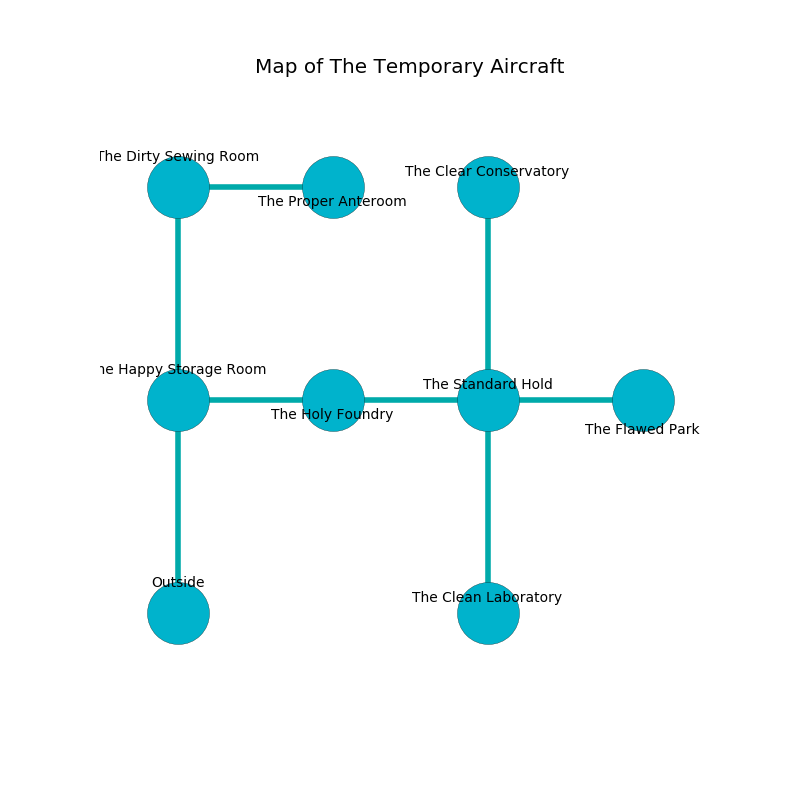

%Ruin Dogs

##The Temporary Aircraft
###Overview
The Temporary Aircraft is located on a spikey mountain. Parts of it are incredibly cold. A blizzard is happening outside. It is occupied by Thri-Kreens. Taylor Cheney The Secretive, a Knight is here. The Thri-Kreens are ruled by Taylor Cheney The Secretive. He  is trying to steal [The Low Assertion](#The-Low-Assertion). 

###Artifact
####The Low Assertion

The Low Assertion is a powerful artifact in the shape of an opaque prism. Magic slips around it. It smells like sausage. When touched it floats above the ground. 

###Locations

####the happy storage room
The floor is sticky. The mirrored walls are unsettled. There are a Slaad Tadpole, a Mud Mephit, and a Sahuagin Priestess here. The air smells like pineapple here. 

* To the east a long threshold leads to [the holy foundry](#the-holy-foundry).
* To the north a long corridor opens to [the dirty sewing room](#the-dirty-sewing-room).
* To the south is the entrance.

####the holy foundry
White razorgrass is sprouting in broken urns. The wooden walls are unsettled. 

* To the west a long threshold leads to [the happy storage room](#the-happy-storage-room).
* To the east a narrow cavern opens to [the standard hold](#the-standard-hold).

####the standard hold
The concrete walls are bloodstained. Green mushrooms are swaying in cracks in the floor. There are two Thri-Kreens here. The Thri-Kreens are defending this room from intruders. 

* To the west a narrow cavern opens to [the holy foundry](#the-holy-foundry).
* To the east a dark path connects to [the flawed park](#the-flawed-park).
* To the north a long pathway opens to [the clear conservatory](#the-clear-conservatory).
* To the south a narrow walkway connects to [the clean laboratory](#the-clean-laboratory).

####the clear conservatory
The wooden walls are pristine. Green moss is swaying in cracks in the floor. There are two Thri-Kreens here. The floor is glossy. The Thri-Kreens are feasting. 

* [Taylor Cheney The Secretive](#Taylor-Cheney-The-Secretive) is here.
* To the south a long pathway opens to [the standard hold](#the-standard-hold).

####the clean laboratory
There is a trap here. When activated, a magical sound detector will make the ceiling slowly lower. There are an Imp, a Giant Octopus, a Jackalwere, and a Pixie here. The crystal walls are scratched. The air tastes like carrot seed here. Red razorgrass is decaying from the ceiling. 

* There is a card here.
* To the north a narrow walkway connects to [the standard hold](#the-standard-hold).

####the dirty sewing room
The air tastes like brown sugar here. The floor is smooth. Red mushrooms are sprouting in a patch on the floor. 

There is an engraving on a monolith written in common. 

> Oh cruel you
>
> sophisticated, influential, flat
>
> responsible and new
>
> the world is fat
>

* [The Low Assertion](#The-Low-Assertion) is here.
* To the east a long path opens to [the proper anteroom](#the-proper-anteroom).
* To the south a long corridor opens to [the happy storage room](#the-happy-storage-room).

####the flawed park
The air smells like shellfish here. Green ferns are growing from the walls. The crystal walls are covered in mold. There are a Guard, a Warhorse, a Copper Dragon Wyrmling, a Draft Horse, and an Acolyte here. The floor is cluttered with ashes. 

* There is a church here.
* To the west a dark path opens to [the standard hold](#the-standard-hold).

####the proper anteroom
Green lichens are swaying from the ceiling. The brick walls are scratched. There are a Steam Mephit, an Orog, a Brass Dragon Wyrmling, and a Manes here. 

* To the west a long path leads to [the dirty sewing room](#the-dirty-sewing-room).

