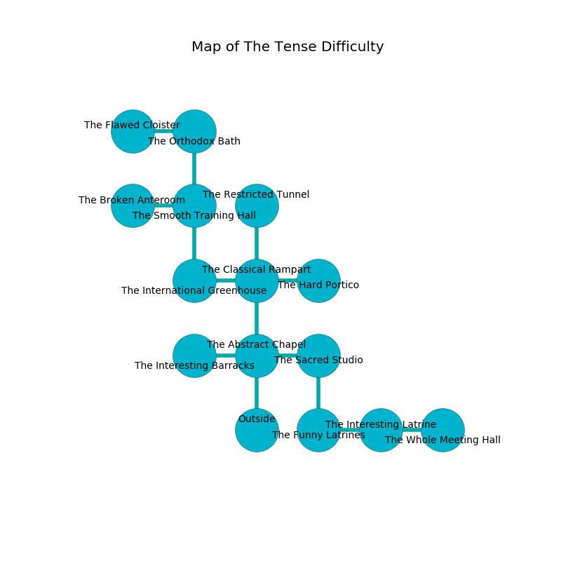

%Ruin Dogs

##The Tense Difficulty
###Overview
The Tense Difficulty is located under an alien rift. Some rooms of it are corrupted. A battle between raiders is happening outside. It is occupied by Orcs. Tommy Stanfield The Cruel, a Mage is here. The Orcs are ruled by Tommy Stanfield The Cruel. He  is founding a new religion. 

###Artifact
####Hemluiamaf

Hemluiamaf looks like a smooth orb. Air pours near it. It smells like tallow. It is a medium yellow color. When touched it illuminates its surroundings. 

###Locations

####the abstract chapel
The air smells like solvent here. There are a Stirge, a Wererat, a Mud Mephit, a Dust Mephit, a Nightmare, a Boar, a Poltergeist, and a Camel here. Green lichens are swaying from the ceiling. 

There is an engraving on the wall written in common. 

> Dear me! my life is poor
>
> thirsty and sick
>
> it is always secure
>
> life is thick
>

* To the west a dark corridor opens to [the interesting barracks](#the-interesting-barracks).
* To the east a torchlit artery connects to [the sacred studio](#the-sacred-studio).
* To the north a twisted artery connects to [the classical rampart](#the-classical-rampart).
* To the south is the entrance.

####the interesting barracks
There are a Kuo-Toa Monitor and a Flesh Golem here. The air tastes like pistachio here. 

* There is a card here.
* To the east a dark corridor opens to [the abstract chapel](#the-abstract-chapel).

####the sacred studio
There are an Orc War Chief and two Orc Eyes of Gruumsh here. The Orcs are crazy with bloodlust. 

* [Tommy Stanfield The Cruel](#Tommy-Stanfield-The-Cruel) is here.
* To the west a torchlit artery opens to [the abstract chapel](#the-abstract-chapel).
* To the south a narrow corridor opens to [the funny latrines](#the-funny-latrines).

####the funny latrines
Yellow razorgrass is swaying in broken urns. The floor is sticky. There are a Quipper, a Minotaur, a Gray Ooze, two Constrictor Snakes, a Bulette, and  here. 

* To the east a torchlit cave opens to [the interesting latrine](#the-interesting-latrine).
* To the north a narrow corridor leads to [the sacred studio](#the-sacred-studio).

####the classical rampart
Yellow ferns are growing in broken urns. There are an Orc War Chief and two Orc Eyes of Gruumsh here. The floor is sticky. The Orcs are performing a ritual. If not interrupted, [Tommy Stanfield](#Tommy-Stanfield) will be magically alarmed. 

* To the west a dripping cave connects to [the international greenhouse](#the-international-greenhouse).
* To the east a flooded hall connects to [the hard portico](#the-hard-portico).
* To the north a dripping path leads to [the restricted tunnel](#the-restricted-tunnel).
* To the south a twisted artery connects to [the abstract chapel](#the-abstract-chapel).

####the international greenhouse
Yellow moss is swaying in broken urns. The air smells like bay here. 

There is an engraving on the ceiling written in Orcs Script. 

> All of us are love
>
> objective, revolutionary, rational
>
> accurate, short, full
>
> yet molecular
>
> ever whole
>
> crude and intense
>
> you must never be eaten
>

* There is a skirt here.
* To the east a dripping cave connects to [the classical rampart](#the-classical-rampart).
* To the north a windy artery leads to [the smooth training hall](#the-smooth-training-hall).

####the hard portico
The air smells like white rose here. There is a Stone Giant here. White moss is decaying from the ceiling. The wooden walls are covered in mold. 

There is an engraving on a monolith written in common. 

> Hide here.
>

* To the west a flooded hall opens to [the classical rampart](#the-classical-rampart).

####the interesting latrine
There are two Orc War Chiefs and an Orc Eye of Gruumsh here. White mushrooms are swaying in broken urns. The air tastes like lovage here. One of the Orcs is on watch, the rest are drunk. 

* There is a nut here.
* To the west a torchlit cave opens to [the funny latrines](#the-funny-latrines).
* To the east a twisted path connects to [the whole meeting hall](#the-whole-meeting-hall).

####the smooth training hall
There are four Orc Eyes of Gruumsh here. The crystal walls are caving in. The floor is smooth. The air smells like malt here. The Orcs are performing a ritual. If not interrupted, [Tommy Stanfield](#Tommy-Stanfield) will be magically alarmed. 

There is an engraving on the wall written in Orcs Script. 

> Maybe try running.
>

* To the west a hazy passageway connects to [the broken anteroom](#the-broken-anteroom).
* To the north a narrow cavern connects to [the orthodox bath](#the-orthodox-bath).
* To the south a windy artery opens to [the international greenhouse](#the-international-greenhouse).

####the orthodox bath
The concrete walls are scratched. Blue moss is sprouting in a patch on the floor. 

* [Hemluiamaf](#Hemluiamaf) is here.
* To the west a twisted cavern connects to [the flawed cloister](#the-flawed-cloister).
* To the south a narrow cavern connects to [the smooth training hall](#the-smooth-training-hall).

####the restricted tunnel
Red mushrooms are swaying from the walls. 

* There is a cat here.
* To the south a dripping path leads to [the classical rampart](#the-classical-rampart).

####the broken anteroom
The air smells like mint here. Red ferns are swaying from the walls. The stone walls are pristine. The floor is cluttered with debris. 

* To the east a hazy passageway opens to [the smooth training hall](#the-smooth-training-hall).

####the whole meeting hall
There are two Orc War Chiefs and an Orc Eye of Gruumsh here. The Orcs are performing a ritual. If not interrupted, the Orcs will become more powerful. 

* To the west a twisted path leads to [the interesting latrine](#the-interesting-latrine).

####the flawed cloister
The wooden walls are scratched. There are a Pteranodon, a Fire Elemental, and a Night Hag here. The floor is sticky. 

* To the east a twisted cavern connects to [the orthodox bath](#the-orthodox-bath).

