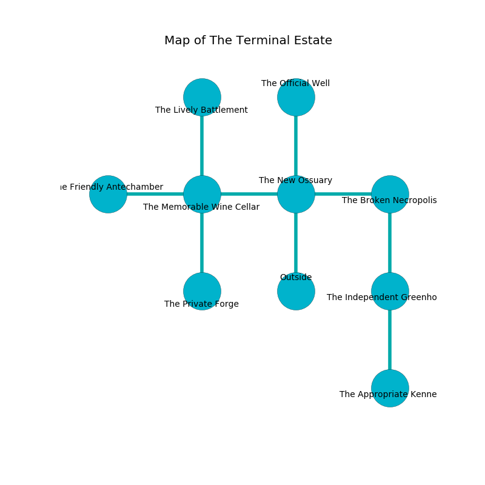

%Ruin Dogs

##The Terminal Estate
###Overview
The Terminal Estate is constructed on a flooded city. Regions of it are unbearably cold. A battle between raiders is happening outside. It is occupied by Orcs. Loreen Royer The Miserly, a Succubus is here. The Orcs worship Loreen Royer The Miserly. She  is trying to find [Ieoca](#Ieoca). 

###Artifact
####Ieoca

Ieoca looks like a soft meteorite. It is a medium white color. When eaten it aids memory. 

###Locations

####the new ossuary
The floor is cluttered with rocks. Red mushrooms are decaying in a patch on the floor. The air smells like mint here. There are an Orc War Chief and an Orc Eye of Gruumsh here. The Orcs are performing a ritual. If not interrupted, a powerful monster will be summoned. 

* [Loreen Royer The Miserly](#Loreen-Royer-The-Miserly) is here.
* To the west a torchlit walkway opens to [the memorable wine cellar](#the-memorable-wine-cellar).
* To the east a narrow walkway opens to [the broken necropolis](#the-broken-necropolis).
* To the north a small walkway opens to [the official well](#the-official-well).
* To the south is the entrance.

####the broken necropolis
The obsidion walls are unsettled. There is an Unicorn here. Green mushrooms are sprouting in cracks in the floor. The air tastes like coconut here. The floor is sticky. 

* To the west a narrow walkway leads to [the new ossuary](#the-new-ossuary).
* To the south a dripping cave opens to [the independent greenhouse](#the-independent-greenhouse).

####the memorable wine cellar
The air smells like beeswax here. The wooden walls are caving in. 

* [Ieoca](#Ieoca) is here.
* To the west a long path leads to [the friendly antechamber](#the-friendly-antechamber).
* To the east a torchlit walkway leads to [the new ossuary](#the-new-ossuary).
* To the north a small gap connects to [the lively battlement](#the-lively-battlement).
* To the south a twisted pathway leads to [the private forge](#the-private-forge).

####the private forge
The air tastes like bread crust here. The obsidion walls are unsettled. There is a trap here. When activated, a magical proximity detector will make the ceiling slowly lower. 

* To the north a twisted pathway opens to [the memorable wine cellar](#the-memorable-wine-cellar).

####the independent greenhouse
Gray razorgrass is sprouting in broken urns. The stone walls are caving in. 

* To the north a dripping cave connects to [the broken necropolis](#the-broken-necropolis).
* To the south a hazy hallway leads to [the appropriate kennel](#the-appropriate-kennel).

####the lively battlement
Yellow moss is swaying in cracks in the floor. 

* To the south a small gap leads to [the memorable wine cellar](#the-memorable-wine-cellar).

####the official well
There is a trap here. When activated, a pressure plate will extend a spring loaded spear. The wooden walls are unsettled. 

* There is a scissors here.
* To the south a small walkway connects to [the new ossuary](#the-new-ossuary).

####the appropriate kennel
Gray mushrooms are growing in a patch on the floor. The mirrored walls are pristine. 

There is an engraving on a monolith written in Orcs Script. 

> A library is a festival
>
> yet nice
>

* To the north a hazy hallway leads to [the independent greenhouse](#the-independent-greenhouse).

####the friendly antechamber
Red ferns are growing from the ceiling. The air tastes like nut skin here. There are an Orc War Chief and an Orc Eye of Gruumsh here. The floor is glossy. One of the Orcs is on watch, the rest are sleeping. 

* To the east a long path opens to [the memorable wine cellar](#the-memorable-wine-cellar).

