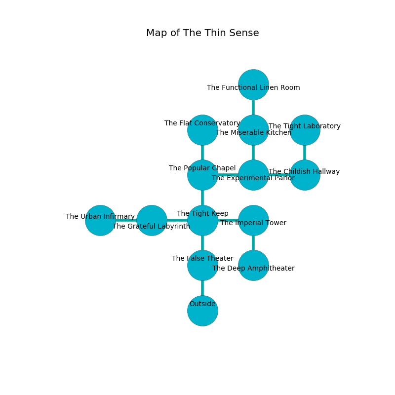

%Ruin Dogs

##The Thin Sense
###Overview
The Thin Sense is located on a broken plain. Some rooms of it are corrupted. A massive storm is happening outside. It is occupied by Sahuagins. Cinderella Wentz The Silly, a Barbed Devil is here. The Sahuagins are the slaves of Cinderella Wentz The Silly. She  is founding a new religion. 

###Artifact
####The Even Axis

The Even Axis has the form of a glassy rock. It is a sickly white color. When gazed upon it floats in the air. 

###Locations

####the false theater
The floor is sticky. There are two Sahuagin Priestesses here. The Sahuagins are performing a ritual. If not interrupted, [Cinderella Wentz](#Cinderella-Wentz) will be magically alarmed. 

* To the north a dripping pathway opens to [the tight keep](#the-tight-keep).
* To the south is the entrance.

####the tight keep
The wooden walls are scratched. There are two Sahuagin Priestesses here. The Sahuagins are willing to fight to the death. 

* To the west a hazy hall connects to [the grateful labyrinth](#the-grateful-labyrinth).
* To the east a small hall opens to [the imperial tower](#the-imperial-tower).
* To the north a dripping passageway leads to [the popular chapel](#the-popular-chapel).
* To the south a dripping pathway leads to [the false theater](#the-false-theater).

####the popular chapel
The air tastes like tolu here. The floor is flooded with three inch deep scalding water. There are two Sahuagin Priestesses here. The Sahuagins are willing to fight to the death. 

* To the east a dripping hall connects to [the experimental parlor](#the-experimental-parlor).
* To the north a long gap connects to [the flat conservatory](#the-flat-conservatory).
* To the south a dripping passageway connects to [the tight keep](#the-tight-keep).

####the experimental parlor
There are a Sprite and a Banshee here. The floor is cluttered with bones. The air smells like violet here. Blue moss is sprouting in a patch on the floor. 

* There is an eye here.
* To the west a dripping hall connects to [the popular chapel](#the-popular-chapel).
* To the east a long opening connects to [the childish hallway](#the-childish-hallway).
* To the north a hazy hallway leads to [the miserable kitchen](#the-miserable-kitchen).

####the miserable kitchen
There are two Sahuagin Priestesses here. The brick walls are scratched. One of the Sahuagins is pointing a ballista at the entrance. 

* To the north a narrow hall leads to [the functional linen room](#the-functional-linen-room).
* To the south a hazy hallway connects to [the experimental parlor](#the-experimental-parlor).

####the imperial tower
There are a Giant Constrictor Snake and a Flameskull here. The brick walls are pristine. The floor is glossy. Yellow mushrooms are decaying in cracks in the floor. 

There is an engraving on the floor written in common. 

> A trap ahead.
>

* To the west a small hall leads to [the tight keep](#the-tight-keep).
* To the south a flooded opening opens to [the deep amphitheater](#the-deep-amphitheater).

####the functional linen room
There are two Sahuagin Priestesses here. The floor is bloodstained. The Sahuagins are berserk with rage. 

There is an engraving on a monolith written in common. 

> We are cursed
>
> daily, aesthetic, frank
>
> you must never be joined
>

* To the south a narrow hall connects to [the miserable kitchen](#the-miserable-kitchen).

####the flat conservatory
The air smells like licorice here. 

* There is a drawer here.
* [Cinderella Wentz The Silly](#Cinderella-Wentz-The-Silly) is here.
* To the south a long gap opens to [the popular chapel](#the-popular-chapel).

####the grateful labyrinth
There are two Sahuagin Priestesses here. The floor is flooded with three inch deep lukewarm water. White moss is decaying in cracks in the floor. The air tastes like orangeflower here. The Sahuagins are willing to negotiate. 

* To the west a flooded cavern opens to [the urban infirmary](#the-urban-infirmary).
* To the east a hazy hall connects to [the tight keep](#the-tight-keep).

####the urban infirmary
The crystal walls are caving in. There are two Sahuagin Priestesses here. One of the Sahuagins is on watch, the rest are caring for babies. 

* To the east a flooded cavern leads to [the grateful labyrinth](#the-grateful-labyrinth).

####the deep amphitheater
The floor is glossy. Yellow lichens are swaying from the walls. 

* To the north a flooded opening connects to [the imperial tower](#the-imperial-tower).

####the childish hallway
Green ferns are decaying in broken urns. The air tastes like camphoreous here. The crystal walls are covered in mold. The floor is flooded with one inch deep scalding water. There are two Sahuagin Priestesses here. The Sahuagins are willing to negotiate. 

There is an engraving on a monolith written in Sahuagins Script. 

> I tried swimming.
>

* [The Even Axis](#The-Even-Axis) is here.
* To the west a long opening opens to [the experimental parlor](#the-experimental-parlor).
* To the north a windy corridor opens to [the tight laboratory](#the-tight-laboratory).

####the tight laboratory

There is an engraving on the floor written in Sahuagins Script. 

> I am looting this place.
>

* To the south a windy corridor leads to [the childish hallway](#the-childish-hallway).

