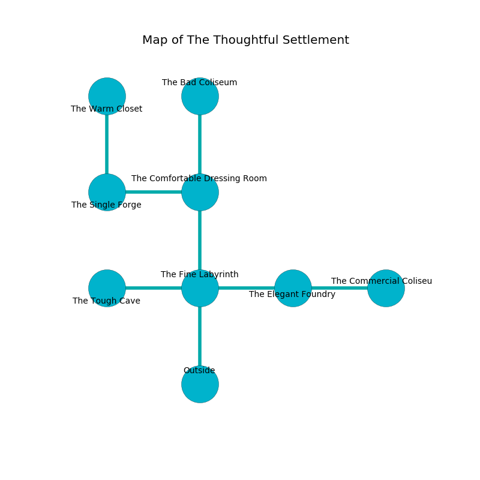

%Ruin Dogs

##The Thoughtful Settlement
###Overview
The Thoughtful Settlement is located in a haunted plain. Some rooms of The Thoughtful Settlement are inaccessible. A blizzard is happening outside. It is occupied by Gnolls. Tu Blankenship The Callous, a Fire Giant is here. The Gnolls are ruled by Tu Blankenship The Callous. She  is founding a new religion. 

###Artifact
####Dfecd

Dfecd is a powerful artifact in the shape of a warm sphere. It is a dark blue color. When worn it turns surrounding objects to ashes. 

###Locations

####the fine labyrinth
There are a Drider, an Orc Eye of Gruumsh, and an Ogre here. Red mushrooms are growing in a patch on the floor. The crystal walls are bloodstained. 

* There is a dragon here.
* To the west a narrow pathway connects to [the tough cave](#the-tough-cave).
* To the east a hazy hall leads to [the elegant foundry](#the-elegant-foundry).
* To the north a dripping opening opens to [the comfortable dressing room](#the-comfortable-dressing-room).
* To the south is the entrance.

####the comfortable dressing room
Green razorgrass is sprouting in cracks in the floor. 

* To the west a flooded hall opens to [the single forge](#the-single-forge).
* To the north a long cavern opens to [the bad coliseum](#the-bad-coliseum).
* To the south a dripping opening connects to [the fine labyrinth](#the-fine-labyrinth).

####the single forge
There are two Gnoll Fangs of Yeenoghu and a Gnoll Pack Lord here. Blue ferns are swaying from the walls. One of the Gnolls is on watch, the rest are fighting amongst themselves. 

* [Dfecd](#Dfecd) is here.
* To the east a flooded hall connects to [the comfortable dressing room](#the-comfortable-dressing-room).
* To the north a twisted threshold opens to [the warm closet](#the-warm-closet).

####the tough cave
The crystal walls are bloodstained. The air smells like carrot seed here. There are a Gnoll Fang of Yeenoghu, a Gnoll, three Gnoll Pack Lords,  here. The Gnolls are celebrating. 

There is an engraving on the ceiling written in common. 

> [Dfecd](#Dfecd)
>
> viable, encouraging, meaningful
>
> yet aesthetic
>
> satisfied, liquid, controversial
>

* To the east a narrow pathway connects to [the fine labyrinth](#the-fine-labyrinth).

####the elegant foundry
The obsidion walls are covered in mold. There are two Gnoll Fangs of Yeenoghu and two Gnoll Pack Lords here. The air tastes like macadamia here. The Gnolls are caring for babies. 

* There is a cart here.
* To the west a hazy hall leads to [the fine labyrinth](#the-fine-labyrinth).
* To the east a windy artery connects to [the commercial coliseum](#the-commercial-coliseum).

####the bad coliseum
There are a Banshee, a Silver Dragon Wyrmling, a Sea Hag, a Tridrone, a Guard, a Swarm of Insects, a Vampire Spawn, and a Piercer here. The floor is cluttered with debris. The air tastes like red currant here. 

There is an engraving on the floor written in common. 

> I tried praying.
>

* There is a brooch here.
* To the south a long cavern connects to [the comfortable dressing room](#the-comfortable-dressing-room).

####the commercial coliseum
Gray ferns are sprouting from the walls. 

There is an engraving on a stone written in common. 

> I lost [Dfecd](#Dfecd).
>
> Run away.
>

* [Tu Blankenship The Callous](#Tu-Blankenship-The-Callous) is here.
* To the west a windy artery connects to [the elegant foundry](#the-elegant-foundry).

####the warm closet
The glass walls are scratched. The floor is cluttered with rocks. 

* To the south a twisted threshold leads to [the single forge](#the-single-forge).

