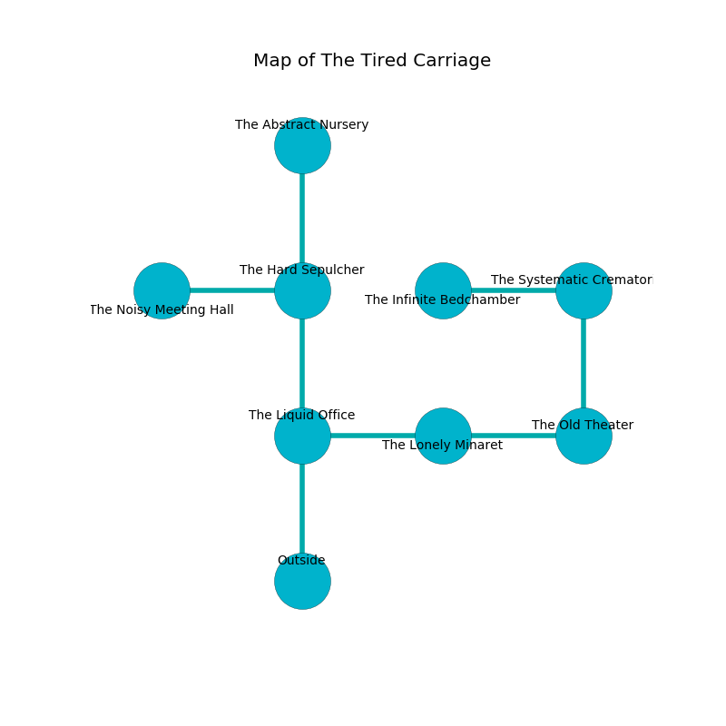

%Ruin Dogs

##The Tired Carriage
###Overview
The Tired Carriage is constructed on a ruined plain. Some areas of The Tired Carriage are flooded. The ruin is larger on the inside than the outside. It is occupied by Drows. Nathaniel Alonzo The Miserly, a Gnoll Fang of Yeenoghu is here. The Drows have been charmed by Nathaniel Alonzo The Miserly. He  is founding a new religion. 

###Artifact
####Aemuaidaeheduf Laeicfaebaemedaeum

Aemuaidaeheduf Laeicfaebaemedaeum has the form of a cold monument. Power flows towards it. It smells like roasted coffee. When picked up it curses all nearby. 

###Locations

####the liquid office
Blue razorgrass is swaying from the ceiling. The air tastes like feces here. There is a trap here. When activated, a magical sound detector will fire a net. 

* To the east a narrow hall leads to [the lonely minaret](#the-lonely-minaret).
* To the north a torchlit cave connects to [the hard sepulcher](#the-hard-sepulcher).
* To the south is the entrance.

####the lonely minaret
The crystal walls are scratched. The air smells like corn chip here. 

* To the west a narrow hall connects to [the liquid office](#the-liquid-office).
* To the east a long cavern connects to [the old theater](#the-old-theater).

####the old theater
The mirrored walls are ruined. 

There is an engraving on the wall written in common. 

> I am defending this place.
>

* To the west a long cavern leads to [the lonely minaret](#the-lonely-minaret).
* To the north a hazy opening leads to [the systematic crematorium](#the-systematic-crematorium).

####the hard sepulcher
The air tastes like sarsaparilla here. There are sixteen Drows here. Red razorgrass is swaying in a patch on the floor. The floor is smooth. The Drows are willing to negotiate. 

There is an engraving on the ceiling written in common. 

> I am afraid.
>
> I tried hiding.
>

* [Aemuaidaeheduf Laeicfaebaemedaeum](#Aemuaidaeheduf-Laeicfaebaemedaeum) is here.
* [Nathaniel Alonzo The Miserly](#Nathaniel-Alonzo-The-Miserly) is here.
* To the west a windy corridor connects to [the noisy meeting hall](#the-noisy-meeting-hall).
* To the north a flooded hall connects to [the abstract nursery](#the-abstract-nursery).
* To the south a torchlit cave leads to [the liquid office](#the-liquid-office).

####the abstract nursery
There is a trap here. When activated, a magical proximity detector will fire a net. The air smells like vinegar here. There are a Minotaur and an Orog here. 

* There is a hammer here.
* To the south a flooded hall leads to [the hard sepulcher](#the-hard-sepulcher).

####the systematic crematorium
Red lichens are sprouting from the ceiling. The air smells like sesame here. 

* To the west a torchlit hallway connects to [the infinite bedchamber](#the-infinite-bedchamber).
* To the south a hazy opening connects to [the old theater](#the-old-theater).

####the infinite bedchamber
The air tastes like mandarin here. There are a Green Hag and a Priest here. White lichens are growing from the walls. 

* There is a brooch here.
* To the east a torchlit hallway leads to [the systematic crematorium](#the-systematic-crematorium).

####the noisy meeting hall
Blue lichens are growing in broken urns. The floor is sticky. 

* To the east a windy corridor leads to [the hard sepulcher](#the-hard-sepulcher).

