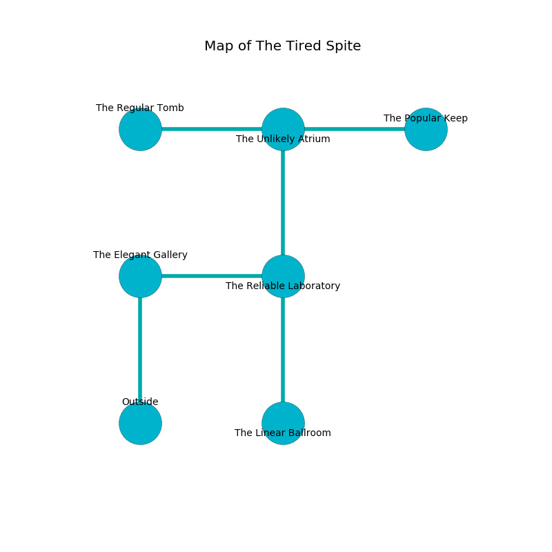

%Ruin Dogs

##The Tired Spite
###Overview
The Tired Spite is constructed on a spikey rift. Some areas of The Tired Spite are foggy. The ruin is flooding. It is occupied by Troglodytes. Darrick Stoner The Indiscreet, a Fire Giant is here. The Troglodytes have been charmed by Darrick Stoner The Indiscreet. He  is founding a new religion. 

###Artifact
####Damagaecaeefwi Huud

Damagaecaeefwi Huud has the form of a sharp monument. It smells like mushroom. Water flows towards it. When gazed upon it levitates surrounding objects. 

###Locations

####the elegant gallery
The crystal walls are scratched. The floor is bloodstained. 

* To the east a torchlit hall opens to [the reliable laboratory](#the-reliable-laboratory).
* To the south is the entrance.

####the reliable laboratory
The air tastes like custard here. There is a trap here. When activated, a magical proximity detector will launch a fusillade of darts. There are a Frog, an Orog, a Tyrannosaurus Rex, a Blood Hawk, and a Succubus here. The brick walls are bloodstained. 

* To the west a torchlit hall leads to [the elegant gallery](#the-elegant-gallery).
* To the north a long passageway leads to [the unlikely atrium](#the-unlikely-atrium).
* To the south a torchlit opening leads to [the linear ballroom](#the-linear-ballroom).

####the unlikely atrium
The air smells like anise here. There are a Myconid Sprout, a Giant Eagle, a Rust Monster, a Giant Frog, a Lizardfolk Shaman, an Awakened Shrub, and an Air Elemental here. 

There is an engraving on the ceiling written in Troglodytes Script. 

> I found [Damagaecaeefwi Huud](#Damagaecaeefwi-Huud).
>
> Try leaving.
>

* There is an imp here.
* [Damagaecaeefwi Huud](#Damagaecaeefwi-Huud) is here.
* To the west a narrow opening connects to [the regular tomb](#the-regular-tomb).
* To the east a long passageway leads to [the popular keep](#the-popular-keep).
* To the south a long passageway opens to [the reliable laboratory](#the-reliable-laboratory).

####the popular keep
The mirrored walls are scratched. There are a Hezrou and an Ankheg here. The air tastes like mimosa here. There is a trap here. When activated, a magical rune will launch a swinging block. 

* There is a key here.
* To the west a long passageway opens to [the unlikely atrium](#the-unlikely-atrium).

####the linear ballroom
There are thirty six Troglodytes here. The floor is flooded with two inch deep cold water. Green lichens are decaying from the ceiling. The stone walls are pristine. If the Troglodytes notice the Ruin Dogs, one of them will retreat and alert the others. 

* There is a spear here.
* [Darrick Stoner The Indiscreet](#Darrick-Stoner-The-Indiscreet) is here.
* To the north a torchlit opening connects to [the reliable laboratory](#the-reliable-laboratory).

####the regular tomb
There are thirty six Troglodytes here. One of the Troglodytes is working a mechanism that can open a trapodoor in the floor. 

* There is a skull here.
* To the east a narrow opening opens to [the unlikely atrium](#the-unlikely-atrium).

