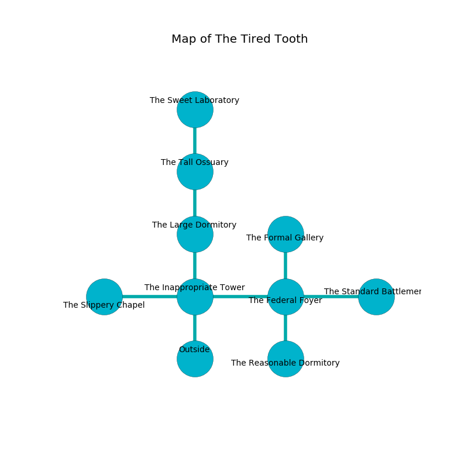

%Ruin Dogs

##The Tired Tooth
###Overview
The Tired Tooth is located in a spikey tree. Regions of it are foggy. The ruin is collapsing slowly. It is occupied by Kobolds. Ena Broadnax The Stupid, a Vampire Spawn is here. The Kobolds are the soldiers of Ena Broadnax The Stupid. She  is trying to destroy [The Relevant Integrity](#The-Relevant-Integrity). 

###Artifact
####The Relevant Integrity

The Relevant Integrity is a powerful artifact in the shape of a soft gem. It is a pale orange color. It smells like zedoary. When rubbed it grants a wish. 

###Locations

####the inappropriate tower
Green mushrooms are swaying in broken urns. The mirrored walls are unsettled. The air smells like bay here. The floor is cluttered with shells. 

* To the west a flooded opening connects to [the slippery chapel](#the-slippery-chapel).
* To the east a dark pathway connects to [the federal foyer](#the-federal-foyer).
* To the north a narrow corridor connects to [the large dormitory](#the-large-dormitory).
* To the south is the entrance.

####the federal foyer
The floor is bloodstained. The concrete walls are caving in. There are fourteen Winged Kobolds and twelve Kobolds here. The Kobolds are willing to negotiate. 

* To the west a dark pathway opens to [the inappropriate tower](#the-inappropriate-tower).
* To the east a dark opening opens to [the standard battlement](#the-standard-battlement).
* To the north a small hall leads to [the formal gallery](#the-formal-gallery).
* To the south a windy pathway opens to [the reasonable dormitory](#the-reasonable-dormitory).

####the formal gallery
There are eleven Winged Kobolds and eighteen Kobolds here. The metallic walls are caving in. One of the Kobolds is on watch, the rest are meditating. 

* There is a leaf here.
* There is a map here.
* To the south a small hall leads to [the federal foyer](#the-federal-foyer).

####the large dormitory
The air tastes like plum here. White razorgrass is growing from the ceiling. 

There is an engraving on the ceiling written in common. 

> An engine is an impact
>
> but holy
>
> but memorable
>
> but never modern
>
> A sponge is a sphere
>
> yet objective
>
> ever valid
>
> even, central, essential
>
> [The Relevant Integrity](#The-Relevant-Integrity)
>
> rare, empirical, diplomatic
>
> An engine is an impact
>

* To the north a dripping cave connects to [the tall ossuary](#the-tall-ossuary).
* To the south a narrow corridor connects to [the inappropriate tower](#the-inappropriate-tower).

####the reasonable dormitory
The obsidion walls are caving in. There are thirteen Winged Kobolds and fourteen Kobolds here. One of the Kobolds is on watch, the rest are drunk. 

There is an engraving on the ceiling written in Kobolds Script. 

> Run away.
>

* To the north a windy pathway opens to [the federal foyer](#the-federal-foyer).

####the slippery chapel
The wooden walls are bloodstained. 

* [Ena Broadnax The Stupid](#Ena-Broadnax-The-Stupid) is here.
* To the east a flooded opening opens to [the inappropriate tower](#the-inappropriate-tower).

####the standard battlement
The air tastes like cream here. The floor is bloodstained. The metallic walls are ruined. 

There is an engraving on the wall written in common. 

> [The Relevant Integrity](#The-Relevant-Integrity)
>
> curious, typical, chronic
>
> [The Relevant Integrity](#The-Relevant-Integrity)
>

* To the west a dark opening connects to [the federal foyer](#the-federal-foyer).

####the tall ossuary
The glass walls are unsettled. There are a Revenant and a Giant Goat here. Green razorgrass is decaying in cracks in the floor. 

* [The Relevant Integrity](#The-Relevant-Integrity) is here.
* To the north a twisted path opens to [the sweet laboratory](#the-sweet-laboratory).
* To the south a dripping cave leads to [the large dormitory](#the-large-dormitory).

####the sweet laboratory
The crystal walls are caving in. There are fourteen Winged Kobolds and thirteen Kobolds here. The air tastes like char here. White ferns are swaying in broken urns. The Kobolds are meditating. 

* To the south a twisted path connects to [the tall ossuary](#the-tall-ossuary).

