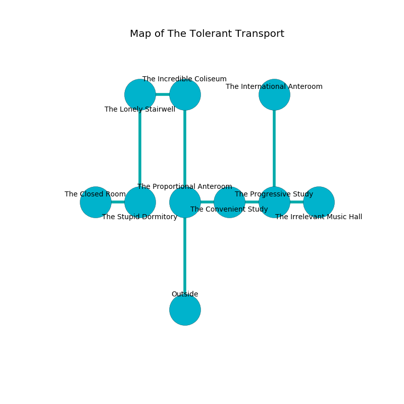

%Ruin Dogs

##The Tolerant Transport
###Overview
The Tolerant Transport is constructed on a volcanic rift. Some areas of The Tolerant Transport are foggy. A massive flood is happening outside. It is occupied by Githyanki. Charles Labelle The Rude, a Stone Giant is here. The Githyanki are ruled by Charles Labelle The Rude. He  is founding a new religion. 

###Artifact
####The Flawed Academy

The Flawed Academy is a powerful artifact in the shape of a glassy doll. When picked up it tunnels into the earth. 

###Locations

####the proportional anteroom
The air tastes like black currant here. White mushrooms are swaying from the walls. 

There is an engraving on a tablet written in common. 

> You are hidden
>
> even, deaf, exciting
>
> They are free
>
> grateful and liberal
>
> All of us are damned
>
> always present
>
> you must be eaten
>

* [Charles Labelle The Rude](#Charles-Labelle-The-Rude) is here.
* To the east a narrow cavern connects to [the convenient study](#the-convenient-study).
* To the north a twisted hall connects to [the incredible coliseum](#the-incredible-coliseum).
* To the south is the entrance.

####the incredible coliseum
The air smells like pepper here. 

* There is a heart here.
* To the west a twisted hallway leads to [the lonely stairwell](#the-lonely-stairwell).
* To the south a twisted hall connects to [the proportional anteroom](#the-proportional-anteroom).

####the lonely stairwell
The floor is sticky. Gray razorgrass is sprouting from the ceiling. The air tastes like bouillon here. There are two Githyanki Warriors here. One of the Githyanki is on watch, the rest are fighting amongst themselves. 

* There is a nut here.
* There is a goblin here.
* To the east a twisted hallway connects to [the incredible coliseum](#the-incredible-coliseum).
* To the south a twisted passageway opens to [the stupid dormitory](#the-stupid-dormitory).

####the convenient study
The stone walls are caving in. There are two Githyanki Warriors here. One of the Githyanki is working a mechanism that can flood the room. 

* To the west a narrow cavern connects to [the proportional anteroom](#the-proportional-anteroom).
* To the east a torchlit threshold opens to [the progressive study](#the-progressive-study).

####the stupid dormitory
The metallic walls are ruined. There are a Quaggoth and a Knight here. Yellow moss is sprouting from the walls. The air tastes like raw potato here. 

* To the west a hazy cavern connects to [the closed room](#the-closed-room).
* To the north a twisted passageway opens to [the lonely stairwell](#the-lonely-stairwell).

####the progressive study
There are a Giant Wolf Spider, a Giant Constrictor Snake, a Quaggoth, a Myconid Sovereign, and a Boar here. The wooden walls are unsettled. Blue mushrooms are sprouting in a patch on the floor. The floor is flooded with two inch deep cold water. The air smells like guava here. 

* There is a picture here.
* [The Flawed Academy](#The-Flawed-Academy) is here.
* To the west a torchlit threshold opens to [the convenient study](#the-convenient-study).
* To the east a small opening connects to [the irrelevant music hall](#the-irrelevant-music-hall).
* To the north a windy path opens to [the international anteroom](#the-international-anteroom).

####the irrelevant music hall
The air smells like marigold here. Blue lichens are decaying from the ceiling. The floor is glossy. 

There is an engraving on the ceiling written in common. 

> I am defending The Tolerant Transport.
>
> Leave now.
>

* There is a boat here.
* To the west a small opening leads to [the progressive study](#the-progressive-study).

####the closed room
The wooden walls are scratched. The floor is smooth. There are two Githyanki Warriors here. The Githyanki are crazy with bloodlust. 

* There is an arch here.
* There is a ring here.
* To the east a hazy cavern leads to [the stupid dormitory](#the-stupid-dormitory).

####the international anteroom
The concrete walls are bloodstained. 

There is an engraving on the ceiling written in common. 

> Try giving up.
>

* To the south a windy path connects to [the progressive study](#the-progressive-study).

