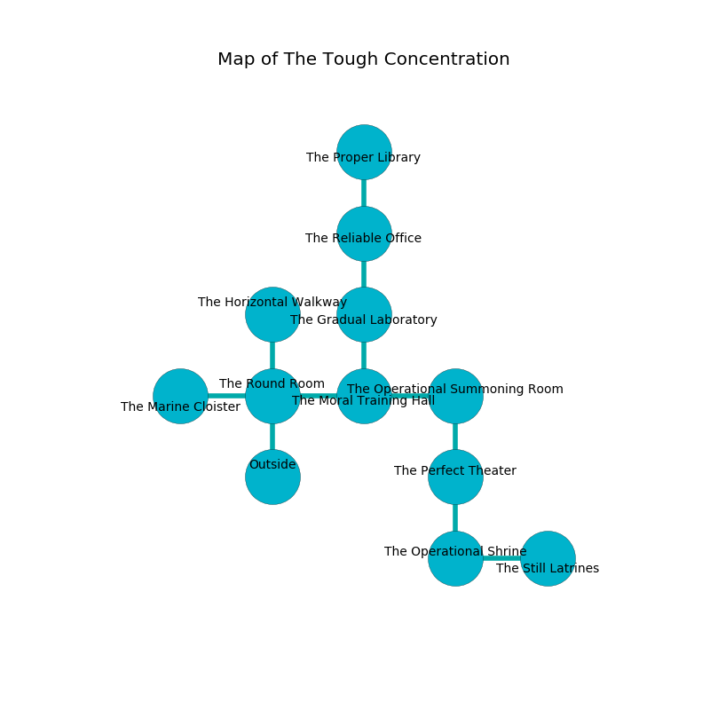

%Ruin Dogs

##The Tough Concentration
###Overview
The Tough Concentration is located in a flooded rift. Some areas of The Tough Concentration are corrupted. A windstorm is happening outside. It is occupied by Drows. Natalie Pressley The Changeable, a Cloud Giant is here. The Drows have been charmed by Natalie Pressley The Changeable. She  is trying to hide [Heda Cafabumwi](#Heda-Cafabumwi). 

###Artifact
####Heda Cafabumwi

Heda Cafabumwi has the form of a hard meteorite. It smells like feces. Magic flows away from it. When carried it tunnels into the earth. 

###Locations

####the round room

* To the west a torchlit walkway leads to [the marine cloister](#the-marine-cloister).
* To the east a small walkway leads to [the moral training hall](#the-moral-training-hall).
* To the north a windy artery connects to [the horizontal walkway](#the-horizontal-walkway).
* To the south is the entrance.

####the moral training hall
The floor is sticky. The crystal walls are bloodstained. There are thirty two Drows here. White razorgrass is sprouting in cracks in the floor. The Drows are performing a ritual. If not interrupted, the Drows will become more powerful. 

* To the west a small walkway opens to [the round room](#the-round-room).
* To the east a narrow opening opens to [the operational summoning room](#the-operational-summoning-room).
* To the north a long hall connects to [the gradual laboratory](#the-gradual-laboratory).

####the operational summoning room
There are a Darkmantle, an Invisible Stalker, and a Hobgoblin Captain here. Green ferns are swaying from the walls. The air tastes like cantaloupe here. 

* To the west a narrow opening connects to [the moral training hall](#the-moral-training-hall).
* To the south a long cave connects to [the perfect theater](#the-perfect-theater).

####the gradual laboratory
The glass walls are caving in. The air tastes like sausage here. The floor is cluttered with bones. 

There is an engraving on a stone written in common. 

> I lost [Heda Cafabumwi](#Heda-Cafabumwi).
>

* There is a dog here.
* To the north a dripping threshold leads to [the reliable office](#the-reliable-office).
* To the south a long hall leads to [the moral training hall](#the-moral-training-hall).

####the horizontal walkway
There are thirty two Drows here. Yellow ferns are swaying in a patch on the floor. The brick walls are unsettled. One of the Drows is on watch, the rest are caring for babies. 

* To the south a windy artery opens to [the round room](#the-round-room).

####the perfect theater
There are a Lion, an Earth Elemental, a Vampire Spawn, and a Worg here. The floor is cluttered with bones. 

* There is a key here.
* To the north a long cave connects to [the operational summoning room](#the-operational-summoning-room).
* To the south a windy pathway leads to [the operational shrine](#the-operational-shrine).

####the operational shrine
Yellow lichens are sprouting in broken urns. The floor is smooth. 

* [Heda Cafabumwi](#Heda-Cafabumwi) is here.
* To the east a long cave connects to [the still latrines](#the-still-latrines).
* To the north a windy pathway opens to [the perfect theater](#the-perfect-theater).

####the reliable office
There are a Blink Dog, a Flumph, a Giant Badger, a Beholder Zombie, and an Owlbear here. The air tastes like sulfur here. The crystal walls are ruined. 

* There is a carriage here.
* To the north a narrow pathway opens to [the proper library](#the-proper-library).
* To the south a dripping threshold opens to [the gradual laboratory](#the-gradual-laboratory).

####the proper library
The air tastes like umami here. 

There is an engraving on a stone written in common. 

> O cruel you
>
> optimistic, short, productive
>
> negative and new
>
> all is constructive
>

* There is a sponge here.
* To the south a narrow pathway connects to [the reliable office](#the-reliable-office).

####the marine cloister
Green lichens are sprouting in a patch on the floor. There is an Assassin here. 

There is an engraving on a monolith written in common. 

> Poor me! sorry we
>
> nervous and critical
>
> narrow and free
>
> all is political
>

* [Natalie Pressley The Changeable](#Natalie-Pressley-The-Changeable) is here.
* To the east a torchlit walkway leads to [the round room](#the-round-room).

####the still latrines
Gray moss is growing from the walls. There are thirty two Drows here. One of the Drows is on watch, the rest are drunk. 

* To the west a long cave leads to [the operational shrine](#the-operational-shrine).

