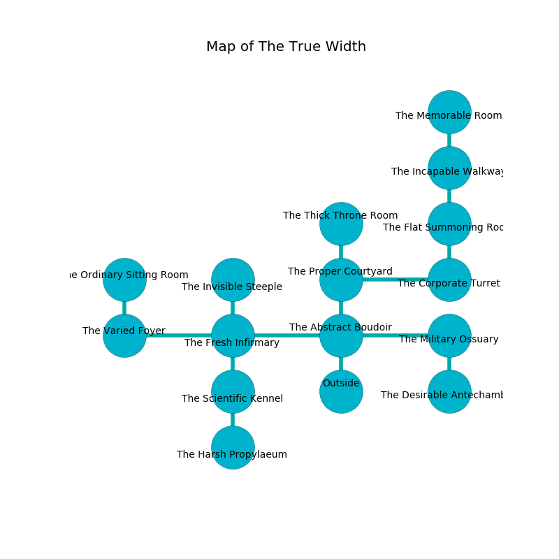

%Ruin Dogs

##The True Width
###Overview
The True Width is located on a haunted mountain. Some rooms of The True Width are foggy. The ruin is flooding. It is occupied by Pixies. Armida Cooper The Cynical, an Imp is here. The Pixies are the minions of Armida Cooper The Cynical. She  is founding a new religion. 

###Artifact
####Iaefl Geaefwi

Iaefl Geaefwi looks like a sharp crystal. It smells like frying. When held it grants power to its owner. 

###Locations

####the abstract boudoir
The air tastes like jasmin here. 

* There is a brake here.
* [Armida Cooper The Cynical](#Armida-Cooper-The-Cynical) is here.
* To the west a torchlit path leads to [the fresh infirmary](#the-fresh-infirmary).
* To the east a narrow opening opens to [the military ossuary](#the-military-ossuary).
* To the north a hazy hall opens to [the proper courtyard](#the-proper-courtyard).
* To the south is the entrance.

####the proper courtyard
White razorgrass is sprouting in a patch on the floor. The metallic walls are bloodstained. There are eight Pixies here. The floor is glossy. The Pixies are performing a ritual. If not interrupted, a powerful monster will be summoned. 

There is an engraving on the ceiling written in common. 

> Poor me! dire you
>
> excited and independent
>
> cruel, cooperative, new
>
> nothing is dependent
>

* To the east a windy gap leads to [the corporate turret](#the-corporate-turret).
* To the north a small corridor opens to [the thick throne room](#the-thick-throne-room).
* To the south a hazy hall connects to [the abstract boudoir](#the-abstract-boudoir).

####the fresh infirmary
The concrete walls are pristine. The floor is smooth. There are eight Pixies here. The Pixies are willing to negotiate. 

* To the west a dark hall opens to [the varied foyer](#the-varied-foyer).
* To the east a torchlit path leads to [the abstract boudoir](#the-abstract-boudoir).
* To the north a torchlit artery opens to [the invisible steeple](#the-invisible-steeple).
* To the south a torchlit hallway leads to [the scientific kennel](#the-scientific-kennel).

####the military ossuary
The concrete walls are caving in. The floor is sticky. The air tastes like foliage here. 

* To the west a narrow opening connects to [the abstract boudoir](#the-abstract-boudoir).
* To the south a twisted cave leads to [the desirable antechamber](#the-desirable-antechamber).

####the invisible steeple
The air tastes like black tea here. Green ferns are sprouting from the walls. 

* To the south a torchlit artery leads to [the fresh infirmary](#the-fresh-infirmary).

####the varied foyer
The air smells like pecan here. The floor is cluttered with debris. 

* To the east a dark hall connects to [the fresh infirmary](#the-fresh-infirmary).
* To the north a dripping cavern connects to [the ordinary sitting Room](#the-ordinary-sitting-Room).

####the scientific kennel
The air tastes like freesia here. The floor is smooth. 

* There is a ring here.
* To the north a torchlit hallway leads to [the fresh infirmary](#the-fresh-infirmary).
* To the south a small cavern connects to [the harsh propylaeum](#the-harsh-propylaeum).

####the corporate turret
The air tastes like tequila here. There are a Quipper and a Swarm of Poisonous Snakes here. The floor is flooded with four inch deep cold water. 

* To the west a windy gap connects to [the proper courtyard](#the-proper-courtyard).
* To the north a flooded pathway connects to [the flat summoning room](#the-flat-summoning-room).

####the ordinary sitting Room
The mirrored walls are ruined. The air smells like custard here. Green lichens are decaying in cracks in the floor. There are an Azer and a Kenku here. 

* To the south a dripping cavern connects to [the varied foyer](#the-varied-foyer).

####the flat summoning room
The floor is cluttered with rocks. There is a trap here. When activated, a pressure plate will launch a poison dart. 

* To the north a twisted opening opens to [the incapable walkway](#the-incapable-walkway).
* To the south a flooded pathway connects to [the corporate turret](#the-corporate-turret).

####the harsh propylaeum
There are eight Pixies here. White ferns are swaying in cracks in the floor. The crystal walls are unsettled. The air tastes like rose tea here. The Pixies are berserk with rage. 

* To the north a small cavern opens to [the scientific kennel](#the-scientific-kennel).

####the thick throne room
The air smells like curry here. There are eight Pixies here. The Pixies are meditating. 

* To the south a small corridor leads to [the proper courtyard](#the-proper-courtyard).

####the desirable antechamber
The wooden walls are unsettled. The floor is bloodstained. Green mushrooms are decaying in cracks in the floor. 

* To the north a twisted cave connects to [the military ossuary](#the-military-ossuary).

####the incapable walkway
There are eight Pixies here. The concrete walls are ruined. The air tastes like acorn here. The Pixies are caring for babies. 

* [Iaefl Geaefwi](#Iaefl-Geaefwi) is here.
* To the north a windy cavern connects to [the memorable room](#the-memorable-room).
* To the south a twisted opening connects to [the flat summoning room](#the-flat-summoning-room).

####the memorable room
The floor is smooth. The metallic walls are covered in mold. The air smells like saffron here. White razorgrass is growing from the walls. 

* There is a bell here.
* To the south a windy cavern leads to [the incapable walkway](#the-incapable-walkway).

