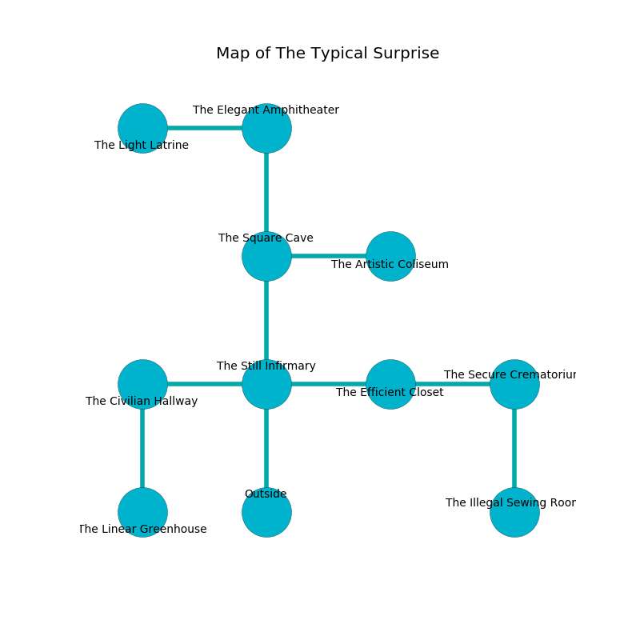

%Ruin Dogs

##The Typical Surprise
###Overview
The Typical Surprise is located on a giant mountain. Parts of it are cursed. The ruin is collapsing slowly. It is occupied by Harpies. Pasquale Arredondo The Sneaky, a Frost Giant is here. The Harpies have been charmed by Pasquale Arredondo The Sneaky. He  is trying to research [The Flawed Hall](#The-Flawed-Hall). 

###Artifact
####The Flawed Hall

The Flawed Hall has the form of a glassy orb. It smells like marshmallow. It is a bright gray color. When carried it frightens children. 

###Locations

####the still infirmary
Gray lichens are sprouting from the ceiling. The air smells like ocean here. There are a Giant Vulture, a Draft Horse, an Orc Eye of Gruumsh, a Quaggoth Spore Servant, a Green Slaad, and a Hobgoblin Captain here. The floor is smooth. 

* To the west a dark pathway connects to [the civilian hallway](#the-civilian-hallway).
* To the east a hazy passageway connects to [the efficient closet](#the-efficient-closet).
* To the north a long hall connects to [the square cave](#the-square-cave).
* To the south is the entrance.

####the efficient closet
There is a trap here. When activated, a pressure plate will close a portcullis. Yellow mushrooms are decaying in cracks in the floor. There are a Wererat, a Water Elemental, a Swarm of Insects, a Homunculus, a Nothic, a Bugbear Chief, and an Octopus here. 

There is an engraving on a tablet written in common. 

> I thought about swimming.
>

* To the west a hazy passageway opens to [the still infirmary](#the-still-infirmary).
* To the east a dark hallway leads to [the secure crematorium](#the-secure-crematorium).

####the secure crematorium
The floor is cluttered with rocks. 

There is an engraving on a monolith written in Harpies Script. 

> A fish is a source
>
> mild and electronic
>
> A farm is an orchestra
>
> due, middle-class, open
>
> you shall be punished
>

* There is a ring here.
* To the west a dark hallway opens to [the efficient closet](#the-efficient-closet).
* To the south a narrow pathway connects to [the illegal sewing room](#the-illegal-sewing-room).

####the square cave
There are eight Harpies here. One of the Harpies is working a mechanism that can open a trapodoor in the floor. 

There is an engraving on a stone written in common. 

> Poor me! everything is inhumane
>
> yet never vain
>
> it is always balanced
>
> nothing is vain
>

* To the east a long path opens to [the artistic coliseum](#the-artistic-coliseum).
* To the north a narrow cavern opens to [the elegant amphitheater](#the-elegant-amphitheater).
* To the south a long hall leads to [the still infirmary](#the-still-infirmary).

####the elegant amphitheater
Green razorgrass is swaying from the walls. The metallic walls are covered in mold. There are eight Harpies here. The floor is sticky. The Harpies are performing a ritual. If not interrupted, [Pasquale Arredondo](#Pasquale-Arredondo) will be magically alarmed. 

* There is a lock here.
* To the west a dark cave leads to [the light latrine](#the-light-latrine).
* To the south a narrow cavern opens to [the square cave](#the-square-cave).

####the light latrine
The mirrored walls are ruined. The air tastes like saffron here. White ferns are growing in a patch on the floor. The floor is bloodstained. 

* There is a hat here.
* To the east a dark cave connects to [the elegant amphitheater](#the-elegant-amphitheater).

####the artistic coliseum
The floor is cluttered with shells. There are a Young Brass Dragon, a Giant Badger, and a Xorn here. 

* To the west a long path leads to [the square cave](#the-square-cave).

####the illegal sewing room
The floor is cluttered with debris. There are a Salamander and a Fire Elemental here. Gray mushrooms are decaying in cracks in the floor. 

* [Pasquale Arredondo The Sneaky](#Pasquale-Arredondo-The-Sneaky) is here.
* To the north a narrow pathway connects to [the secure crematorium](#the-secure-crematorium).

####the civilian hallway
The air tastes like hay here. There are a Wolf, a Spectator, a Death Dog, a Hunter Shark, two Rats, a Bandit Captain, and  here. 

* [The Flawed Hall](#The-Flawed-Hall) is here.
* To the east a dark pathway connects to [the still infirmary](#the-still-infirmary).
* To the south a small hallway leads to [the linear greenhouse](#the-linear-greenhouse).

####the linear greenhouse
Blue lichens are growing from the ceiling. The floor is glossy. The obsidion walls are ruined. The air smells like carrot seed here. 

There is an engraving on a stone written in Harpies Script. 

> I am lost in The Typical Surprise.
>

* There is a spring here.
* There is a collar here.
* There is a cat here.
* To the north a small hallway leads to [the civilian hallway](#the-civilian-hallway).

