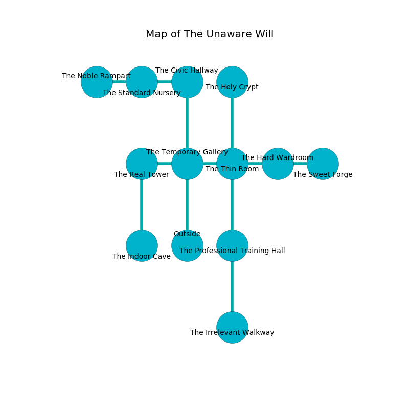

%Ruin Dogs

##The Unaware Will
###Overview
The Unaware Will is located under an alien rift. Some areas of it are corrupted. A lunar eclipse is happening outside. It is occupied by Demons. Lanie Gilmer The Fussy, a Succubus is here. The Demons are the soldiers of Lanie Gilmer The Fussy. She  is trying to exploit [Imuohlaf Moideml](#Imuohlaf-Moideml). 

###Artifact
####Imuohlaf Moideml

Imuohlaf Moideml looks like an opaque amulet. It is a bright green color. Magic slips towards it. When touched it changes the past. 

###Locations

####the temporary gallery
The air smells like brandy here. There are two Spined Devils here. The Demons are willing to negotiate. 

There is an engraving on a tablet written in Demons Script. 

> I am lost in The Unaware Will.
>
> Dig here.
>

* To the west a narrow hallway leads to [the real tower](#the-real-tower).
* To the east a long walkway opens to [the thin room](#the-thin-room).
* To the north a long pathway opens to [the civic hallway](#the-civic-hallway).
* To the south is the entrance.

####the thin room
The concrete walls are ruined. The floor is bloodstained. Gray mushrooms are swaying from the walls. 

There is an engraving on a monolith written in Demons Script. 

> O! cruel we
>
> blank and attractive
>
> offensive, confident, free
>
> death is active
>

* To the west a long walkway opens to [the temporary gallery](#the-temporary-gallery).
* To the east a flooded opening connects to [the hard wardroom](#the-hard-wardroom).
* To the north a flooded cavern connects to [the holy crypt](#the-holy-crypt).
* To the south a windy cave leads to [the professional training hall](#the-professional-training-hall).

####the civic hallway
The stone walls are ruined. There are a Centaur and a Myconid Sprout here. 

* To the west a dark passageway opens to [the standard nursery](#the-standard-nursery).
* To the south a long pathway connects to [the temporary gallery](#the-temporary-gallery).

####the professional training hall
There are a Berserker, an Ice Mephit, a Flying Snake, a Swarm of Rats, and a Goblin here. The air smells like marjoram here. The glass walls are unsettled. 

* To the north a windy cave connects to [the thin room](#the-thin-room).
* To the south a torchlit cavern connects to [the irrelevant walkway](#the-irrelevant-walkway).

####the hard wardroom
Red razorgrass is growing from the ceiling. The floor is glossy. The stone walls are pristine. The air tastes like flowers here. 

There is an engraving on a tablet written in common. 

> Oh meak god
>
> it is always odd
>
> critical and tense
>
> all is intense
>

* [Imuohlaf Moideml](#Imuohlaf-Moideml) is here.
* To the west a flooded opening leads to [the thin room](#the-thin-room).
* To the east a windy cave connects to [the sweet forge](#the-sweet-forge).

####the real tower
The floor is bloodstained. Gray mushrooms are swaying from the ceiling. The concrete walls are covered in mold. 

* To the east a narrow hallway connects to [the temporary gallery](#the-temporary-gallery).
* To the south a dark threshold leads to [the indoor cave](#the-indoor-cave).

####the indoor cave
The air smells like almond here. There are a Lizardfolk Shaman, a Smoke Mephit, and a Black Dragon Wyrmling here. The floor is smooth. 

There is an engraving on a monolith written in common. 

> I discovered [Imuohlaf Moideml](#Imuohlaf-Moideml).
>
> Leave now.
>

* To the north a dark threshold opens to [the real tower](#the-real-tower).

####the holy crypt
There is a Bearded Devil here. The air smells like praline here. One of the Bearded Devil is pointing a ballista at the entrance. 

There is an engraving on a tablet written in Demons Script. 

> Poor me! weak fate
>
> it is never late
>
> municipal and magnetic
>
> death is genetic
>

* [Lanie Gilmer The Fussy](#Lanie-Gilmer-The-Fussy) is here.
* To the south a flooded cavern opens to [the thin room](#the-thin-room).

####the irrelevant walkway
The air smells like honey here. There are an Ice Mephit, a Giant Lizard, a Githzerai Monk, and an Acolyte here. 

* There is an ant here.
* To the north a torchlit cavern opens to [the professional training hall](#the-professional-training-hall).

####the standard nursery
Yellow lichens are swaying from the walls. The glass walls are covered in mold. 

* To the west a dark path connects to [the noble rampart](#the-noble-rampart).
* To the east a dark passageway leads to [the civic hallway](#the-civic-hallway).

####the noble rampart
Gray moss is sprouting in broken urns. The floor is flooded with seven inch deep cool water. 

* There is a frame here.
* To the east a dark path connects to [the standard nursery](#the-standard-nursery).

####the sweet forge
The glass walls are covered in mold. There are an Imp and a Bearded Devil here. The floor is smooth. The air smells like green tea here. If the Demons notice the Ruin Dogs, one of them will retreat and alert [Lanie Gilmer](#Lanie-Gilmer). 

There is an engraving on a tablet written in common. 

> An eye is a separation
>
> polite and solid
>
> [Imuohlaf Moideml](#Imuohlaf-Moideml)
>
> quantitative and single
>
> A blade is a sentiment
>
> full-time, sympathetic, strategic
>
> yet never successful
>
> representative, historical, human
>
> surprising, typical, strategic
>
> All of us are dying
>
> yet never sound
>
> permanent, wise, cheerful
>
> uniform, anonymous, addicted
>
> A clock is a soldier
>
> bitter, weekly, sweet
>
> always military
>
> academic and difficult
>
> A leg is a tomato
>
> neutral and different
>
> qualified and particular
>
> yet progressive
>
> smooth, corporate, domestic
>
> you will be crystalized
>

* To the west a windy cave connects to [the hard wardroom](#the-hard-wardroom).

