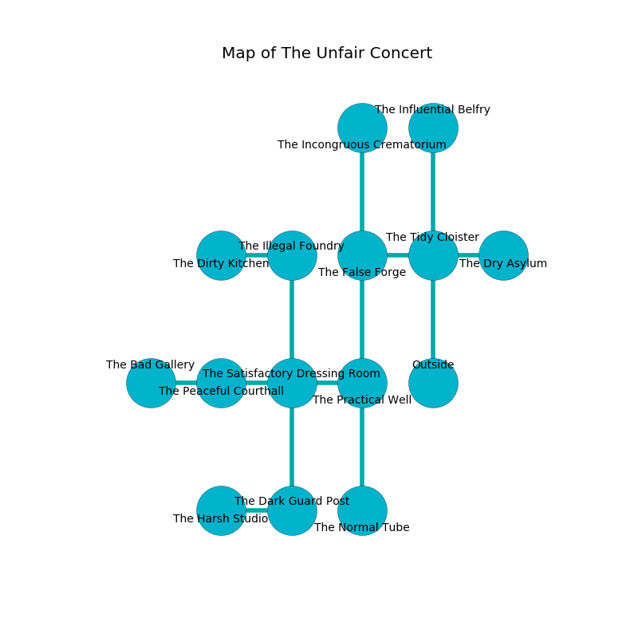

%Ruin Dogs

##The Unfair Concert
###Overview
The Unfair Concert is located on a flooded rift. Some rooms of it are frozen. The ruin is sinking into the earth. It is occupied by Giants. Leann Jeffery The Unreliable, a Mind Flayer Arcanist is here. The Giants are the soldiers of Leann Jeffery The Unreliable. She  is founding a new religion. 

###Artifact
####Iaaedmaf

Iaaedmaf is a powerful artifact in the shape of a glassy amulet. Light glows from it. It is a dark gray color. When thrown it destroys itself. 

###Locations

####the tidy cloister
The floor is bloodstained. Red lichens are growing in a patch on the floor. 

* There is a hat here.
* To the west a dripping artery connects to [the false forge](#the-false-forge).
* To the east a hazy artery leads to [the dry asylum](#the-dry-asylum).
* To the north a torchlit opening leads to [the influential belfry](#the-influential-belfry).
* To the south is the entrance.

####the false forge
Gray moss is decaying in broken urns. There are a Hydra and a Barlgura here. 

* [Iaaedmaf](#Iaaedmaf) is here.
* To the east a dripping artery leads to [the tidy cloister](#the-tidy-cloister).
* To the north a flooded pathway opens to [the incongruous crematorium](#the-incongruous-crematorium).
* To the south a long cave connects to [the practical well](#the-practical-well).

####the dry asylum
Blue ferns are swaying from the ceiling. 

* There is a snake here.
* To the west a hazy artery leads to [the tidy cloister](#the-tidy-cloister).

####the practical well
The floor is sticky. The brick walls are bloodstained. 

* There is an ant here.
* To the west a windy walkway leads to [the satisfactory dressing room](#the-satisfactory-dressing-room).
* To the north a long cave connects to [the false forge](#the-false-forge).
* To the south a dark gap opens to [the normal tube](#the-normal-tube).

####the satisfactory dressing room
The brick walls are caving in. The floor is flooded with eight inch deep lukewarm water. 

* There is a cake here.
* To the west a dripping walkway opens to [the peaceful courthall](#the-peaceful-courthall).
* To the east a windy walkway leads to [the practical well](#the-practical-well).
* To the north a dark passageway connects to [the illegal foundry](#the-illegal-foundry).
* To the south a twisted pathway connects to [the dark guard post](#the-dark-guard-post).

####the peaceful courthall

There is an engraving on a monolith written in common. 

> Maybe try digging.
>

* To the west a long cavern leads to [the bad gallery](#the-bad-gallery).
* To the east a dripping walkway opens to [the satisfactory dressing room](#the-satisfactory-dressing-room).

####the influential belfry
The floor is smooth. The air smells like corn chip here. Green ferns are growing in broken urns. The stone walls are bloodstained. 

There is an engraving on the ceiling written in common. 

> Oh pitiful we
>
> but never free
>
> immune and obscure
>
> sadness is pure
>

* [Leann Jeffery The Unreliable](#Leann-Jeffery-The-Unreliable) is here.
* To the south a torchlit opening connects to [the tidy cloister](#the-tidy-cloister).

####the normal tube
Green razorgrass is sprouting from the walls. 

There is an engraving on the wall written in common. 

> I am lost.
>
> Dig here.
>

* To the north a dark gap leads to [the practical well](#the-practical-well).

####the illegal foundry
The obsidion walls are scratched. There are a Minotaur, an Elephant, and a Chasme here. There is a trap here. When activated, a pressure plate will launch a poison needle. 

* To the west a torchlit hall connects to [the dirty kitchen](#the-dirty-kitchen).
* To the south a dark passageway leads to [the satisfactory dressing room](#the-satisfactory-dressing-room).

####the bad gallery
Blue moss is decaying from the walls. The brick walls are bloodstained. There are a Hill Giant and a Frost Giant here. The Giants are willing to negotiate. 

* To the east a long cavern opens to [the peaceful courthall](#the-peaceful-courthall).

####the dirty kitchen
The obsidion walls are unsettled. The air tastes like foliage here. 

* To the east a torchlit hall opens to [the illegal foundry](#the-illegal-foundry).

####the dark guard post
The air smells like raspberry here. There is a Frost Giant here. The glass walls are unsettled. The floor is glossy. One of the Frost Giant is on watch, the rest are caring for babies. 

* To the west a flooded hallway leads to [the harsh studio](#the-harsh-studio).
* To the north a twisted pathway opens to [the satisfactory dressing room](#the-satisfactory-dressing-room).

####the harsh studio
There is a Frost Giant here. The brick walls are ruined. One of the Frost Giant is on watch, the rest are fighting amongst themselves. 

There is an engraving on a stone written in Giants Script. 

> O! the world is sadistic
>
> usual, native, artistic
>
> it is always parental
>
> fate is experimental
>

* To the east a flooded hallway connects to [the dark guard post](#the-dark-guard-post).

####the incongruous crematorium
There are two Stone Giants here. There is a trap here. When activated, a magical sound detector will fire a scything blade. The air tastes like almond here. Yellow lichens are swaying in broken urns. The Giants are celebrating. 

* There is a belt here.
* To the south a flooded pathway opens to [the false forge](#the-false-forge).

