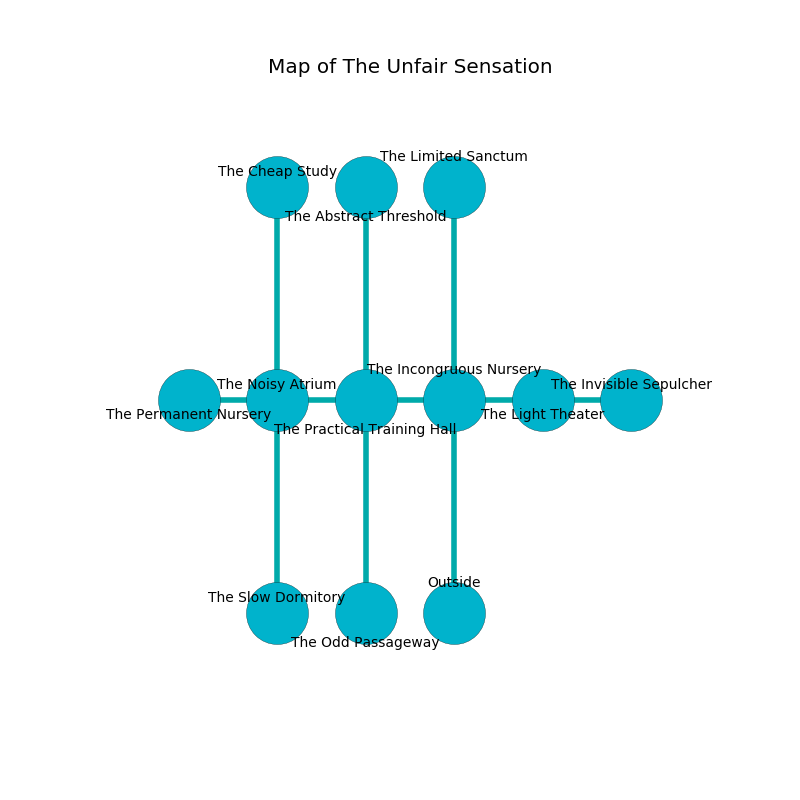

%Ruin Dogs

##The Unfair Sensation
###Overview
The Unfair Sensation is constructed on a crystal rift. Some rooms of it are somewhat cold. A battle between raiders is happening outside. It is occupied by Orc. Theodore Aguiar The Flirtatious, a Fire Giant is here. The Orc are the soldiers of Theodore Aguiar The Flirtatious. He  is trying to discover [Aemiaela Bafcwi](#Aemiaela-Bafcwi). 

###Artifact
####Aemiaela Bafcwi

Aemiaela Bafcwi looks like a wet cube. When touched it floats above the ground. 

###Locations

####the incongruous nursery
The air smells like mimosa here. There are a Pony, a Draft Horse, a Treant, a Swarm of Insects, a Bandit, and a Flying Snake here. Yellow lichens are decaying from the ceiling. The floor is smooth. 

* To the west a small opening opens to [the practical training hall](#the-practical-training-hall).
* To the east a flooded gap leads to [the light theater](#the-light-theater).
* To the north a flooded gap connects to [the limited sanctum](#the-limited-sanctum).
* To the south is the entrance.

####the practical training hall
There are twenty Orcs here. The air smells like red currant here. Yellow mushrooms are sprouting in a patch on the floor. The Orc are defending this room from intruders. 

* To the west a torchlit gap connects to [the noisy atrium](#the-noisy-atrium).
* To the east a small opening opens to [the incongruous nursery](#the-incongruous-nursery).
* To the north a small cavern connects to [the abstract threshold](#the-abstract-threshold).
* To the south a twisted artery connects to [the odd passageway](#the-odd-passageway).

####the light theater
There is a trap here. When activated, a tripwire will extend a spring loaded spear. The air tastes like storax here. Green moss is sprouting in a patch on the floor. The floor is cluttered with bones. 

* To the west a flooded gap opens to [the incongruous nursery](#the-incongruous-nursery).
* To the east a dark cave connects to [the invisible sepulcher](#the-invisible-sepulcher).

####the limited sanctum
The floor is smooth. The air smells like vetiver here. White moss is growing in cracks in the floor. 

* To the south a flooded gap opens to [the incongruous nursery](#the-incongruous-nursery).

####the noisy atrium
The air tastes like corn chip here. 

* [Aemiaela Bafcwi](#Aemiaela-Bafcwi) is here.
* To the west a narrow threshold leads to [the permanent nursery](#the-permanent-nursery).
* To the east a torchlit gap opens to [the practical training hall](#the-practical-training-hall).
* To the north a torchlit cave opens to [the cheap study](#the-cheap-study).
* To the south a dripping cavern connects to [the slow dormitory](#the-slow-dormitory).

####the odd passageway
The air smells like pecan here. The floor is glossy. The glass walls are unsettled. 

* To the north a twisted artery opens to [the practical training hall](#the-practical-training-hall).

####the abstract threshold
The wooden walls are unsettled. There are a Young White Dragon and a Wyvern here. Gray lichens are swaying from the walls. 

* To the south a small cavern connects to [the practical training hall](#the-practical-training-hall).

####the cheap study
The crystal walls are caving in. The floor is cluttered with broken glass. Blue mushrooms are decaying in a patch on the floor. 

* [Theodore Aguiar The Flirtatious](#Theodore-Aguiar-The-Flirtatious) is here.
* To the south a torchlit cave connects to [the noisy atrium](#the-noisy-atrium).

####the invisible sepulcher
The metallic walls are ruined. 

* To the west a dark cave connects to [the light theater](#the-light-theater).

####the permanent nursery
The air tastes like hay here. 

* To the east a narrow threshold leads to [the noisy atrium](#the-noisy-atrium).

####the slow dormitory
There are a Githyanki Warrior, a Rat, an Azer, a Drow Elite Warrior, a Hawk, and a Will-O’-Wisp here. White moss is sprouting from the walls. 

* To the north a dripping cavern leads to [the noisy atrium](#the-noisy-atrium).

