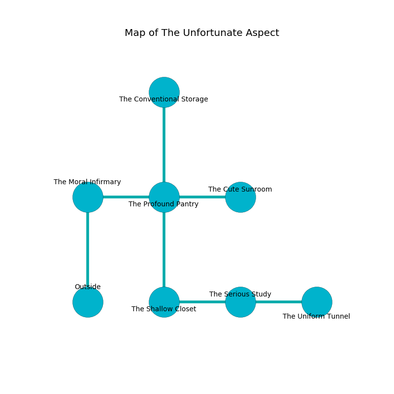

%Ruin Dogs

##The Unfortunate Aspect
###Overview
The Unfortunate Aspect is constructed on a cursed mountain. Some rooms of The Unfortunate Aspect are flooded. A lunar eclipse is happening outside. It is occupied by Giants. Lorine Plunkett The Aggressive, a Kuo-Toa Archpriest is here. The Giants have been charmed by Lorine Plunkett The Aggressive. She  is founding a new religion. 

###Artifact
####The Rare Maintenance

The Rare Maintenance is a powerful artifact in the shape of a glassy blade. Magic flows around it. When touched it destroys itself. 

###Locations

####the moral infirmary
The crystal walls are bloodstained. The air smells like meat here. 

There is an engraving on the wall written in Giants Script. 

> Leave at once.
>

* To the east a hazy artery opens to [the profound pantry](#the-profound-pantry).
* To the south is the entrance.

####the profound pantry
White ferns are sprouting in a patch on the floor. The air tastes like white chocolate here. The floor is cluttered with debris. The stone walls are scratched. 

* There is a shoe here.
* [The Rare Maintenance](#The-Rare-Maintenance) is here.
* To the west a hazy artery opens to [the moral infirmary](#the-moral-infirmary).
* To the east a flooded opening leads to [the cute sunroom](#the-cute-sunroom).
* To the north a torchlit path connects to [the conventional storage](#the-conventional-storage).
* To the south a small hall leads to [the shallow closet](#the-shallow-closet).

####the cute sunroom
The air tastes like smoked sausage here. Yellow ferns are decaying in cracks in the floor. 

There is an engraving on a stone written in common. 

> A pot is a tie
>
> experienced and considerable
>
> you must never be crystalized
>

* To the west a flooded opening opens to [the profound pantry](#the-profound-pantry).

####the shallow closet

* To the east a long hallway connects to [the serious study](#the-serious-study).
* To the north a small hall connects to [the profound pantry](#the-profound-pantry).

####the serious study
The crystal walls are pristine. Yellow mushrooms are decaying in a patch on the floor. 

* To the west a long hallway leads to [the shallow closet](#the-shallow-closet).
* To the east a torchlit passageway opens to [the uniform tunnel](#the-uniform-tunnel).

####the uniform tunnel
The obsidion walls are unsettled. The air smells like tangerine here. Yellow mushrooms are growing from the walls. The floor is bloodstained. There are two Hill Giants here. One of the Giants is on watch, the rest are fighting amongst themselves. 

There is an engraving on the ceiling written in common. 

> A trap ahead.
>

* [Lorine Plunkett The Aggressive](#Lorine-Plunkett-The-Aggressive) is here.
* To the west a torchlit passageway leads to [the serious study](#the-serious-study).

####the conventional storage
The stone walls are bloodstained. There are two Hill Giants here. Yellow lichens are growing in broken urns. If the Giants notice the Ruin Dogs, one of them will retreat and alert the others. 

* To the south a torchlit path leads to [the profound pantry](#the-profound-pantry).

