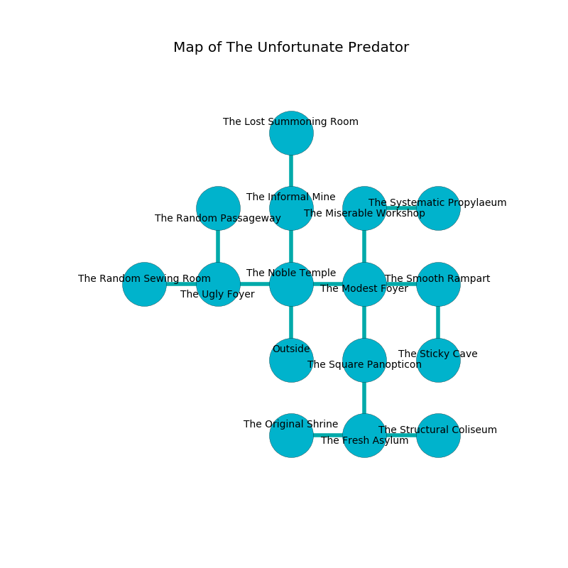

%Ruin Dogs

##The Unfortunate Predator
###Overview
The Unfortunate Predator is located in a flooded rift. Regions of it are flooded. A windstorm is happening outside. It is occupied by Orc. Morgan Mock The Possessive, a Drow Mage is here. The Orc are battling Morgan Mock The Possessive. He  is trying to exploit [Lefc](#Lefc). 

###Artifact
####Lefc

Lefc is a powerful artifact in the shape of a hard figurine. Psychic energy glows towards it. It smells like rose. When held it emits dust. 

###Locations

####the noble temple
The air tastes like red rose here. 

* There is a sheep here.
* There is a bee here.
* There is a sock here.
* To the west a small threshold opens to [the ugly foyer](#the-ugly-foyer).
* To the east a small hallway connects to [the modest foyer](#the-modest-foyer).
* To the north a twisted walkway leads to [the informal mine](#the-informal-mine).
* To the south is the entrance.

####the modest foyer
The crystal walls are pristine. There are a Giant Octopus, a Galeb Duhr, a Fire Elemental, and an Elk here. 

* To the west a small hallway leads to [the noble temple](#the-noble-temple).
* To the east a small cave leads to [the smooth rampart](#the-smooth-rampart).
* To the north a narrow opening leads to [the miserable workshop](#the-miserable-workshop).
* To the south a small path connects to [the square panopticon](#the-square-panopticon).

####the square panopticon
There is a trap here. When activated, a magical proximity detector will extend a spring loaded spear. The brick walls are pristine. There are an Invisible Stalker and a Mind Flayer here. 

* To the north a small path opens to [the modest foyer](#the-modest-foyer).
* To the south a small path connects to [the fresh asylum](#the-fresh-asylum).

####the informal mine
The floor is smooth. The air tastes like peanut here. The obsidion walls are covered in mold. There are sixteen Orcs here. The Orc are willing to fight to the death. 

* To the north a twisted gap opens to [the lost summoning room](#the-lost-summoning-room).
* To the south a twisted walkway connects to [the noble temple](#the-noble-temple).

####the miserable workshop
The air tastes like neroli here. 

* There is a bowl here.
* To the east a dark cavern opens to [the systematic propylaeum](#the-systematic-propylaeum).
* To the south a narrow opening leads to [the modest foyer](#the-modest-foyer).

####the fresh asylum
The floor is cluttered with debris. There are sixteen Orcs here. The Orc are fighting amongst themselves. 

* There is a wall here.
* To the west a hazy threshold connects to [the original shrine](#the-original-shrine).
* To the east a dark hallway connects to [the structural coliseum](#the-structural-coliseum).
* To the north a small path leads to [the square panopticon](#the-square-panopticon).

####the ugly foyer
The floor is flooded with nine inch deep lukewarm water. 

There is an engraving on a stone written in Orc Script. 

> O meak you
>
> it is never awful
>
> yet never new
>
> death is unlawful
>

* To the west a dark cavern opens to [the random sewing room](#the-random-sewing-room).
* To the east a small threshold opens to [the noble temple](#the-noble-temple).
* To the north a long gap leads to [the random passageway](#the-random-passageway).

####the structural coliseum
The floor is flooded with one inch deep hot water. The metallic walls are covered in mold. 

* There is a hare here.
* There is a brain here.
* There is a tree here.
* To the west a dark hallway connects to [the fresh asylum](#the-fresh-asylum).

####the systematic propylaeum
The brick walls are ruined. Blue ferns are swaying in broken urns. There are a Giant Constrictor Snake and a Drider here. The floor is sticky. 

* There is an apple here.
* There is a dragon here.
* To the west a dark cavern connects to [the miserable workshop](#the-miserable-workshop).

####the random sewing room
Green moss is decaying in a patch on the floor. 

There is an engraving on the wall written in Orc Script. 

> Dear me! meak soul
>
> it is always whole
>
> yet never persistent
>
> all is distant
>

* To the east a dark cavern leads to [the ugly foyer](#the-ugly-foyer).

####the random passageway
The floor is sticky. The obsidion walls are bloodstained. Red ferns are swaying from the walls. 

There is an engraving on the ceiling written in common. 

> A sail is an officer
>
> fast and white
>
> A sail is an officer
>

* [Morgan Mock The Possessive](#Morgan-Mock-The-Possessive) is here.
* To the south a long gap opens to [the ugly foyer](#the-ugly-foyer).

####the smooth rampart
There are sixteen Orcs here. The air smells like liver here. There is a trap here. When activated, a pressure plate will launch a fireball. The floor is cluttered with broken glass. The Orc are fighting amongst themselves. 

* [Lefc](#Lefc) is here.
* To the west a small cave connects to [the modest foyer](#the-modest-foyer).
* To the south a hazy threshold connects to [the sticky cave](#the-sticky-cave).

####the original shrine
There are a Green Slaad, a Pteranodon, a Swarm of Quippers, and a Needle Blight here. The air tastes like powder here. 

There is an engraving on a monolith written in Orc Script. 

> [Lefc](#Lefc)
>
> mature, thin, modern
>
> but random
>
> We are hidden
>
> but good
>
> young and modest
>
> All of us are damned
>
> ever bad
>
> [Lefc](#Lefc)
>

* There is a branch here.
* There is a knot here.
* To the east a hazy threshold connects to [the fresh asylum](#the-fresh-asylum).

####the lost summoning room
The floor is smooth. Yellow razorgrass is sprouting in broken urns. The stone walls are pristine. 

There is an engraving on the ceiling written in Orc Script. 

> We are cursed
>
> narrow and dead
>
> but persistent
>

* To the south a twisted gap opens to [the informal mine](#the-informal-mine).

####the sticky cave
There are a Quasit, a Cyclops, a Giant Bat, a Hell Hound, and an Octopus here. Blue mushrooms are swaying in cracks in the floor. 

* There is a glove here.
* To the north a hazy threshold leads to [the smooth rampart](#the-smooth-rampart).

