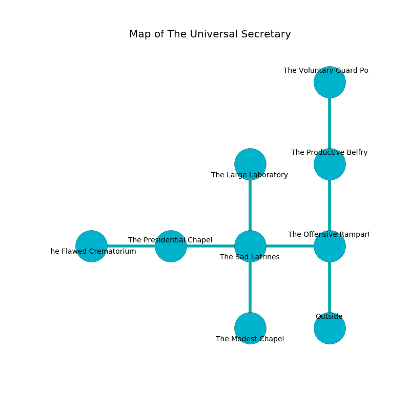

%Ruin Dogs

##The Universal Secretary
###Overview
The Universal Secretary is located under an obsidion rift. Some rooms of The Universal Secretary are cursed. The ruin is collapsing slowly. It is occupied by Deep Gnomes. Gordon Roland The Quick-Tempered, a Bearded Devil is here. The Deep Gnomes are battling Gordon Roland The Quick-Tempered. He  is trying to hide [Uddaebaeib](#Uddaebaeib). 

###Artifact
####Uddaebaeib

Uddaebaeib has the form of a broken gem. It smells like wormwood. Cacophony pours from it. When held it frightens children. 

###Locations

####the offensive rampart
There are a Frog and a Helmed Horror here. The air smells like fruit here. The floor is cluttered with bones. 

There is an engraving on the floor written in Deep Gnomes Script. 

> You are corrupted
>
> medieval, fine, curious
>
> past, dominant, bald
>
> eager and finished
>
> aesthetic and wise
>
> honorable, bitter, blonde
>
> [Uddaebaeib](#Uddaebaeib)
>
> yet new
>

* To the west a twisted passageway opens to [the sad latrines](#the-sad-latrines).
* To the north a dark corridor opens to [the productive belfry](#the-productive-belfry).
* To the south is the entrance.

####the sad latrines
There are eight Deep Gnomes here. The floor is glossy. The glass walls are covered in mold. White lichens are sprouting from the walls. The Deep Gnomes are performing a ritual. If not interrupted, the Deep Gnomes will become more powerful. 

There is an engraving on the floor written in common. 

> A boat is a withdrawal
>
> pleasant and crude
>
> You are sorrowful
>
> nervous, mobile, painful
>
> far and fastidious
>
> rough, viable, afraid
>
> We are damned
>
> useful and stunning
>
> A boat is a withdrawal
>

* To the west a hazy passageway leads to [the presidential chapel](#the-presidential-chapel).
* To the east a twisted passageway opens to [the offensive rampart](#the-offensive-rampart).
* To the north a hazy artery connects to [the large laboratory](#the-large-laboratory).
* To the south a long passageway connects to [the modest chapel](#the-modest-chapel).

####the presidential chapel
There are eight Deep Gnomes here. The wooden walls are ruined. The air tastes like marigold here. The Deep Gnomes are performing a ritual. If not interrupted, the ruin dogs will be weakened. 

* There is a knot here.
* There is a bag here.
* [Uddaebaeib](#Uddaebaeib) is here.
* [Gordon Roland The Quick-Tempered](#Gordon-Roland-The-Quick-Tempered) is here.
* To the west a hazy path leads to [the flawed crematorium](#the-flawed-crematorium).
* To the east a hazy passageway opens to [the sad latrines](#the-sad-latrines).

####the large laboratory

* To the south a hazy artery connects to [the sad latrines](#the-sad-latrines).

####the modest chapel
The air tastes like lettuce here. The floor is flooded with three inch deep lukewarm water. 

* To the north a long passageway leads to [the sad latrines](#the-sad-latrines).

####the productive belfry
The air tastes like cucumber skin here. Gray mushrooms are swaying in a patch on the floor. 

* To the north a long path leads to [the voluntary guard post](#the-voluntary-guard-post).
* To the south a dark corridor connects to [the offensive rampart](#the-offensive-rampart).

####the voluntary guard post
The brick walls are caving in. The air smells like pomegranate here. Red lichens are growing in cracks in the floor. 

* There is a frame here.
* There is a treasure here.
* To the south a long path opens to [the productive belfry](#the-productive-belfry).

####the flawed crematorium
There is a trap here. When activated, a magical rune will collapse a column. The air tastes like almond here. 

There is an engraving on a monolith written in common. 

> I am lost in The Universal Secretary.
>
> Run away.
>

* There is a comb here.
* To the east a hazy path leads to [the presidential chapel](#the-presidential-chapel).

