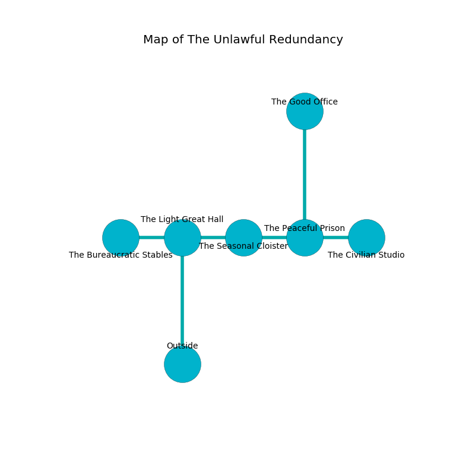

%Ruin Dogs

##The Unlawful Redundancy
###Overview
The Unlawful Redundancy is located under a ruined mountain. Some areas of it are frozen. The ruin is sinking into the earth. It is occupied by Deep Gnomes. Hans Spradlin The Possessive, an Ogre is here. The Deep Gnomes worship Hans Spradlin The Possessive. He  is founding a new religion. 

###Artifact
####Dasdofa

Dasdofa has the form of a broken prism. Cacophony incinerates towards it. It is a pale pink color. When eaten it sings the hymn of the damned. 

###Locations

####the light great hall
The floor is sticky. 

* To the west a torchlit corridor connects to [the bureaucratic stables](#the-bureaucratic-stables).
* To the east a small corridor leads to [the seasonal cloister](#the-seasonal-cloister).
* To the south is the entrance.

####the seasonal cloister
The air tastes like sulfur here. Yellow ferns are decaying in broken urns. The floor is cluttered with shells. The mirrored walls are bloodstained. 

* To the west a small corridor opens to [the light great hall](#the-light-great-hall).
* To the east a dripping path opens to [the peaceful prison](#the-peaceful-prison).

####the peaceful prison
The brick walls are bloodstained. There is a trap here. When activated, a magical proximity detector will launch stone blocks from the ceiling. There is a Winter Wolf here. The air smells like musk here. 

There is an engraving on the floor written in common. 

> I tried hiding.
>

* There is a coat here.
* [Dasdofa](#Dasdofa) is here.
* [Hans Spradlin The Possessive](#Hans-Spradlin-The-Possessive) is here.
* To the west a dripping path leads to [the seasonal cloister](#the-seasonal-cloister).
* To the east a long passageway leads to [the civilian studio](#the-civilian-studio).
* To the north a twisted corridor connects to [the good office](#the-good-office).

####the civilian studio
Gray ferns are swaying from the walls. The floor is flooded with eight inch deep cool water. The wooden walls are bloodstained. 

* To the west a long passageway leads to [the peaceful prison](#the-peaceful-prison).

####the bureaucratic stables
The air tastes like almond here. The floor is flooded with one inch deep lukewarm water. The glass walls are unsettled. 

* There is a cow here.
* There is a collar here.
* There is a sponge here.
* To the east a torchlit corridor leads to [the light great hall](#the-light-great-hall).

####the good office
There are six Deep Gnomes here. The Deep Gnomes are defending this room from intruders. 

There is an engraving on a monolith written in common. 

> I thought about running.
>

* To the south a twisted corridor connects to [the peaceful prison](#the-peaceful-prison).

