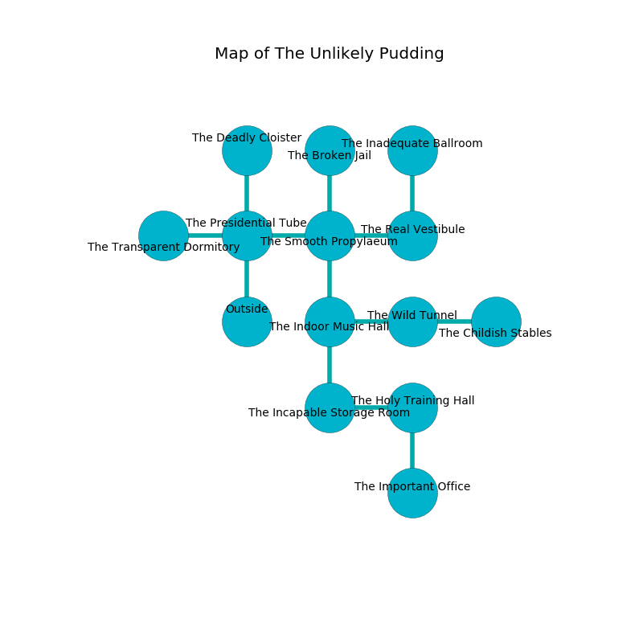

%Ruin Dogs

##The Unlikely Pudding
###Overview
The Unlikely Pudding is located on a volcanic city. Regions of it are flooded. A battle between raiders is happening outside. It is occupied by Kuo-Toa. Tora Buxton The Naughty, a Cult Fanatic is here. The Kuo-Toa are the soldiers of Tora Buxton The Naughty. She  is founding a new religion. 

###Artifact
####Dumwi Haaeiofa

Dumwi Haaeiofa is a powerful artifact in the shape of a broken spear. It is a pale green color. It smells like earth. When held it becomes hot. 

###Locations

####the presidential tube

* [Dumwi Haaeiofa](#Dumwi-Haaeiofa) is here.
* To the west a dark opening connects to [the transparent dormitory](#the-transparent-dormitory).
* To the east a long hall leads to [the smooth propylaeum](#the-smooth-propylaeum).
* To the north a dripping cave opens to [the deadly cloister](#the-deadly-cloister).
* To the south is the entrance.

####the smooth propylaeum
There is a Swarm of Poisonous Snakes here. The concrete walls are scratched. The air smells like lavender here. 

* There is a door here.
* There is a hoard here.
* To the west a long hall connects to [the presidential tube](#the-presidential-tube).
* To the east a small passageway connects to [the real vestibule](#the-real-vestibule).
* To the north a dripping opening opens to [the broken jail](#the-broken-jail).
* To the south a long walkway opens to [the indoor music hall](#the-indoor-music-hall).

####the indoor music hall
There are two Kuo-Toa Whips and two Kuo-Toa here. The crystal walls are pristine. The floor is cluttered with broken glass. There is a trap here. When activated, a magical rune will launch a fusillade of darts. The Kuo-Toa are performing a ritual. If not interrupted, the Kuo-Toa will become more powerful. 

There is an engraving on a tablet written in common. 

> We are maddened
>
> open and optional
>

* To the east a dark pathway opens to [the wild tunnel](#the-wild-tunnel).
* To the north a long walkway leads to [the smooth propylaeum](#the-smooth-propylaeum).
* To the south a dark gap connects to [the incapable storage room](#the-incapable-storage-room).

####the incapable storage room
The air smells like blueberry here. There are a Kuo-Toa Whip and four Kuo-Toa here. The concrete walls are caving in. One of the Kuo-Toa is working a mechanism that can flood the room. 

There is an engraving on the wall written in Kuo-Toa Script. 

> I am sneaky.
>

* There is a shield here.
* To the east a hazy passageway connects to [the holy training hall](#the-holy-training-hall).
* To the north a dark gap opens to [the indoor music hall](#the-indoor-music-hall).

####the broken jail
Yellow moss is swaying in a patch on the floor. 

* To the south a dripping opening leads to [the smooth propylaeum](#the-smooth-propylaeum).

####the holy training hall
The wooden walls are unsettled. There are two Kuo-Toa Whips here. One of the Kuo-Toa is on watch, the rest are celebrating. 

* To the west a hazy passageway opens to [the incapable storage room](#the-incapable-storage-room).
* To the south a narrow artery leads to [the important office](#the-important-office).

####the transparent dormitory
The air tastes like bread crust here. 

* To the east a dark opening connects to [the presidential tube](#the-presidential-tube).

####the important office
The air tastes like seashore here. There are two Kuo-Toa Whips here. The floor is glossy. The metallic walls are pristine. If the Kuo-Toa notice the Ruin Dogs, one of them will retreat and alert the others. 

* There is a leprechaun here.
* [Tora Buxton The Naughty](#Tora-Buxton-The-Naughty) is here.
* To the north a narrow artery connects to [the holy training hall](#the-holy-training-hall).

####the real vestibule
The metallic walls are caving in. 

* To the west a small passageway opens to [the smooth propylaeum](#the-smooth-propylaeum).
* To the north a small cavern leads to [the inadequate ballroom](#the-inadequate-ballroom).

####the inadequate ballroom

There is an engraving on the ceiling written in common. 

> Try giving up.
>

* To the south a small cavern leads to [the real vestibule](#the-real-vestibule).

####the wild tunnel
The floor is glossy. White ferns are swaying in broken urns. The air smells like smoke here. The mirrored walls are covered in mold. 

* To the west a dark pathway connects to [the indoor music hall](#the-indoor-music-hall).
* To the east a windy hallway leads to [the childish stables](#the-childish-stables).

####the childish stables
The air smells like linden flower here. The floor is cluttered with bones. There are two Kuo-Toa Whips and a Kuo-Toa here. The Kuo-Toa are performing a ritual. If not interrupted, [Tora Buxton](#Tora-Buxton) will be magically alarmed. 

* To the west a windy hallway leads to [the wild tunnel](#the-wild-tunnel).

####the deadly cloister
The stone walls are unsettled. 

* To the south a dripping cave opens to [the presidential tube](#the-presidential-tube).

