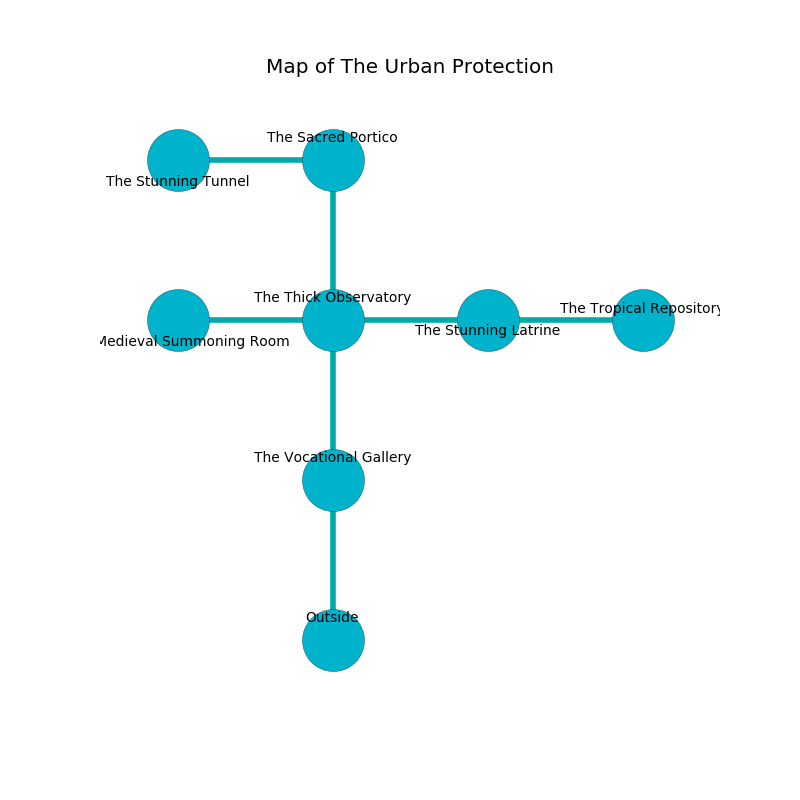

%Ruin Dogs

##The Urban Protection
###Overview
The Urban Protection is constructed on a cursed rift. Parts of it are frozen. The ruin is flooding. It is occupied by Centaurs. Demetrius Helms The Quarrelsome, a Cloud Giant is here. The Centaurs are the slaves of Demetrius Helms The Quarrelsome. He  is founding a new religion. 

###Artifact
####Cmebdehma

Cmebdehma is a powerful artifact in the shape of a broken spear. It is a medium purple color. When thrown it shows an image of the future. 

###Locations

####the vocational gallery
The wooden walls are pristine. The air tastes like amber here. 

* To the north a flooded opening connects to [the thick observatory](#the-thick-observatory).
* To the south is the entrance.

####the thick observatory
Yellow ferns are swaying from the ceiling. The air tastes like sawdust here. The floor is glossy. There are a Hook Horror, an Intellect Devourer, and a Stone Giant here. 

* To the west a hazy walkway connects to [the medieval summoning room](#the-medieval-summoning-room).
* To the east a windy cave opens to [the stunning latrine](#the-stunning-latrine).
* To the north a windy passageway opens to [the sacred portico](#the-sacred-portico).
* To the south a flooded opening leads to [the vocational gallery](#the-vocational-gallery).

####the sacred portico
Green razorgrass is growing in a patch on the floor. The air smells like brandy here. There are a Sprite, a Peryton, a Tribal Warrior, a Flameskull, an Orc Eye of Gruumsh, a Homunculus, a Copper Dragon Wyrmling, a Young Faerie Dragon, and an Ankylosaurus here. 

* [Cmebdehma](#Cmebdehma) is here.
* To the west a flooded path connects to [the stunning tunnel](#the-stunning-tunnel).
* To the south a windy passageway opens to [the thick observatory](#the-thick-observatory).

####the medieval summoning room
Blue mushrooms are growing in broken urns. The mirrored walls are scratched. 

There is an engraving on a stone written in common. 

> I am afraid.
>
> Leave at once.
>

* There is a rod here.
* There is a stamp here.
* To the east a hazy walkway leads to [the thick observatory](#the-thick-observatory).

####the stunning latrine
The floor is glossy. 

* [Demetrius Helms The Quarrelsome](#Demetrius-Helms-The-Quarrelsome) is here.
* To the west a windy cave opens to [the thick observatory](#the-thick-observatory).
* To the east a flooded opening opens to [the tropical repository](#the-tropical-repository).

####the tropical repository
There are five Centaurs here. The floor is bloodstained. Blue mushrooms are decaying in a patch on the floor. The Centaurs are willing to negotiate. 

* To the west a flooded opening connects to [the stunning latrine](#the-stunning-latrine).

####the stunning tunnel
The obsidion walls are unsettled. White lichens are growing in a patch on the floor. 

There is an engraving on the ceiling written in Centaurs Script. 

> Oh my! meak you
>
> yet true
>
> industrial and visible
>
> hope is invisible
>

* To the east a flooded path opens to [the sacred portico](#the-sacred-portico).

