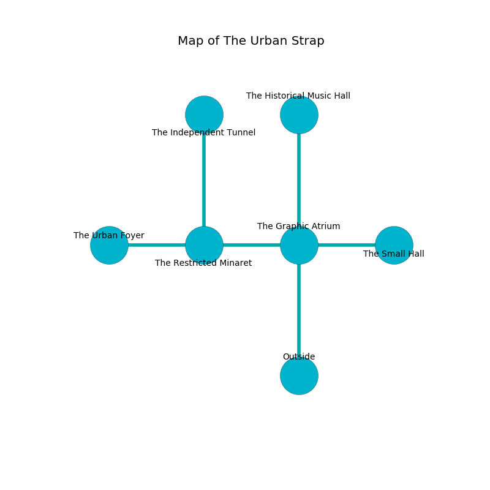

%Ruin Dogs

##The Urban Strap
###Overview
The Urban Strap is constructed on an alien rift. Some areas of The Urban Strap are flooded. The ruin is flooding. It is occupied by Goblins. Modesto Steffen The Bone-Idle, an Assassin is here. The Goblins are the slaves of Modesto Steffen The Bone-Idle. He  is trying to use [Muha](#Muha). 

###Artifact
####Muha

Muha has the form of a glassy prism. It is a bright red color. It smells like tangerine. When carried it destroys others. 

###Locations

####the graphic atrium
There are a Hobgoblin Warlord and two Hobgoblins here. The floor is sticky. The Goblins are sleeping. 

There is an engraving on a tablet written in Goblins Script. 

> Poor me! terrible soul
>
> secure, permanent, whole
>
> tough, persistent, steady
>
> everything is ready
>

* [Muha](#Muha) is here.
* To the west a small hallway opens to [the restricted minaret](#the-restricted-minaret).
* To the east a dripping cave connects to [the small hall](#the-small-hall).
* To the north a dark threshold connects to [the historical music hall](#the-historical-music-hall).
* To the south is the entrance.

####the restricted minaret
The floor is glossy. 

There is an engraving on a monolith written in Goblins Script. 

> A trap ahead.
>

* [Modesto Steffen The Bone-Idle](#Modesto-Steffen-The-Bone-Idle) is here.
* To the west a torchlit corridor connects to [the urban foyer](#the-urban-foyer).
* To the east a small hallway connects to [the graphic atrium](#the-graphic-atrium).
* To the north a windy opening opens to [the independent tunnel](#the-independent-tunnel).

####the independent tunnel
There are a Sahuagin, a Reef Shark, a Doppelganger, a Monodrone, and a Young Black Dragon here. Yellow razorgrass is growing from the ceiling. 

* There is a table here.
* To the south a windy opening opens to [the restricted minaret](#the-restricted-minaret).

####the small hall
Red ferns are sprouting in a patch on the floor. There is a trap here. When activated, a magical rune will launch stone blocks from the ceiling. There are a Gnoll Fang of Yeenoghu and a Young Black Dragon here. The floor is cluttered with ashes. 

* To the west a dripping cave opens to [the graphic atrium](#the-graphic-atrium).

####the urban foyer
The floor is smooth. The concrete walls are scratched. 

* There is a bone here.
* To the east a torchlit corridor connects to [the restricted minaret](#the-restricted-minaret).

####the historical music hall
Red ferns are growing from the ceiling. The air tastes like valerian root here. The obsidion walls are ruined. There is a trap here. When activated, a tripwire will extend a spring loaded spear. 

* To the south a dark threshold opens to [the graphic atrium](#the-graphic-atrium).

