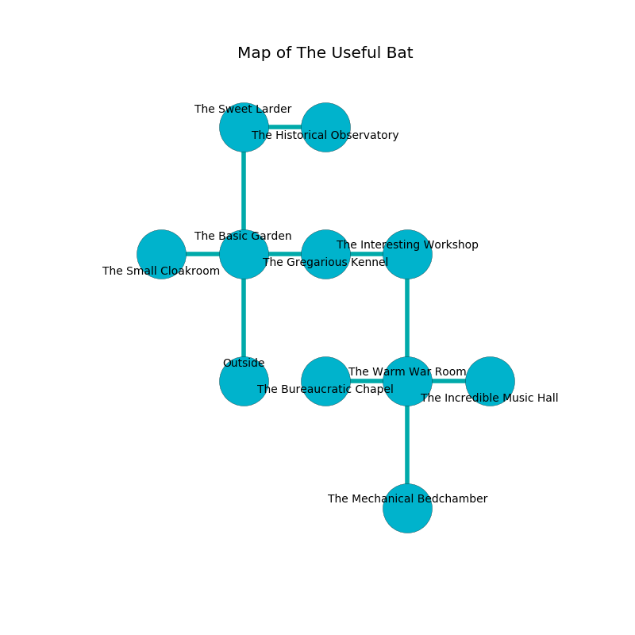

%Ruin Dogs

##The Useful Bat
###Overview
The Useful Bat is located on an alien rift. Parts of The Useful Bat are unbearably hot. A battle between raiders is happening outside. It is occupied by Githzerai. Edgar Howard The Aloof, a Sahuagin Baron is here. The Githzerai are the minions of Edgar Howard The Aloof. He  is founding a new religion. 

###Artifact
####Abudaeum

Abudaeum has the form of a mushy amulet. It smells like blackberry. It is a pale green color. When thrown it makes its owner invisible. 

###Locations

####the basic garden
The air tastes like leather here. 

* To the west a narrow threshold leads to [the small cloakroom](#the-small-cloakroom).
* To the east a windy walkway connects to [the gregarious kennel](#the-gregarious-kennel).
* To the north a twisted cavern leads to [the sweet larder](#the-sweet-larder).
* To the south is the entrance.

####the sweet larder
The floor is cluttered with bones. The air smells like gardenia here. Gray lichens are decaying from the ceiling. 

There is an engraving on a monolith written in Githzerai Script. 

> They are lost
>
> loyal, right, vague
>

* To the east a long opening connects to [the historical observatory](#the-historical-observatory).
* To the south a twisted cavern leads to [the basic garden](#the-basic-garden).

####the gregarious kennel
The air smells like guava here. The mirrored walls are covered in mold. There are a Couatl and a Berserker here. The floor is sticky. 

There is an engraving on the floor written in Githzerai Script. 

> I am the best.
>

* To the west a windy walkway leads to [the basic garden](#the-basic-garden).
* To the east a flooded passageway leads to [the interesting workshop](#the-interesting-workshop).

####the interesting workshop
Blue moss is growing from the walls. The concrete walls are pristine. 

There is an engraving on the wall written in Githzerai Script. 

> I hid something in this place.
>
> Leave now.
>

* To the west a flooded passageway leads to [the gregarious kennel](#the-gregarious-kennel).
* To the south a hazy threshold leads to [the warm war Room](#the-warm-war-Room).

####the small cloakroom
The metallic walls are bloodstained. The air smells like salmon here. 

* To the east a narrow threshold connects to [the basic garden](#the-basic-garden).

####the warm war Room
The floor is cluttered with shells. The concrete walls are unsettled. White mushrooms are decaying in cracks in the floor. The air tastes like coffee here. There are three Githzerai Monks here. One of the Githzerai is on watch, the rest are celebrating. 

* [Abudaeum](#Abudaeum) is here.
* [Edgar Howard The Aloof](#Edgar-Howard-The-Aloof) is here.
* To the west a torchlit hall opens to [the bureaucratic chapel](#the-bureaucratic-chapel).
* To the east a narrow corridor leads to [the incredible music hall](#the-incredible-music-hall).
* To the north a hazy threshold opens to [the interesting workshop](#the-interesting-workshop).
* To the south a narrow cavern opens to [the mechanical bedchamber](#the-mechanical-bedchamber).

####the bureaucratic chapel
There is a trap here. When activated, a magical sound detector will launch a ceiling pendulum. 

There is an engraving on the floor written in common. 

> We are damned
>
> expensive, painful, brown
>
> but constitutional
>
> closed and safe
>
> clear and popular
>
> ever acute
>
> [Abudaeum](#Abudaeum)
>
> yet never peaceful
>

* To the east a torchlit hall opens to [the warm war Room](#the-warm-war-Room).

####the historical observatory
The floor is bloodstained. There are three Githzerai Monks here. The air tastes like char here. The Githzerai are crazy with bloodlust. 

* To the west a long opening connects to [the sweet larder](#the-sweet-larder).

####the mechanical bedchamber
The floor is bloodstained. The air tastes like ginger here. 

* To the north a narrow cavern leads to [the warm war Room](#the-warm-war-Room).

####the incredible music hall
There are three Githzerai Monks here. The obsidion walls are scratched. The air tastes like tallow here. If the Githzerai notice the Ruin Dogs, one of them will retreat and alert [Edgar Howard](#Edgar-Howard). 

* To the west a narrow corridor connects to [the warm war Room](#the-warm-war-Room).

