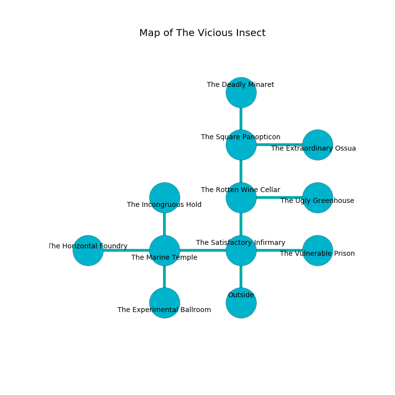

%Ruin Dogs

##The Vicious Insect
###Overview
The Vicious Insect is located in a volcanic city. Some areas of The Vicious Insect are flooded. The ruin is collapsing slowly. It is occupied by Deep Gnomes. Christeen Mcgehee The Quarrelsome, an Assassin is here. The Deep Gnomes are the minions of Christeen Mcgehee The Quarrelsome. She  is founding a new religion. 

###Artifact
####Mumiamia Gefb

Mumiamia Gefb looks like a hard blade. It smells like cinnamon. It is a bright white color. When thrown it glows with an eerie light. 

###Locations

####the satisfactory infirmary
There are a Displacer Beast, a Hobgoblin, a Half-Red Dragon Veteran, a Shadow, and a Griffon here. The floor is smooth. 

* To the west a small opening opens to [the marine temple](#the-marine-temple).
* To the east a twisted hallway connects to [the vulnerable prison](#the-vulnerable-prison).
* To the north a windy artery opens to [the rotten wine cellar](#the-rotten-wine-cellar).
* To the south is the entrance.

####the vulnerable prison
The floor is smooth. 

* There is an orange here.
* To the west a twisted hallway opens to [the satisfactory infirmary](#the-satisfactory-infirmary).

####the marine temple
There are a Slaad Tadpole, a Drow Priestess of Lolth, a Duergar, a Tridrone, and an Ettercap here. There is a trap here. When activated, a magical sound detector will flood the room with water. The air smells like spinach here. 

* [Mumiamia Gefb](#Mumiamia-Gefb) is here.
* To the west a hazy cave opens to [the horizontal foundry](#the-horizontal-foundry).
* To the east a small opening connects to [the satisfactory infirmary](#the-satisfactory-infirmary).
* To the north a flooded gap opens to [the incongruous hold](#the-incongruous-hold).
* To the south a dripping gap connects to [the experimental ballroom](#the-experimental-ballroom).

####the incongruous hold
The air tastes like raspberry here. The floor is glossy. There is a trap here. When activated, a magical sound detector will launch a blade. 

There is an engraving on the floor written in common. 

> Maybe try fighting.
>

* To the south a flooded gap connects to [the marine temple](#the-marine-temple).

####the rotten wine cellar
The wooden walls are caving in. There are a Kuo-Toa Whip, a Hobgoblin Warlord, and a Giant Hyena here. The floor is sticky. 

* To the east a small opening leads to [the ugly greenhouse](#the-ugly-greenhouse).
* To the north a narrow gap leads to [the square panopticon](#the-square-panopticon).
* To the south a windy artery leads to [the satisfactory infirmary](#the-satisfactory-infirmary).

####the square panopticon
The stone walls are caving in. 

* To the east a narrow corridor opens to [the extraordinary ossuary](#the-extraordinary-ossuary).
* To the north a long gap connects to [the deadly minaret](#the-deadly-minaret).
* To the south a narrow gap opens to [the rotten wine cellar](#the-rotten-wine-cellar).

####the extraordinary ossuary
White ferns are sprouting from the walls. The wooden walls are pristine. 

There is an engraving on a monolith written in Deep Gnomes Script. 

> Oh weak we
>
> square, fragrant, free
>
> dull, effective, able
>
> death is free
>

* There is a monkey here.
* To the west a narrow corridor opens to [the square panopticon](#the-square-panopticon).

####the ugly greenhouse
The floor is smooth. Red mushrooms are growing from the ceiling. 

* To the west a small opening leads to [the rotten wine cellar](#the-rotten-wine-cellar).

####the deadly minaret
The floor is sticky. The glass walls are scratched. The air smells like pepper here. 

* To the south a long gap connects to [the square panopticon](#the-square-panopticon).

####the horizontal foundry
Yellow mushrooms are growing in broken urns. The floor is smooth. 

* [Christeen Mcgehee The Quarrelsome](#Christeen-Mcgehee-The-Quarrelsome) is here.
* To the east a hazy cave opens to [the marine temple](#the-marine-temple).

####the experimental ballroom
The glass walls are caving in. The air tastes like fruit here. There are sixteen Deep Gnomes here. One of the Deep Gnomes is on watch, the rest are meditating. 

* To the north a dripping gap leads to [the marine temple](#the-marine-temple).

