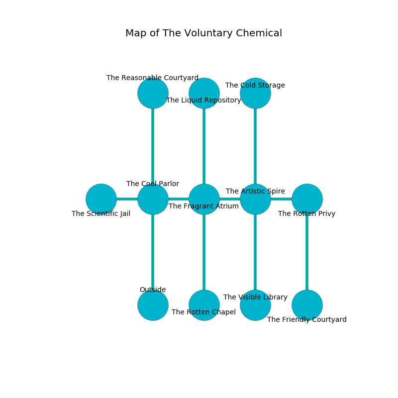

%Ruin Dogs

##The Voluntary Chemical
###Overview
The Voluntary Chemical is located on a haunted rift. Some rooms of The Voluntary Chemical are incredibly hot. The ruin is sinking into the earth. It is occupied by Kobolds. Otha Butcher The Pessimistic, a Bandit Captain is here. The Kobolds have been charmed by Otha Butcher The Pessimistic. She  is founding a new religion. 

###Artifact
####Dmaufwi Baemaeidaf

Dmaufwi Baemaeidaf has the form of a mushy monument. Magic bends towards it. It is a bright pink color. When gazed upon it tunnels into the earth. 

###Locations

####the cool parlor
Gray ferns are sprouting in cracks in the floor. The crystal walls are ruined. 

* There is a chest here.
* [Dmaufwi Baemaeidaf](#Dmaufwi-Baemaeidaf) is here.
* To the west a twisted walkway connects to [the scientific jail](#the-scientific-jail).
* To the east a windy threshold leads to [the fragrant atrium](#the-fragrant-atrium).
* To the north a small walkway opens to [the reasonable courtyard](#the-reasonable-courtyard).
* To the south is the entrance.

####the fragrant atrium
The glass walls are pristine. The air smells like oak wood here. 

* To the west a windy threshold connects to [the cool parlor](#the-cool-parlor).
* To the east a twisted corridor leads to [the artistic spire](#the-artistic-spire).
* To the north a windy corridor leads to [the liquid repository](#the-liquid-repository).
* To the south a small artery connects to [the rotten chapel](#the-rotten-chapel).

####the liquid repository
The metallic walls are pristine. 

* There is an ant here.
* To the south a windy corridor connects to [the fragrant atrium](#the-fragrant-atrium).

####the artistic spire
Red moss is sprouting from the ceiling. 

* To the west a twisted corridor connects to [the fragrant atrium](#the-fragrant-atrium).
* To the east a windy cave connects to [the rotten privy](#the-rotten-privy).
* To the north a twisted gap connects to [the cold storage](#the-cold-storage).
* To the south a flooded opening connects to [the visible library](#the-visible-library).

####the cold storage
There are ten Winged Kobolds and five Kobolds here. The floor is flooded with four inch deep lukewarm water. Green ferns are decaying in a patch on the floor. The concrete walls are bloodstained. The air tastes like gasoline here. One of the Kobolds is pointing a ballista at the entrance. 

* To the south a twisted gap connects to [the artistic spire](#the-artistic-spire).

####the reasonable courtyard
The air tastes like rain here. There are a Slaad Tadpole and a Displacer Beast here. 

* To the south a small walkway opens to [the cool parlor](#the-cool-parlor).

####the rotten privy
The obsidion walls are covered in mold. The floor is sticky. The air tastes like brown sugar here. 

There is an engraving on the ceiling written in common. 

> O! meak you
>
> extinct and new
>
> it is always beautiful
>
> death is new
>

* There is a drawer here.
* To the west a windy cave leads to [the artistic spire](#the-artistic-spire).
* To the south a windy pathway connects to [the friendly courtyard](#the-friendly-courtyard).

####the friendly courtyard
The air tastes like lemongrass here. 

* There is a key here.
* [Otha Butcher The Pessimistic](#Otha-Butcher-The-Pessimistic) is here.
* To the north a windy pathway leads to [the rotten privy](#the-rotten-privy).

####the visible library
The obsidion walls are scratched. There are a Slaad Tadpole, a Merrow, and a Priest here. White razorgrass is decaying from the walls. The floor is bloodstained. The air smells like cornmint here. 

* To the north a flooded opening connects to [the artistic spire](#the-artistic-spire).

####the rotten chapel
There are a Giant Poisonous Snake, a Merfolk, a Berserker, a Scarecrow, a Baboon, two Flying Snakes, and  here. The air tastes like laundered cloth here. The floor is cluttered with bones. Green lichens are swaying from the walls. 

* There is a seed here.
* To the north a small artery leads to [the fragrant atrium](#the-fragrant-atrium).

####the scientific jail
Green moss is growing in cracks in the floor. The mirrored walls are pristine. The floor is bloodstained. 

* To the east a twisted walkway connects to [the cool parlor](#the-cool-parlor).

