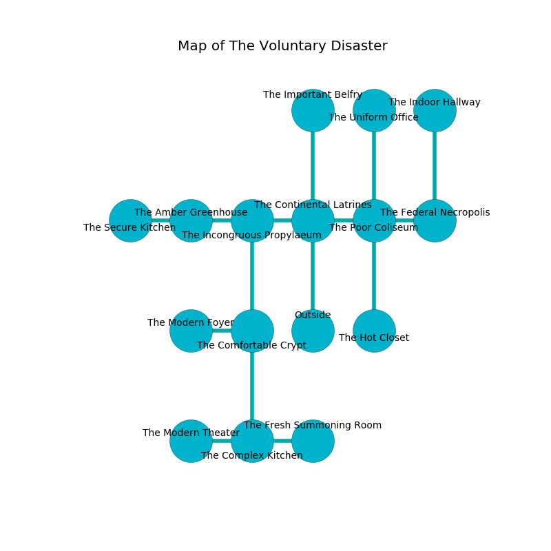

%Ruin Dogs

##The Voluntary Disaster
###Overview
The Voluntary Disaster is located on a volcanic rift. Some rooms of it are cursed. A windstorm is happening outside. It is occupied by Dryads. Celestine Cowles The Pompous, a Cloud Giant is here. The Dryads worship Celestine Cowles The Pompous. She  is founding a new religion. 

###Artifact
####Mahhacd Baed

Mahhacd Baed has the form of a hard gem. It is a bright orange color. Fire slips around it. When rubbed it levitates surrounding objects. 

###Locations

####the continental latrines
The air smells like pennyroyal here. The glass walls are pristine. The floor is sticky. 

There is an engraving on the ceiling written in common. 

> I am lost in The Voluntary Disaster.
>
> Treasure here.
>

* [Mahhacd Baed](#Mahhacd-Baed) is here.
* To the west a torchlit path connects to [the incongruous propylaeum](#the-incongruous-propylaeum).
* To the east a narrow walkway opens to [the poor coliseum](#the-poor-coliseum).
* To the north a twisted cave leads to [the important belfry](#the-important-belfry).
* To the south is the entrance.

####the incongruous propylaeum
There are a Treant, a Ghast, a Kobold, a Revenant, and a Yuan-Ti Pureblood here. Yellow mushrooms are decaying in cracks in the floor. The floor is bloodstained. The air tastes like tequila here. 

* There is a fork here.
* To the west a twisted gap opens to [the amber greenhouse](#the-amber-greenhouse).
* To the east a torchlit path leads to [the continental latrines](#the-continental-latrines).
* To the south a twisted threshold leads to [the comfortable crypt](#the-comfortable-crypt).

####the comfortable crypt

* To the west a small pathway opens to [the modern foyer](#the-modern-foyer).
* To the north a twisted threshold opens to [the incongruous propylaeum](#the-incongruous-propylaeum).
* To the south a small artery leads to [the complex kitchen](#the-complex-kitchen).

####the poor coliseum
The air smells like plastic here. The concrete walls are caving in. The floor is sticky. There are ten Dryads here. The Dryads are willing to negotiate. 

* There is a chest here.
* To the west a narrow walkway opens to [the continental latrines](#the-continental-latrines).
* To the east a torchlit threshold leads to [the federal necropolis](#the-federal-necropolis).
* To the north a dark gap leads to [the uniform office](#the-uniform-office).
* To the south a small cave leads to [the hot closet](#the-hot-closet).

####the complex kitchen
White moss is sprouting in cracks in the floor. The crystal walls are bloodstained. The air smells like chocolate here. 

* [Celestine Cowles The Pompous](#Celestine-Cowles-The-Pompous) is here.
* To the west a twisted opening opens to [the modern theater](#the-modern-theater).
* To the east a hazy path leads to [the fresh summoning room](#the-fresh-summoning-room).
* To the north a small artery opens to [the comfortable crypt](#the-comfortable-crypt).

####the federal necropolis
Green ferns are growing in cracks in the floor. There are ten Dryads here. The air tastes like fir needle here. One of the Dryads is on watch, the rest are feasting. 

* To the west a torchlit threshold leads to [the poor coliseum](#the-poor-coliseum).
* To the north a flooded cave opens to [the indoor hallway](#the-indoor-hallway).

####the hot closet
There are a Thri-Kreen, a Bone Devil, a Water Weird, a Sea Horse, an Elk, and a Gibbering Mouther here. The floor is smooth. 

* To the north a small cave leads to [the poor coliseum](#the-poor-coliseum).

####the modern foyer
The air tastes like currant here. The concrete walls are scratched. The floor is sticky. 

* To the east a small pathway leads to [the comfortable crypt](#the-comfortable-crypt).

####the indoor hallway
There are a Glabrezu, a Jackal, an Orc, and a Dryad here. The wooden walls are ruined. 

* To the south a flooded cave opens to [the federal necropolis](#the-federal-necropolis).

####the uniform office
Blue moss is sprouting from the walls. The floor is cluttered with bones. The glass walls are ruined. There are ten Dryads here. The Dryads are willing to fight to the death. 

* To the south a dark gap leads to [the poor coliseum](#the-poor-coliseum).

####the modern theater
The air tastes like lovage here. There are a Gray Slaad, a Badger, a Fire Elemental, and an Orc War Chief here. There is a trap here. When activated, a tripwire will flood the room with water. Red razorgrass is growing in broken urns. 

There is an engraving on the floor written in Dryads Script. 

> I am free.
>

* To the east a twisted opening leads to [the complex kitchen](#the-complex-kitchen).

####the amber greenhouse
There are ten Dryads here. The floor is glossy. White mushrooms are decaying in a patch on the floor. One of the Dryads is pointing a ballista at the entrance. 

* There is a stocking here.
* There is a sceptre here.
* To the west a long gap leads to [the secure kitchen](#the-secure-kitchen).
* To the east a twisted gap leads to [the incongruous propylaeum](#the-incongruous-propylaeum).

####the secure kitchen
The floor is sticky. The stone walls are caving in. There is a trap here. When activated, a magical proximity detector will collapse a wall. There are ten Dryads here. Red moss is sprouting from the ceiling. One of the Dryads is on watch, the rest are meditating. 

There is an engraving on a stone written in common. 

> All of us are sorrowful
>
> exciting, bloody, academic
>
> All of us are sorrowful
>

* To the east a long gap opens to [the amber greenhouse](#the-amber-greenhouse).

####the fresh summoning room
The wooden walls are ruined. The floor is bloodstained. There are a Young Brass Dragon, an Orog, and a Peryton here. 

* To the west a hazy path connects to [the complex kitchen](#the-complex-kitchen).

####the important belfry
The metallic walls are ruined. There are ten Dryads here. One of the Dryads is working a mechanism that can flood the room. 

* There is a rail here.
* To the south a twisted cave opens to [the continental latrines](#the-continental-latrines).

