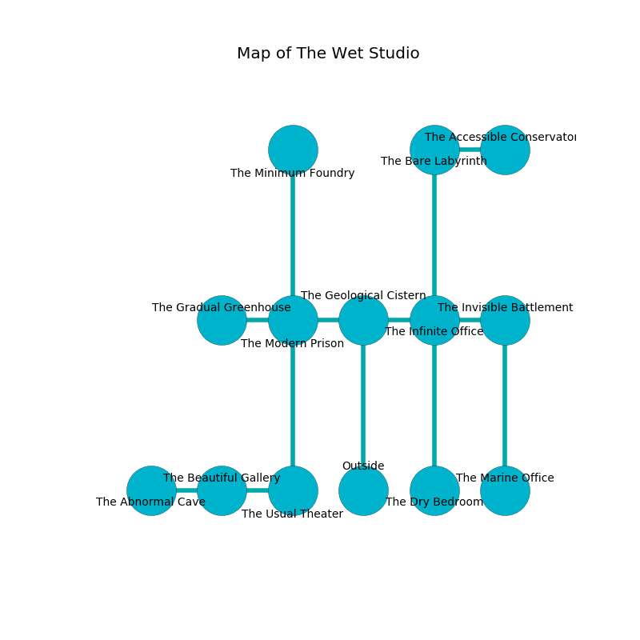

%Ruin Dogs

##The Wet Studio
###Overview
The Wet Studio is located on a cursed plain. Some rooms of it are flooded. The ruin is coming to life. It is occupied by Kenku. Tana Mcculloch The Inconsiderate, an Incubus is here. The Kenku are the minions of Tana Mcculloch The Inconsiderate. She  is trying to research [Dewi Iwibddub](#Dewi-Iwibddub). 

###Artifact
####Dewi Iwibddub

Dewi Iwibddub is a powerful artifact in the shape of an opaque cube. Fire slides near it. It smells like corn. When worshipped it levitates those nearby. 

###Locations

####the geological cistern
The floor is glossy. The air smells like rosemary here. The wooden walls are scratched. 

* To the west a flooded hallway opens to [the modern prison](#the-modern-prison).
* To the east a windy passageway leads to [the infinite office](#the-infinite-office).
* To the south is the entrance.

####the modern prison
There are a Cult Fanatic, a Lion, an Orog, a Draft Horse, a Blood Hawk, and a Baboon here. Yellow moss is swaying in broken urns. The floor is smooth. 

There is an engraving on the floor written in Kenku Script. 

> O! the world is inhumane
>
> financial and plain
>
> it is never systematic
>
> the world is charismatic
>

* To the west a narrow hallway connects to [the gradual greenhouse](#the-gradual-greenhouse).
* To the east a flooded hallway connects to [the geological cistern](#the-geological-cistern).
* To the north a windy artery leads to [the minimum foundry](#the-minimum-foundry).
* To the south a long passageway opens to [the usual theater](#the-usual-theater).

####the infinite office
The air tastes like eggs here. There are a Myconid Sprout, an Eagle, a Gargoyle, a Poisonous Snake, a Giant Elk, and an Octopus here. Green razorgrass is decaying in broken urns. The floor is bloodstained. 

* [Tana Mcculloch The Inconsiderate](#Tana-Mcculloch-The-Inconsiderate) is here.
* To the west a windy passageway connects to [the geological cistern](#the-geological-cistern).
* To the east a twisted path leads to [the invisible battlement](#the-invisible-battlement).
* To the north a windy cavern opens to [the bare labyrinth](#the-bare-labyrinth).
* To the south a dark pathway leads to [the dry bedroom](#the-dry-bedroom).

####the bare labyrinth
The floor is sticky. Yellow ferns are swaying in cracks in the floor. The wooden walls are unsettled. 

* To the east a dripping path leads to [the accessible conservatory](#the-accessible-conservatory).
* To the south a windy cavern leads to [the infinite office](#the-infinite-office).

####the accessible conservatory
There are twenty Kenkus here. The floor is cluttered with ashes. The Kenku are willing to negotiate. 

There is an engraving on a tablet written in common. 

> Hide here.
>

* To the west a dripping path opens to [the bare labyrinth](#the-bare-labyrinth).

####the usual theater
There are a Blink Dog, a Nothic, and a Triceratops here. The floor is flooded with nine inch deep cool water. 

* There is a spoon here.
* To the west a twisted path opens to [the beautiful gallery](#the-beautiful-gallery).
* To the north a long passageway opens to [the modern prison](#the-modern-prison).

####the minimum foundry
The mirrored walls are covered in mold. The air tastes like cheese here. There is a trap here. When activated, a tripwire will fire a net. 

* To the south a windy artery leads to [the modern prison](#the-modern-prison).

####the invisible battlement
Gray lichens are decaying in a patch on the floor. The air smells like gas here. There are twenty Kenkus here. The floor is glossy. The Kenku are defending this room from intruders. 

* To the west a twisted path leads to [the infinite office](#the-infinite-office).
* To the south a windy opening opens to [the marine office](#the-marine-office).

####the dry bedroom
There is a trap here. When activated, a tripwire will launch a rolling boulder. The wooden walls are caving in. 

* To the north a dark pathway leads to [the infinite office](#the-infinite-office).

####the gradual greenhouse
The air smells like absinthe here. There are an Aarakocra, a Pteranodon, an Orog, a Rug of Smothering, and a Minotaur here. 

* There is a pot here.
* To the east a narrow hallway connects to [the modern prison](#the-modern-prison).

####the marine office
Green mushrooms are swaying from the walls. 

There is an engraving on the floor written in Kenku Script. 

> I could not try jumping.
>

* There is a key here.
* There is a crossbow here.
* To the north a windy opening connects to [the invisible battlement](#the-invisible-battlement).

####the beautiful gallery
The stone walls are unsettled. The air tastes like forest here. 

* [Dewi Iwibddub](#Dewi-Iwibddub) is here.
* To the west a dark pathway opens to [the abnormal cave](#the-abnormal-cave).
* To the east a twisted path connects to [the usual theater](#the-usual-theater).

####the abnormal cave
The floor is smooth. There are twenty Kenkus here. If the Kenku notice the Ruin Dogs, one of them will retreat and alert the others. 

* There is a pin here.
* To the east a dark pathway opens to [the beautiful gallery](#the-beautiful-gallery).

