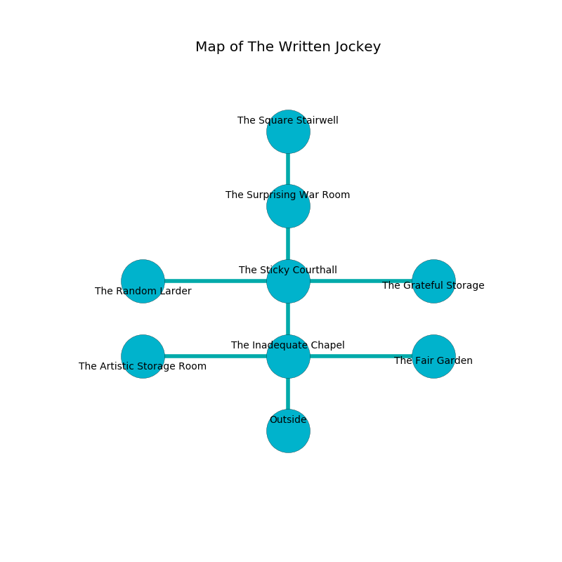

%Ruin Dogs

##The Written Jockey
###Overview
The Written Jockey is located under a haunted plain. Parts of The Written Jockey are inaccessible. The ruin is coming to life. It is occupied by Yuan-Ti. Howard Linville The Jealous, a Yuan-Ti Malison is here. The Yuan-Ti worship Howard Linville The Jealous. He  is trying to recover [Deaemdaf Cubdfubaeia](#Deaemdaf-Cubdfubaeia). 

###Artifact
####Deaemdaf Cubdfubaeia

Deaemdaf Cubdfubaeia looks like a hard spear. It is a sickly gray color. It smells like tomato. Gravity slides from it. When smelled it curses all nearby. 

###Locations

####the inadequate chapel
The wooden walls are scratched. There are a Slaad Tadpole, a Kuo-Toa Whip, a Swarm of Quippers, a Noble, and a Gnoll Pack Lord here. The air tastes like fruit here. Red razorgrass is swaying in a patch on the floor. 

* To the west a long hallway connects to [the artistic storage room](#the-artistic-storage-room).
* To the east a torchlit hall leads to [the fair garden](#the-fair-garden).
* To the north a long threshold connects to [the sticky courthall](#the-sticky-courthall).
* To the south is the entrance.

####the fair garden
There are two Yuan-Ti Malisons here. The metallic walls are pristine. Blue razorgrass is growing in cracks in the floor. The Yuan-Ti are meditating. 

* There is an apple here.
* There is an apple here.
* There is a comb here.
* To the west a torchlit hall opens to [the inadequate chapel](#the-inadequate-chapel).

####the artistic storage room
Yellow mushrooms are sprouting in a patch on the floor. The floor is smooth. 

* There is a cart here.
* [Howard Linville The Jealous](#Howard-Linville-The-Jealous) is here.
* To the east a long hallway connects to [the inadequate chapel](#the-inadequate-chapel).

####the sticky courthall
There are a Yuan-Ti Pureblood and a Yuan-Ti Malison here. The air smells like chicken coup here. The Yuan-Ti are drunk. 

* To the west a flooded path opens to [the random larder](#the-random-larder).
* To the east a flooded cavern connects to [the grateful storage](#the-grateful-storage).
* To the north a windy cavern opens to [the surprising war Room](#the-surprising-war-Room).
* To the south a long threshold opens to [the inadequate chapel](#the-inadequate-chapel).

####the grateful storage
The floor is flooded with six inch deep hot water. The wooden walls are caving in. 

* There is a brooch here.
* To the west a flooded cavern connects to [the sticky courthall](#the-sticky-courthall).

####the surprising war Room
The floor is glossy. There are two Yuan-Ti Malisons here. The concrete walls are covered in mold. The air tastes like acorn here. The Yuan-Ti are willing to fight to the death. 

* [Deaemdaf Cubdfubaeia](#Deaemdaf-Cubdfubaeia) is here.
* To the north a twisted cavern connects to [the square stairwell](#the-square-stairwell).
* To the south a windy cavern leads to [the sticky courthall](#the-sticky-courthall).

####the random larder
The floor is smooth. 

There is an engraving on a tablet written in Yuan-Ti Script. 

> I am lost in The Written Jockey.
>

* To the east a flooded path leads to [the sticky courthall](#the-sticky-courthall).

####the square stairwell
The floor is glossy. There are two Yuan-Ti Malisons here. The brick walls are pristine. The air smells like blackberry here. The Yuan-Ti are performing a ritual. If not interrupted, a powerful monster will be summoned. 

* To the south a twisted cavern opens to [the surprising war Room](#the-surprising-war-Room).

