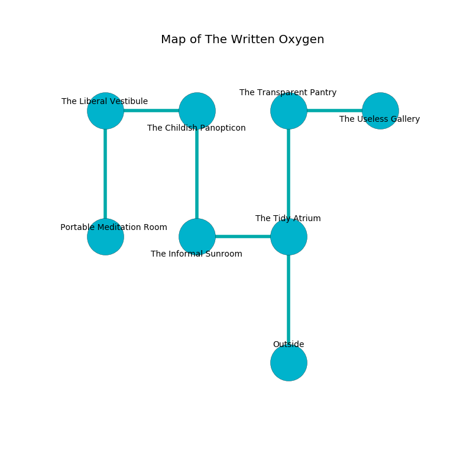

%Ruin Dogs

##The Written Oxygen
###Overview
The Written Oxygen is located in a giant mountain. Regions of it are cursed. The ruin is flooding. It is occupied by Sahuagin. Ed Cushman The Intolerant, a Bearded Devil is here. The Sahuagin are battling Ed Cushman The Intolerant. He  is trying to steal [The Aesthetic Bell](#The-Aesthetic-Bell). 

###Artifact
####The Aesthetic Bell

The Aesthetic Bell looks like a broken monument. Cacophony slips near it. It smells like cedar. When rubbed it emits dust. 

###Locations

####the tidy atrium
The floor is cluttered with rocks. Red moss is decaying from the ceiling. The air smells like molasses here. The glass walls are bloodstained. 

* To the west a long opening connects to [the informal sunroom](#the-informal-sunroom).
* To the north a flooded walkway leads to [the transparent pantry](#the-transparent-pantry).
* To the south is the entrance.

####the informal sunroom
The floor is glossy. Red mushrooms are growing from the ceiling. The metallic walls are pristine. The air tastes like buttery	cabbage here. 

* To the east a long opening leads to [the tidy atrium](#the-tidy-atrium).
* To the north a flooded artery opens to [the childish panopticon](#the-childish-panopticon).

####the childish panopticon
The air tastes like green peas here. The obsidion walls are scratched. White lichens are decaying from the walls. The floor is bloodstained. There are six Sahuagin here. There is a trap here. When activated, a tripwire will open a large pit in the floor. The Sahuagin are defending this room from intruders. 

* There is a brush here.
* To the west a windy cave connects to [the liberal vestibule](#the-liberal-vestibule).
* To the south a flooded artery leads to [the informal sunroom](#the-informal-sunroom).

####the liberal vestibule
Green ferns are sprouting in broken urns. The stone walls are pristine. The floor is flooded with two inch deep cool water. 

* To the east a windy cave opens to [the childish panopticon](#the-childish-panopticon).
* To the south a dark hall connects to [the portable meditation room](#the-portable-meditation-room).

####the portable meditation room
The mirrored walls are pristine. The air tastes like tagette here. Red ferns are sprouting in a patch on the floor. The floor is bloodstained. 

* [Ed Cushman The Intolerant](#Ed-Cushman-The-Intolerant) is here.
* To the north a dark hall leads to [the liberal vestibule](#the-liberal-vestibule).

####the transparent pantry
The air smells like honeydew here. There are a Nothic, an Allosaurus, a Tridrone, and a Vulture here. The brick walls are unsettled. 

* There is a chainmail here.
* There is a cheese here.
* [The Aesthetic Bell](#The-Aesthetic-Bell) is here.
* To the east a twisted hall opens to [the useless gallery](#the-useless-gallery).
* To the south a flooded walkway leads to [the tidy atrium](#the-tidy-atrium).

####the useless gallery
There are six Sahuagin here. The Sahuagin are performing a ritual. If not interrupted, a powerful monster will be summoned. 

* To the west a twisted hall opens to [the transparent pantry](#the-transparent-pantry).

