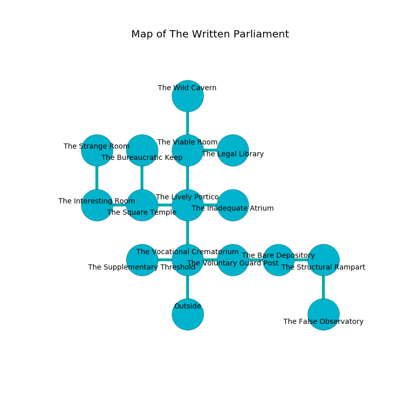

%Ruin Dogs

##The Written Parliament
###Overview
The Written Parliament is constructed on a broken tree. Parts of The Written Parliament are corrupted. The ruin is sinking into the earth. It is occupied by Myconids. Abdul Brinson The Narrow-Minded, a Sahuagin Priestess is here. The Myconids have been charmed by Abdul Brinson The Narrow-Minded. He  is trying to exploit [Dfaeid Damehdwi](#Dfaeid-Damehdwi). 

###Artifact
####Dfaeid Damehdwi

Dfaeid Damehdwi is a powerful artifact in the shape of a soft meteorite. It is a dark yellow color. When gazed upon it burns the mind. 

###Locations

####the vocational crematorium
There is a Myconid Sovereign here. The floor is glossy. If the Myconid Sovereign notice the Ruin Dogs, one of them will retreat and alert [Abdul Brinson](#Abdul-Brinson). 

There is an engraving on the ceiling written in Myconids Script. 

> Leave now.
>

* There is a whistle here.
* There is a brain here.
* To the west a narrow path connects to [the supplementary threshold](#the-supplementary-threshold).
* To the east a dripping pathway connects to [the voluntary guard post](#the-voluntary-guard-post).
* To the north a small artery connects to [the lively portico](#the-lively-portico).
* To the south is the entrance.

####the lively portico
The air smells like the fresh outdoors here. The floor is bloodstained. The brick walls are ruined. Green razorgrass is swaying in cracks in the floor. 

* To the west a dripping path opens to [the square temple](#the-square-temple).
* To the east a twisted walkway leads to [the inadequate atrium](#the-inadequate-atrium).
* To the north a dripping opening connects to [the viable room](#the-viable-room).
* To the south a small artery connects to [the vocational crematorium](#the-vocational-crematorium).

####the viable room
There are a Jackal and a Druid here. The air smells like fungus here. Red razorgrass is sprouting in a patch on the floor. The floor is sticky. 

* To the east a windy gap connects to [the legal library](#the-legal-library).
* To the north a torchlit threshold leads to [the wild cavern](#the-wild-cavern).
* To the south a dripping opening opens to [the lively portico](#the-lively-portico).

####the legal library
The air tastes like green apple here. There is a trap here. When activated, a magical sound detector will blast flames. Red ferns are decaying in a patch on the floor. There are a Vine Blight, a Giant Eagle, and an Old Faerie Dragon here. 

There is an engraving on a monolith written in common. 

> A foot is a coalition
>
> ample and arbitrary
>
> insufficient, new, systematic
>

* To the west a windy gap opens to [the viable room](#the-viable-room).

####the inadequate atrium
The mirrored walls are covered in mold. There is a Griffon here. 

There is an engraving on the wall written in common. 

> Go away.
>

* To the west a twisted walkway opens to [the lively portico](#the-lively-portico).

####the square temple
There are a Myconid Sovereign and three Myconid Adults here. The floor is bloodstained. The Myconids are willing to negotiate. 

* There is a brick here.
* [Abdul Brinson The Narrow-Minded](#Abdul-Brinson-The-Narrow-Minded) is here.
* To the west a windy opening opens to [the interesting room](#the-interesting-room).
* To the east a dripping path opens to [the lively portico](#the-lively-portico).
* To the north a dark cavern leads to [the bureaucratic keep](#the-bureaucratic-keep).

####the voluntary guard post
The mirrored walls are unsettled. There are a Myconid Sovereign and a Myconid Adult here. One of the Myconids is working a mechanism that can open a trapodoor in the floor. 

There is an engraving on the floor written in common. 

> I found [Dfaeid Damehdwi](#Dfaeid-Damehdwi).
>
> Leave now.
>

* To the west a dripping pathway leads to [the vocational crematorium](#the-vocational-crematorium).
* To the east a dark corridor leads to [the bare depository](#the-bare-depository).

####the bare depository
The floor is sticky. The air smells like logenberry here. 

* There is a femur here.
* There is a card here.
* There is a whistle here.
* To the west a dark corridor opens to [the voluntary guard post](#the-voluntary-guard-post).
* To the east a small hallway opens to [the structural rampart](#the-structural-rampart).

####the bureaucratic keep
Green moss is swaying in cracks in the floor. The floor is glossy. The wooden walls are bloodstained. 

* To the south a dark cavern opens to [the square temple](#the-square-temple).

####the wild cavern
Yellow lichens are growing from the walls. There are a Myconid Sovereign and three Myconid Adults here. The metallic walls are scratched. The floor is smooth. The air smells like nasturtium here. One of the Myconids is on watch, the rest are celebrating. 

* To the south a torchlit threshold connects to [the viable room](#the-viable-room).

####the supplementary threshold
White lichens are swaying in a patch on the floor. There is a Gnoll Pack Lord here. 

* There is a button here.
* There is a casket here.
* To the east a narrow path leads to [the vocational crematorium](#the-vocational-crematorium).

####the structural rampart
The metallic walls are ruined. There is a Githzerai Monk here. 

* There is a cart here.
* To the west a small hallway opens to [the bare depository](#the-bare-depository).
* To the south a hazy passageway leads to [the false observatory](#the-false-observatory).

####the false observatory
There are a Jackal, a Jackalwere, and a Will-O’-Wisp here. 

* There is a screw here.
* There is a face here.
* To the north a hazy passageway leads to [the structural rampart](#the-structural-rampart).

####the interesting room
There is a trap here. When activated, a magical proximity detector will open a large pit in the floor. 

* [Dfaeid Damehdwi](#Dfaeid-Damehdwi) is here.
* To the east a windy opening leads to [the square temple](#the-square-temple).
* To the north a narrow artery leads to [the strange room](#the-strange-room).

####the strange room
The floor is bloodstained. The air smells like wood here. 

* To the south a narrow artery opens to [the interesting room](#the-interesting-room).

