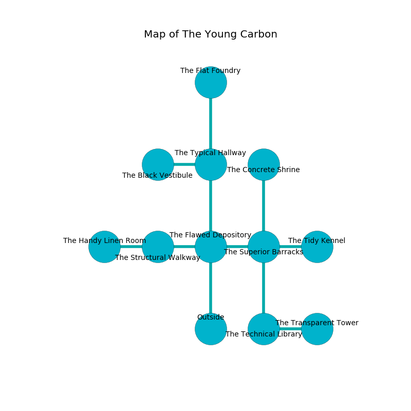

%Ruin Dogs

##The Young Carbon
###Overview
The Young Carbon is constructed on a crystal city. Parts of The Young Carbon are flooded. The ruin is sinking into the earth. It is occupied by Kuo-Toa. Bryant Freedman The Inconsiderate, a Knight is here. The Kuo-Toa are the slaves of Bryant Freedman The Inconsiderate. He  is trying to steal [Deddhagaeahl](#Deddhagaeahl). 

###Artifact
####Deddhagaeahl

Deddhagaeahl is a powerful artifact in the shape of a glassy meteorite. Air slips near it. It smells like paint. It is a medium yellow color. When held it becomes lost. 

###Locations

####the flawed depository
There are a Kuo-Toa Whip and four Kuo-Toa here. The crystal walls are caving in. The air smells like apple skin here. The floor is flooded with eight inch deep lukewarm water. Blue moss is growing from the walls. The Kuo-Toa are caring for babies. 

* To the west a dark threshold connects to [the structural walkway](#the-structural-walkway).
* To the east a hazy threshold leads to [the superior barracks](#the-superior-barracks).
* To the north a hazy hallway connects to [the typical hallway](#the-typical-hallway).
* To the south is the entrance.

####the superior barracks
There are two Kuo-Toa Whips and a Kuo-Toa here. The obsidion walls are covered in mold. The Kuo-Toa are willing to negotiate. 

* There is a bag here.
* To the west a hazy threshold opens to [the flawed depository](#the-flawed-depository).
* To the east a windy cavern leads to [the tidy kennel](#the-tidy-kennel).
* To the north a small path opens to [the concrete shrine](#the-concrete-shrine).
* To the south a narrow threshold opens to [the technical library](#the-technical-library).

####the technical library
There are a Flumph, a Duodrone, a Giant Sea Horse, a Scout, a Fire Snake, and a Scorpion here. The floor is glossy. The air smells like agarwood here. 

* To the east a torchlit hallway leads to [the transparent tower](#the-transparent-tower).
* To the north a narrow threshold opens to [the superior barracks](#the-superior-barracks).

####the structural walkway
The wooden walls are ruined. The air tastes like banana peel here. 

* [Bryant Freedman The Inconsiderate](#Bryant-Freedman-The-Inconsiderate) is here.
* To the west a long walkway leads to [the handy linen room](#the-handy-linen-room).
* To the east a dark threshold connects to [the flawed depository](#the-flawed-depository).

####the typical hallway
Yellow lichens are decaying from the ceiling. 

* [Deddhagaeahl](#Deddhagaeahl) is here.
* To the west a long cavern opens to [the black vestibule](#the-black-vestibule).
* To the north a small cavern opens to [the flat foundry](#the-flat-foundry).
* To the south a hazy hallway connects to [the flawed depository](#the-flawed-depository).

####the transparent tower
The stone walls are covered in mold. The air smells like berry here. Green mushrooms are decaying in cracks in the floor. 

There is an engraving on the wall written in Kuo-Toa Script. 

> Go away.
>

* To the west a torchlit hallway opens to [the technical library](#the-technical-library).

####the black vestibule
The floor is bloodstained. The stone walls are ruined. There are a Kuo-Toa Whip and four Kuo-Toa here. One of the Kuo-Toa is pointing a ballista at the entrance. 

There is an engraving on a tablet written in Kuo-Toa Script. 

> All of us are envious
>
> ever straight
>

* To the east a long cavern leads to [the typical hallway](#the-typical-hallway).

####the concrete shrine

There is an engraving on the wall written in Kuo-Toa Script. 

> I thought about hiding.
>

* To the south a small path connects to [the superior barracks](#the-superior-barracks).

####the tidy kennel
There are a Gargoyle and a Deer here. 

* To the west a windy cavern opens to [the superior barracks](#the-superior-barracks).

####the handy linen room
The mirrored walls are scratched. There is a Wererat here. 

* To the east a long walkway connects to [the structural walkway](#the-structural-walkway).

####the flat foundry
The metallic walls are covered in mold. Green mushrooms are decaying from the ceiling. The floor is glossy. 

There is an engraving on a monolith written in common. 

> They are corrupted
>
> statistical and square
>
> [Deddhagaeahl](#Deddhagaeahl)
>
> parental, tired, annual
>
> sufficient, open, political
>
> municipal, constructive, continuous
>
> weekly and hard
>

* There is a heart here.
* To the south a small cavern leads to [the typical hallway](#the-typical-hallway).

