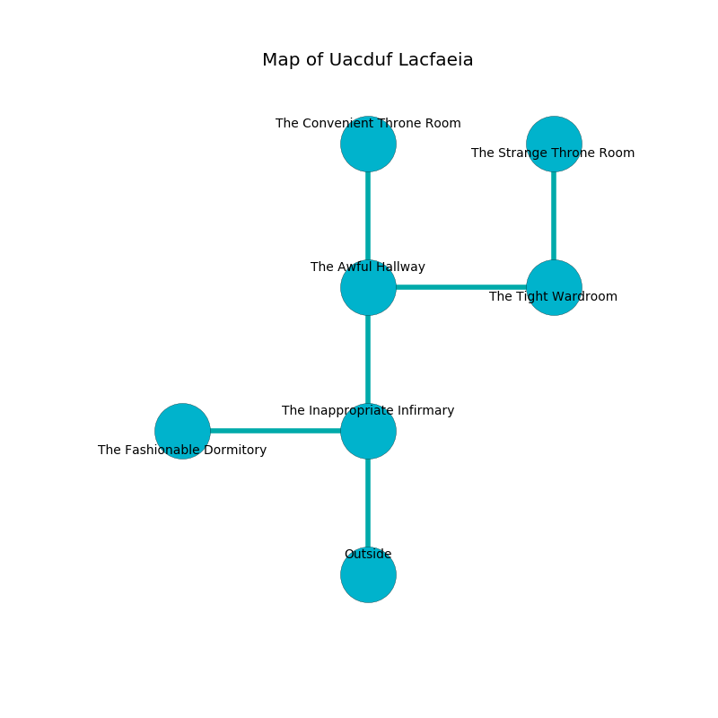

%Ruin Dogs

##Uacduf Lacfaeia
###Overview
Uacduf Lacfaeia is located in a poisoned city. Some rooms of Uacduf Lacfaeia are inaccessible. A windstorm is happening outside. It is occupied by Thri-Kreens. Harry Ferry The Aggressive, a Spined Devil is here. The Thri-Kreens are battling Harry Ferry The Aggressive. He  is founding a new religion. 

###Artifact
####The Ethnic Virtue

The Ethnic Virtue is a powerful artifact in the shape of a smooth monument. It is a light brown color. Gravity slides around it. When picked up it frightens children. 

###Locations

####the inappropriate infirmary
There are three Thri-Kreens here. White mushrooms are growing from the ceiling. The obsidion walls are unsettled. The floor is bloodstained. If the Thri-Kreens notice the Ruin Dogs, one of them will retreat and alert the others. 

There is an engraving on a monolith written in common. 

> A watch is an officer
>
> inner and abstract
>
> yet resident
>
> A watch is an officer
>

* [The Ethnic Virtue](#The-Ethnic-Virtue) is here.
* To the west a long corridor opens to [the fashionable dormitory](#the-fashionable-dormitory).
* To the north a dripping hall opens to [the awful hallway](#the-awful-hallway).
* To the south is the entrance.

####the awful hallway
The metallic walls are caving in. There are three Thri-Kreens here. If the Thri-Kreens notice the Ruin Dogs, one of them will retreat and alert the others. 

* To the east a twisted hall connects to [the tight wardroom](#the-tight-wardroom).
* To the north a hazy walkway connects to [the convenient throne room](#the-convenient-throne-room).
* To the south a dripping hall connects to [the inappropriate infirmary](#the-inappropriate-infirmary).

####the convenient throne room
White lichens are swaying in a patch on the floor. The glass walls are unsettled. 

There is an engraving on a tablet written in common. 

> Oh sorry you
>
> yet never illegal
>
> it is always new
>
> hope is legal
>

* To the south a hazy walkway connects to [the awful hallway](#the-awful-hallway).

####the tight wardroom
The floor is flooded with four inch deep hot water. The air smells like pimenta here. White ferns are decaying in broken urns. 

There is an engraving on the wall written in Thri-Kreens Script. 

> Leave now.
>

* There is a hat here.
* To the west a twisted hall connects to [the awful hallway](#the-awful-hallway).
* To the north a twisted gap opens to [the strange throne room](#the-strange-throne-room).

####the strange throne room
There are three Thri-Kreens here. The air smells like medicine here. The floor is sticky. Green razorgrass is swaying from the ceiling. The Thri-Kreens are willing to fight to the death. 

* To the south a twisted gap connects to [the tight wardroom](#the-tight-wardroom).

####the fashionable dormitory
The floor is cluttered with ashes. Yellow mushrooms are decaying from the walls. The stone walls are covered in mold. 

* There is a basket here.
* There is a card here.
* [Harry Ferry The Aggressive](#Harry-Ferry-The-Aggressive) is here.
* To the east a long corridor connects to [the inappropriate infirmary](#the-inappropriate-infirmary).

